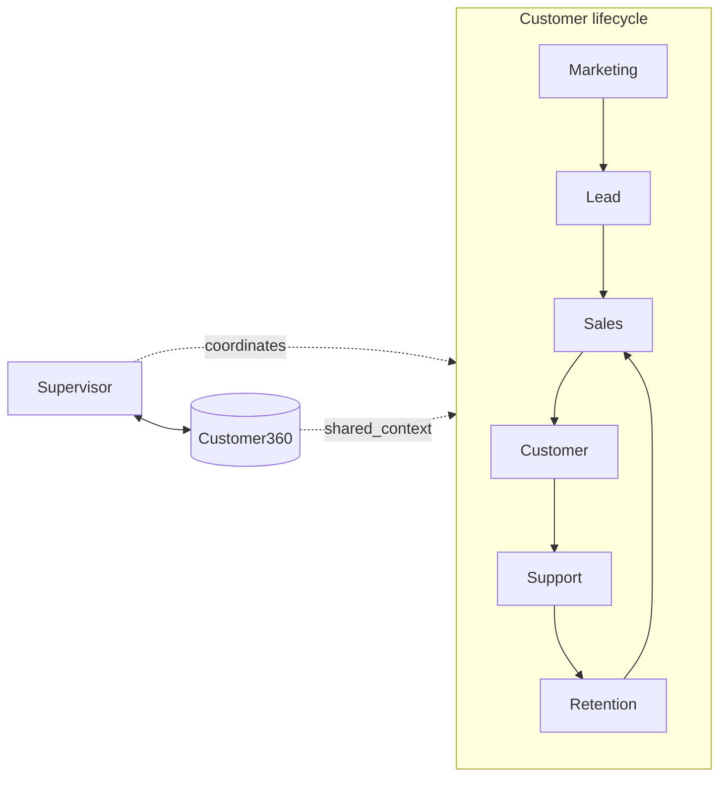
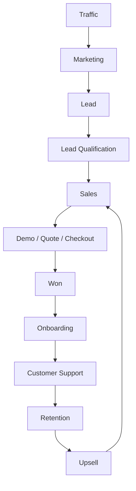
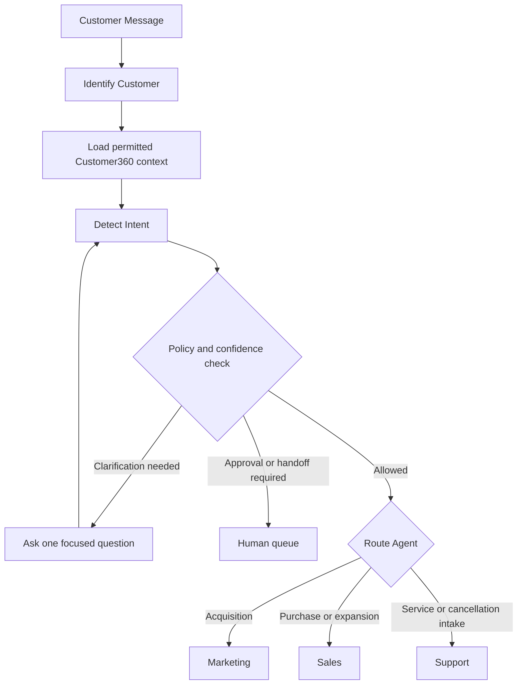
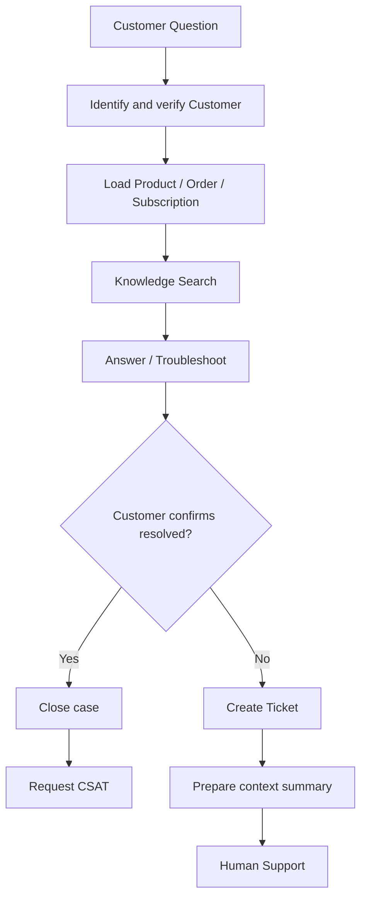
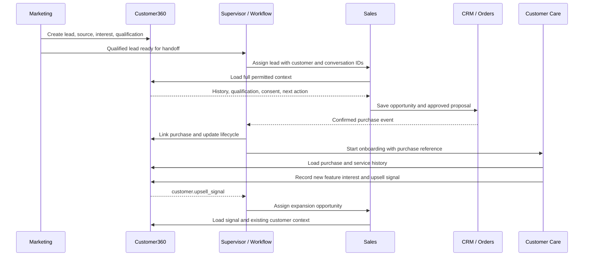
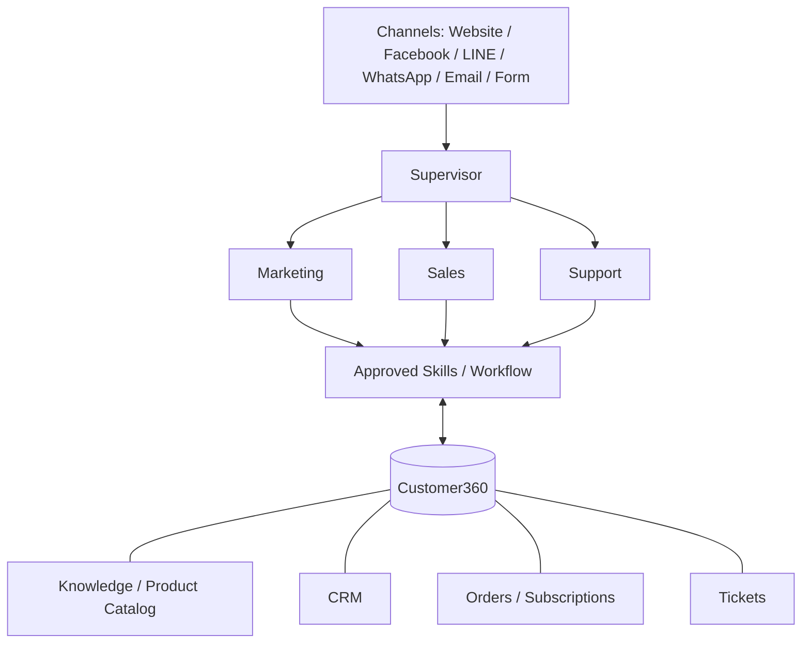
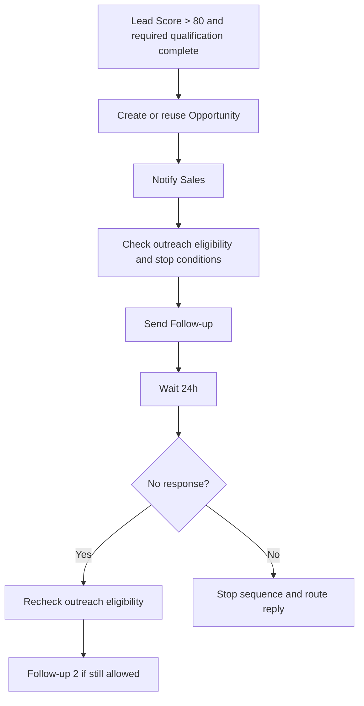
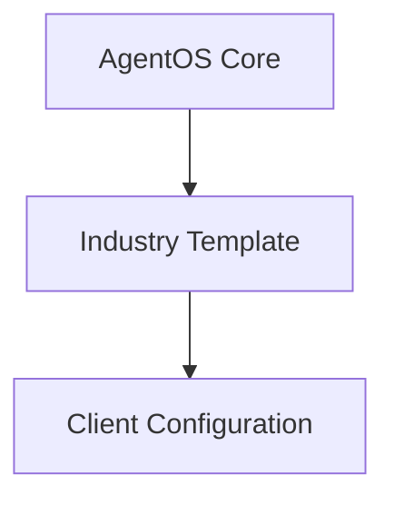
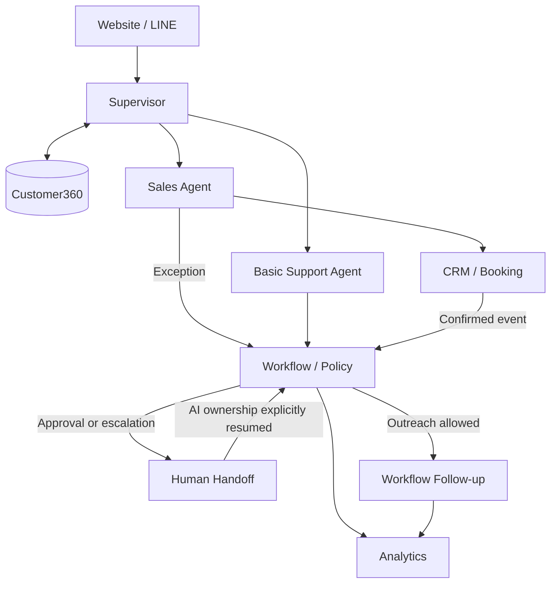
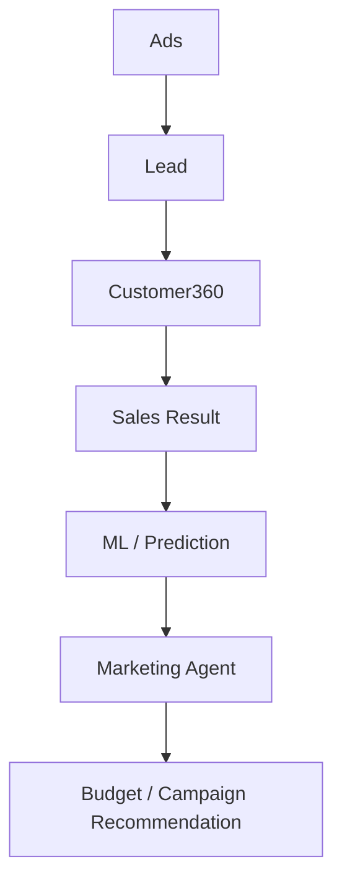

# AgentOS Customer360

AI Online Business OS — Product, Engineering & Business Plan

Status: proposed product design, not a claim of implemented functionality.
Examples, prices, scores, and targets are illustrative unless agreed with a pilot customer.

## 1. Executive Summary

AgentOS Customer360 is a packaged AI platform for operating an online business across the customer lifecycle.
It addresses missed leads, inconsistent follow-up, repetitive support, and fragmented customer information.
Marketing, Sales, and Customer Care / Support Agents work under a Supervisor / Orchestrator Agent.
All agents share Customer360, Workflow, Knowledge, and Business Rules.
Customer360 connects identity, conversations, commercial activity, and service history into one business record.
Teams use human approvals, integrations, and analytics to control actions and measure customer outcomes.
Industry templates and customer configuration adapt the same core platform to different products and businesses.



## 2. Core Concept

```text
Core Platform + Business Configuration + Product Data
              + Knowledge + Integrations
              = Customer Deployment
```

| Area | Core — code once | Configuration — change by business |
|---|---|---|
| Agent behavior | Agent Runtime, Supervisor | Sales questions, qualification fields, agent tone |
| Business process | Workflow Engine | Lead scoring, follow-up rules, sales stages, business hours |
| Business information | Customer360, Knowledge/RAG | Products, prices, promotions, support FAQ |
| Connectivity | Integrations Framework, Messaging | Channels, provider connections, field mappings |
| Control and measurement | Permissions, Audit, Analytics | Escalation policy, role assignments, KPI targets |

Target: **80–90% reusable platform + 10–20% customer configuration**.
This is a design target, not a measured reuse rate or a guarantee.

A product or industry change should normally update configuration, catalog, knowledge, workflows, and business rules. A genuinely new external capability may require a reusable adapter or skill; it should not require a customer-specific fork of the agents.

## 3. Full Customer Lifecycle

This is the central business flow. Support, renewal, and expansion can also start directly from relevant customer events.



| Stage | Owner | Input | Action | Output |
|---|---|---|---|---|
| Traffic | Marketing team / Agent | Audience and campaign plan | Attract visitors through approved campaigns | Attributed visit |
| Marketing | Marketing Agent | Visit or inquiry | Explain the offer and invite engagement | Interested visitor |
| Lead | Marketing Agent | Contact details and interest | Capture contact, source, and consent | Lead in Customer360 |
| Lead Qualification | Marketing / Sales | Lead and engagement | Check required fields, fit, and intent | Sales-qualified lead (SQL) |
| Sales | Sales Agent | SQL and full context | Discover needs and open a deal | Opportunity with next action |
| Demo / Quote / Checkout | Sales / Human | Opportunity and approved product | Book, propose, or provide checkout | Meeting, quote, or purchase request |
| Won | Sales + confirmed system event | Verified commercial outcome | Record the sale and purchase reference | Customer and won opportunity |
| Onboarding | Support + Workflow | Confirmed purchase | Send setup guidance and check activation | Onboarded customer |
| Customer Support | Support Agent | Question and customer history | Answer, troubleshoot, or escalate | Resolved case or human-owned ticket |
| Retention | Support / Sales + Workflow | Usage, renewal, or risk signal | Support adoption and coordinate renewal | Retained customer or recovery action |
| Upsell | Sales Agent | Valid expansion signal | Qualify additional needs | Expansion opportunity |

Not ready → nurture. Poor fit → disqualify with a reason. Lost → record the reason; reactivate only when appropriate and permitted. A customer's statement alone must not mark a purchase as confirmed.

Retention starts as Sales/Support workflows. A dedicated Retention Agent is a later option, not an MVP dependency; advocacy and referral requests can follow successful customer outcomes.

## 4. Key Business Cases

These scenarios describe the full product. Section 21 defines which steps are automated in the MVP.

| Case | Short flow | Success record |
|---|---|---|
| 1 — New Lead → Sale | Facebook → Marketing → Lead → Qualification → Sales → Quote → Confirmed purchase → Won | Attribution, opportunity, quote, purchase |
| 2 — Lead not ready | Lead → Nurture → Engagement → Score increases → Qualification check → Sales handoff | Updated score, readiness, next action |
| 3 — Support issue | Customer → Support → Identity check → Knowledge search → Troubleshoot → Customer confirms solved → Close | Resolution and CSAT request |
| 4 — Support escalation | Customer → Support → Troubleshooting fails → Ticket → Context summary → Human assignment → Human resolution | Ticket owner and outcome |
| 5 — Upsell | Existing customer → Feature interest → Upsell signal → Sales → Expansion qualification → Approved offer → Upgrade | Expansion opportunity and revenue |
| 6 — High-value lead | Enterprise request → Sales qualification → Supervisor policy check → Context package → Human Sales → Approved proposal | Assigned owner and approval history |

## 5. Supervisor Agent

The Supervisor is the AI manager and router. It assembles context, selects an owner, and coordinates next steps; the policy and tool layers enforce permissions.



| Customer message | Routing |
|---|---|
| "How much does it cost?" | Sales |
| "Send me the catalog." | Marketing for general discovery; Sales for purchase intent |
| "I cannot log in." | Support |
| "I want to buy 50 more users." | Sales / upsell |
| "I want to cancel." | Support / retention intake, then Human for the cancellation decision |

If identity is unverified, load only safe public or session context. If intent remains unclear, clarify or hand off instead of repeatedly switching agents.

## 6. Marketing Agent

Purpose: turn campaign engagement into qualified demand with a traceable source.

```text
Campaign → Traffic → Lead Capture → Customer360 → Lead Scoring
         → Nurture → Qualified Lead → Sales Handoff
```

Already-ready leads can skip nurture.

| Capability | Concrete action |
|---|---|
| Campaign content | Draft approved ad, landing-page, email, and social content |
| Capture and attribution | Save contact, campaign/source identifiers, product interest, and consent |
| Segmentation and scoring | Group leads by fit, interest, behavior, and readiness |
| Nurture and reactivation | Deliver useful content, track engagement, and revisit eligible inactive leads |
| Sales handoff | Pass qualification evidence, campaign history, and recommended next action |

Start with configurable rules, not ML. Example scoring inputs include form submission, pricing engagement, budget, timeline, and demo requests. Cap and deduplicate behavioral contributions; missing qualification fields still need confirmation.

Example: Facebook Ad → landing page → product question → lead captured → pricing viewed three times → combined configured score = 82 → qualification requirements satisfied → Sales handoff.

The score includes prior fit and engagement signals; three page views alone do not imply a score of 82. Contact eligibility is governed separately by the outreach rules in Section 13.

## 7. Sales Agent

Purpose: move a qualified lead to a clear commercial outcome.

```text
Qualified Lead → Discovery → Need → Budget → Authority → Timeline
               → Product Recommendation → Demo / Quote → Follow-up
               → Won / Lost
```

Default opportunity state:

`New → Qualified → Demo → Proposal → Negotiation → Won/Lost`

Stages may be skipped only through configured transitions. Incomplete qualification returns to discovery or nurture; record unknown fields instead of inventing answers.

| Capability | Action or output |
|---|---|
| Qualification | Collect need, budget, authority, timeline, fit, and intent |
| Recommendation and pricing | Search the approved Product Catalog and explain suitable options |
| Meeting booking | Check availability, book a confirmed slot, and save the reference |
| Quotation | Create a quote from approved catalog data or prepare an approval request |
| CRM updates | Persist qualification, stage, owner, notes, and next action |
| Follow-up | Start or stop the appropriate workflow |
| Human handoff | Transfer high-value, complex, or exception deals with full context |

Example — a SaaS buyer:

1. Receive a qualified lead for a 30-user team.
2. Confirm the need, a USD 900 monthly budget, CEO approval, and a six-week timeline.
3. Retrieve the illustrative Business plan at USD 25 per user/month; 30 users cost USD 750/month before applicable taxes.
4. Book a demo and save the opportunity in CRM.
5. Prepare the approved quote, obtain any required human approval, and schedule follow-up.
6. Mark Won only after the configured authoritative confirmation; trigger onboarding.

Automated quotation and checkout are full-product capabilities. Their MVP boundaries are explicit in Section 21.

## 8. Customer Care / Support Agent

Purpose: resolve routine problems with customer and product context, then transfer exceptions cleanly.



Without a reliable answer, or when permitted troubleshooting is exhausted, take the escalation path. Do not close a case solely because the AI sent a response.

| Handoff field | What Human Support receives |
|---|---|
| Customer | Verified customer ID, contact, account, and plan |
| Issue | Customer's problem and desired outcome |
| Context | Relevant conversation, product, order, subscription, and environment |
| Troubleshooting tried | Steps attempted, results, and remaining unknowns |
| Priority | Impact, urgency, sentiment, and SLA risk |
| Recommended next action | Suggested action, destination team, and ticket/conversation links |

Support also records adoption gaps and feature interest as signals. Sales owns any resulting commercial offer.

## 9. Cross-Agent Handoff

**The customer should not re-enter known information when changing agents.**
Security re-verification and confirmation of outdated details may still be necessary.



Every handoff carries customer/conversation IDs, current owner and stage, a short summary, relevant business-record links, unresolved items, and the next action.

The receiving owner must accept the handoff. Keep one active responder per conversation; pause automated replies while a human owns it. Failed assignment remains visible in a queue and must not be reported as completed.

## 10. High-Level Architecture

This is a logical dependency map, not a requirement to deploy each box as a separate service.



Customer360 stores shared records and source-system references. Skills query knowledge and external systems through authorized interfaces; the lower links are data relationships, not API calls through a database.

| Boundary | Responsibility |
|---|---|
| Channel gateway | Verify inbound events, normalize messages, resolve session/tenant, deduplicate delivery |
| Supervisor and runtime | Assemble context, route work, run role-specific agents, validate responses |
| Skills and workflow | Validate tool inputs, enforce policy, execute approved actions, track state and timers |
| Data and integrations | Persist business records, retrieve approved information, synchronize source systems |

Execution contract: `Approved context → Agent proposal → Authorize/execute needed tools → Validate results and response → Send → Audit + Customer360 update`.

Start with a modular application and durable background worker.

| Data | Initial storage approach |
|---|---|
| Customer records, conversations, workflow state, events, audit | Relational database with tenant-scoped access |
| Source documents | Object storage with controlled access |
| Retrieval index | Derived search/vector index; never the only copy of business state |
| Analytics | Derived views or aggregates; introduce a warehouse only when justified |

## 11. Customer360

Customer360 is **shared memory plus the business record**, not just chat memory.

| Record group | What it stores or links |
|---|---|
| Identity and contact | Customer/account IDs, verified channel identities, email, phone, company, consent, preferences |
| Acquisition | Lead source, campaign touches, product interest, lead score, qualification |
| Conversations | Messages, summaries, handoffs, active owner, next action |
| Commercial | Opportunities, quotes, orders, subscriptions, customer value |
| Service and growth | Tickets, resolution history, renewal status, churn/adoption indicators, upsell signals |

Illustrative profile:

```yaml
customer:
  tenant_id: tenant_demo
  id: cust_123
  identity: {crm_id: crm_456, line_id: line_example, verified: true}
  contact: {name: An Nguyen, email: an@example.com}
  preferences: {channel: line, marketing_consent: true}
  lifecycle: {stage: active_customer, source: facebook, campaign: saas_q3}
  product_interest: [business_plan]
  lead_score: 82
  qualification: {users: 30, budget_monthly_usd: 900, timeline_weeks: 6}
  conversations:
    - {id: conv_01, summary: "30 users; CEO approves upgrades."}
  opportunity: {id: opp_01, stage: won}
  quotes: [quote_01]
  orders: [order_01]
  subscription: {id: sub_01, status: active}
  tickets: [ticket_01]
  customer_value: {revenue_to_date: 750, currency: USD}
  upsell_signals:
    - {type: additional_users, quantity: 50, source: ticket_01}
```

Link a trusted channel/account ID to the customer within the same tenant. Verify ambiguous email/phone matches before linking or merging; an order ID alone is not identity proof.

Define field ownership for every integration: Customer360 owns unified identity/context; CRM owns its sales records; commerce/billing owns confirmed orders and subscriptions; ticketing owns its case status. Synchronize references and outcomes without silently overwriting authoritative values.

## 12. Knowledge and Agent Context

| Knowledge source | Use |
|---|---|
| Approved product and sales material | Product explanations, comparisons, onboarding |
| FAQ and troubleshooting guides | Routine support and resolution steps |
| Policies and service documentation | Approved customer explanations, delivery terms, SLA information |
| Internal playbooks | Staff-only guidance, restricted by role |

Retrieval flow: `Question → Tenant/permission filter → Search → Current approved sources → Grounded answer`.

Each knowledge item has an owner, version, approval status, effective/expiry dates, and visibility. Exclude outdated or unauthorized sources. Use live catalog data for prices and eligibility; descriptive documents cannot override executable business rules.

Build a bounded context bundle:

`Recent messages + Summary + Verified facts + Active workflow + Relevant business records + Retrieved sources`

Keep references to supporting sources. If identity, retrieval evidence, tool results, or policy certainty are insufficient, clarify or escalate. Do not treat a model's self-reported confidence as proof of correctness.

## 13. Workflow Engine

**AI understands the situation and proposes actions. The Workflow Engine controls the business process.**
Rules, permissions, transitions, timers, and stop conditions must exist outside prompts.

Example — an eligible hot lead:



A failed eligibility check ends the outbound path; it does not send a message.

| Workflow element | Contract |
|---|---|
| Trigger | A recorded event such as `lead.qualified`, `quotation.sent`, `payment.completed`, `ticket.resolved`, or `customer.upsell_signal` |
| State | Persist current step, owner, next run time, and terminal outcome |
| Conditions | Evaluate configured qualification, eligibility, policy, and current customer state |
| Actions | Call approved skills and save verified results |
| Timers and approvals | Resume durably after a wait or explicit human decision |
| Event record | Include event ID, tenant/customer IDs, timestamp, source, and correlation ID |

Stop the active sales/nurture sequence after opt-out, a customer reply, its opportunity reaching Won/Lost, or human takeover. Other lifecycle workflows need their own eligibility checks; do not implicitly restart a stopped sequence. Every send must respect purpose-specific consent, channel restrictions, business hours/timezone, frequency caps, and active human ownership; recheck immediately before sending and log the outcome.

## 14. Human-in-the-loop

Flow: `Agent → Policy → Approval/Handoff → Human → Recorded decision`.

| Mandatory human involvement | AI may do before handoff |
|---|---|
| High-value deal | Collect qualification and prepare the commercial summary |
| Custom pricing or discount outside policy | Retrieve standard prices and submit an approval request |
| Refund or cancellation | Verify identity, collect reasons, explain the process, create the request |
| Legal or security issue | Acknowledge and route to the responsible team |
| Low confidence, repeated failure, or SLA risk | Preserve evidence and recommend a next step |
| Customer requests a human | Transfer without forcing further AI troubleshooting |

High-value thresholds, discount limits, minimum evidence/confidence thresholds, and maximum failed troubleshooting steps are tenant configuration. No response from an approver is not approval.

Supported modes: shadow/silent assistance, human-first copilot, AI-first with escalation, and approved low-risk automation. If a human is unavailable, acknowledge the pending request, retain an accountable queue/owner, and apply the configured business-hours response.

## 15. Integrations

| Category | Purpose |
|---|---|
| CRM | Contacts, qualification, opportunities, ownership, sales outcomes |
| LINE | Customer messages and channel identity |
| WhatsApp | Customer messages and channel identity |
| Facebook | Messenger, lead forms, and source attribution |
| Email | Conversations and permitted follow-up |
| Calendar | Availability, booking, cancellation/rescheduling |
| Payment | Approved payment links and confirmed payment/refund status |
| E-commerce | Catalog/availability, orders, delivery, subscriptions where supported |
| Ticketing | Cases, assignment, status, resolution |
| Ads | Campaign/source metadata, spend, and permitted outcome feedback |

Outbound integration actions use `Agent / Workflow → Approved Skill → Adapter → Provider`. Provider-specific authentication, field mapping, API details, and inbound webhook normalization stay in adapters, not agent prompts.

Start with one CRM and one calendar provider. Additional channels, including Instagram, SMS, mobile chat, and voice, are later adapters; internal alerts can use the operator console or connected messaging tools.

## 16. Security, Reliability, and Operations

| Area | Minimum design requirement |
|---|---|
| Tenant and data ownership | Tenant owns its data; enforce isolation in records, retrieval, files, queues, and analytics; configure retention/export/deletion |
| Access control | Role- and field-level permissions; least-privilege tools; assigned-deal/case access; admin MFA; enterprise SSO when required |
| Data and credentials | Encrypt in transit/at rest; protect and rotate secrets; verify webhooks; redact sensitive logs |
| Agent guardrails | Treat messages, documents, and tool output as untrusted input; prevent instructions in content from granting permissions; validate outbound responses |
| Action authorization | Check identity, tenant, tool schema, policy, approval, and rate limits at execution time |
| Delivery reliability | Timeouts, bounded retries, idempotency keys, durable events, and dead-letter/manual exception queues |
| Partial failure | Reconcile uncertain outcomes before retrying; compensate only through an authorized action |
| Audit | Record actor, tenant/customer/conversation, action, policy/config version, approval, result, timestamp, and correlation ID |
| Observability | Track latency, tool/workflow failures, queue health, retrieval gaps, incidents, token usage, and cost per interaction |

Use roles such as Owner, Administrator, Marketing/Sales/Support Manager, assigned Sales/Support staff, and read-only Analyst.

Never tell a customer that a booking, quote, payment, or ticket succeeded until the relevant system confirms it. If a provider times out after possibly accepting a write, look up the result before retrying.

## 17. Product and Business Configuration

Use the same Sales Agent with different data and qualification definitions.



| Industry template | Qualification fields | Typical next action |
|---|---|---|
| SaaS | Users, need, budget, authority, timeline | Demo, trial, subscription proposal |
| Automotive | Model, budget, financing, purchase timeline | Vehicle recommendation and test drive |
| Real Estate | Location, budget, property type, buying timeline | Property shortlist and viewing |
| B2B Distribution | Specification, quantity, budget, delivery timeline | Availability check and approved quote |
| Clinic administration | Service inquiry, appointment preference, contact details | Consultation booking and professional handoff |

Clinic templates cover administrative workflows; clinical decisions remain with qualified professionals.

**Do not hard-code product logic directly in agent prompts.** Prompts define the role and interaction boundaries; structured configuration defines questions, fields, process choices, and rules.

A deployment bundle contains the selected template, catalog, approved knowledge, workflow definitions, provider mappings, channel settings, policies, and evaluation cases. Version it, validate it, test it, obtain owner approval, and publish it with a rollback path.

## 18. Product Catalog

Sales must retrieve products and current approved commercial terms from the Product Catalog.

```yaml
product:
  id: business_plan
  name: Business
  category: saas
  price: {amount: 25, currency: USD, unit: user_per_month}
  description: Shared workspace for growing teams
  eligibility: {min_users: 10, max_users: 100}
  promotion: {id: null, discount_percent: 0}
```

Recommendation flow:

`Customer Need → Search Catalog → Filter → Recommend`

Filter by requirements, budget, eligibility, availability, and effective promotion rules. Explain the fit and trade-offs; do not invent an option when none qualifies.

Maintain product/version IDs, currency, billing units, applicable taxes/fees, availability, and effective dates in production data. Revalidate terms before issuing a quote and save a price/version snapshot. Exceptions go through Section 14.

## 19. Product Packaging and Deployment

Sell measurable business outcomes using modules on the same platform.

| Package | Included outcome-focused scope | Primary KPI |
|---|---|---|
| A — Lead Agent | Lead capture, FAQ, recommendation, qualification, CRM, handoff | Qualified leads |
| B — Sales Automation | Package A plus scoring, booking, follow-up, pipeline, quotations | Pipeline and sales conversion |
| C — Customer Support AI | Knowledge, customer/order lookup, troubleshooting, ticketing, escalation | Resolution rate and handling cost |
| D — Customer Lifecycle Platform | Marketing, Sales, Support, retention workflows, cross-channel context, analytics | Revenue growth and operational efficiency |

These are target packages, not a claim that every module ships in the MVP.

Proposed commercial model: platform fee + selected modules/connectors + metered AI/automation usage + implementation. Premium integrations can be scoped separately; exact pricing requires pilot validation.

Choose one first vertical with frequent inquiries, repetitive qualification/support, measurable conversion, and a clear booking or quotation outcome. Do not launch all templates at once.

Deployment sequence:

1. Define the buyer, top 20 intents, target outcomes, and responsible business owners.
2. Import products and approved knowledge; configure qualification and escalation.
3. Connect the selected channels, CRM, and calendar; verify field ownership.
4. Test representative conversations, handoffs, permissions, and failure paths.
5. Launch with controlled autonomy; review outcomes before expansion.

Provide a basic admin/operator console for configuration, knowledge/catalog maintenance, connections, human queues, dashboards, and audits. Visual Agent, Workflow, and Journey Builders are later usability layers.

The defensible product value is tested vertical workflows, reusable skills/adapters, deployment experience, and linked customer outcomes—not exclusive access to an LLM.

## 20. Analytics

| Audience | Essential KPIs |
|---|---|
| Marketing | Leads, Qualified Leads, Cost per Lead (CPL), Cost per Qualified Lead |
| Sales | Opportunities, Meetings, Quotes, Conversion, Revenue |
| Support | AI Resolution Rate, Escalation Rate, Response Time, CSAT |
| Business | Revenue influenced by AI, Customer Acquisition Cost (CAC), LTV, Retention, Upsell Revenue |

Agree on event definitions, reporting periods, cohort rules, and denominators before launch.

- CPL = attributed campaign spend / captured leads; Cost per Qualified Lead uses qualified leads.
- Sales conversion uses a declared denominator, such as Won opportunities / closed opportunities.
- AI resolution counts confirmed resolutions without human resolution; monitor reopened cases separately.
- Revenue influenced by AI requires a recorded qualifying touch and a deduplicated order; it is attribution, not proof of incremental revenue.
- CAC includes the agreed acquisition costs. LTV is labeled estimated until sufficient realized customer history exists.

Unavailable data appears as unavailable, not zero. Pilot dashboards report only connected data; broader Marketing and retention reporting follows the roadmap.

## 21. MVP

Objective: prove one reusable inbound Sales journey with basic Support and accountable human handoff.



The diagram shows MVP scope. Handoff is conditional, and analytics consumes events from every stage, not only follow-up.

| Priority | Deliverable | Minimum usable behavior |
|---:|---|---|
| 1 | Customer360 | Tenant-scoped identity, contact, conversation, consent, lead and opportunity references |
| 2 | Web/LINE chat | Inbound/outbound messaging, normalized events, delivery deduplication |
| 3 | Knowledge | Approved catalog/FAQ ingestion, retrieval, source/version controls |
| 4 | Supervisor | Sales/Support routing, context loading, safe clarification |
| 5 | Sales qualification | Required questions, persisted fields, rules-based score |
| 6 | Product recommendation | Catalog-backed choices with verified prices and eligibility |
| 7 | CRM integration | One provider; contact/opportunity sync with known field ownership |
| 8 | Booking | One calendar provider, verified availability and booking result |
| 9 | Follow-up | One durable sequence with timers, consent checks, and stop rules |
| 10 | Basic Support | FAQ answers, bounded guidance, unresolved-case capture |
| 11 | Human handoff | Queue, assigned owner, complete summary, AI pause/resume |
| 12 | Dashboard | Conversations, qualification, bookings, handoffs, basic support outcomes, cost |

Permissions, tenant isolation, audit, and failure handling are acceptance requirements across all twelve items, not optional add-ons.

Not in MVP: custom ML; automated ad management; full campaign/nurture automation; dedicated Retention Agent; advanced ticketing/SLA; automated quote generation, payment/refund/cancellation execution; voice; visual builders. Humans handle quotations and purchase confirmation through the chosen CRM process.

### Validation and rollout

Run a fixed conversation test set after changing prompts, tools, catalog, knowledge, configuration, or workflows.

| Acceptance area | Required evidence |
|---|---|
| End-to-end journey | Lead → qualification → recommendation → booking → CRM; basic support → answer or human-owned case |
| Shared context | Sales/Support handoff preserves identity, history, next action, and ownership |
| Commercial correctness | Recommendations use approved terms; a 30% discount request cannot bypass policy |
| Safety and privacy | Tenant-isolation, prompt-injection, unverified-identity, refund/cancellation, and human-request tests |
| Reliability | Duplicate webhook, timeout, uncertain write, unavailable calendar, and failed-handoff tests |
| Outreach | Opt-out, reply, closed opportunity, and human ownership prevent scheduled sends |
| Agent quality | Routing, grounded answers, qualification, escalation, and configured language/tone tests |

Proposed pilot targets, to agree against a documented baseline: first response under 30 seconds; qualification completion above 60%; booking conversion +20% relative to baseline; repetitive Sales qualification time -30%; routine Support automation above 50%; handoff-summary completeness above 95%; policy-test compliance above 99%; **zero critical unauthorized actions**.

Progress through `Shadow → Human Copilot → Controlled Low-risk Automation → Expanded Autonomy`.
Advance only after reviewing test results and pilot evidence; keep a human takeover and rollback path.

## 22. Roadmap

MVP already includes basic FAQ support and one follow-up sequence. Later phases deepen those capabilities rather than defer them.

| Phase | Delivery focus | Exit evidence |
|---|---|---|
| 1 — Sales MVP | Customer360, Web/LINE, Knowledge, Supervisor; Lead → Qualification → Booking → CRM; basic Support/handoff/follow-up/dashboard | Section 21 acceptance checks pass and a pilot journey is measured |
| 2 — Support | FAQ → troubleshooting → Ticket → Human; richer ticketing, priority/SLA, CSAT | Confirmed resolutions and context-complete escalations |
| 3 — Workflow Automation | More follow-up and event workflows; approved quotation and commerce adapters as needed | Durable runs, safe retries, approvals, and verified outcomes |
| 4 — Marketing | Campaign content, lead nurture, segmentation, campaign attribution, reactivation | Source → qualified lead → Sales result is traceable |
| 5 — Retention | Adoption, renewal, churn signals, upsell/cross-sell, expansion | Renewal actions and expansion outcomes are recorded |
| 6 — Marketing Intelligence | Prediction and optimization roadmap below | Sufficient linked data, validated predictions, human-reviewed recommendations |

Before Phase 1, select the first vertical, pilot customer, CRM/calendar providers, business owners, and baseline metrics. This plan does not assume those choices are already made.

## 23. Marketing Intelligence / ML — Roadmap Only

Custom ML is not MVP core. Do not build an ad-bidding engine to replace Meta or Google.

| Responsibility boundary | Optimization focus |
|---|---|
| Meta / Google | Delivery, Auction, Placement |
| AgentOS | Lead Quality, Revenue, LTV, Budget Decision |



| Intelligence phase | Capability | Dependency |
|---|---|---|
| 1 | Rules + Marketing Agent | Approved rules and campaign-to-lead tracking; no custom ML |
| 2 | Lead Quality Prediction | Consistent qualification fields and labeled Sales outcomes |
| 3 | Conversion Prediction | Reliable opportunity stages and Won/Lost history |
| 4 | LTV / Expected Revenue | Linked revenue, renewal, expansion, and customer cohorts |
| 5 | Budget Recommendation | Spend data and validated quality/revenue estimates |

The intelligence phases are a capability ladder: rules arrive with Marketing; learned models follow only when data supports them. Validate on later, held-out outcomes, check calibration and drift, and compare with the rules baseline.

Marketing proposes campaign and budget changes for human approval. Predictive scores and attributed revenue do not establish causal lift or authorize autonomous spend.
