# AgentOS Customer360
## Product & System Design Specification
### AI-powered Marketing, Sales, and Customer Support Platform

**Document status:** Concept / Product Architecture  
**Primary objective:** Package a reusable online AI-agent solution that manages the customer lifecycle from acquisition through sales, service, retention, and upsell.

---

# 1. Executive Summary

AgentOS Customer360 is a multi-agent customer lifecycle platform that combines:

1. **Marketing Agent**
2. **Sales Agent**
3. **Customer Support Agent**
4. **Supervisor / Orchestrator Agent**
5. **Shared Customer360 Data Layer**
6. **Knowledge & Retrieval Layer**
7. **Workflow / Automation Engine**
8. **Human Handoff Layer**
9. **Analytics & Business Dashboard**
10. **Channel and Third-party Integration Layer**

The product is not positioned as "three chatbots." It is a coordinated customer operating system.

The full lifecycle is:

```text
Traffic
  ↓
Lead Capture
  ↓
Qualification
  ↓
Sales Opportunity
  ↓
Quotation / Meeting
  ↓
Purchase
  ↓
Onboarding
  ↓
Customer Support
  ↓
Retention
  ↓
Upsell / Cross-sell
  ↓
Advocacy / Referral
```

The core product concept is:

> **One customer profile, multiple specialized agents, shared context, automated handoffs, measurable business outcomes.**

---

# 2. Product Vision

## 2.1 Customer problem

Most businesses operate customer-facing functions in separate systems:

- Marketing owns campaigns.
- Sales owns leads and CRM.
- Support owns tickets.
- Operations owns orders.
- Management sees separate reports.
- Customers repeat the same information across departments.

This creates:

- slow response time,
- missed leads,
- inconsistent follow-up,
- duplicate work,
- poor handoffs,
- fragmented customer history,
- weak reporting,
- limited automation.

AgentOS Customer360 solves this by making all agents work from a common customer record and event stream.

---

# 3. Product Positioning

Avoid selling the product primarily as:

> "AI agents."

Sell it as:

> **An AI Customer Growth & Service System that converts leads, supports customers, and automates repetitive customer operations.**

Possible positioning statements:

- "Turn inbound traffic into qualified sales opportunities automatically."
- "Follow every lead until there is a clear next step."
- "Resolve routine support questions instantly."
- "Give marketing, sales, and service one shared customer history."
- "Automate the customer journey from first contact to repeat purchase."

---

# 4. Primary System Diagram

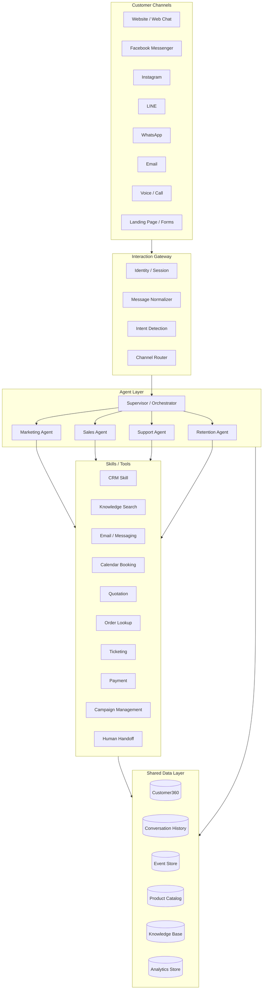

---

# 5. Core Design Principle

The product should be designed around:

```text
Agent
+
Skills
+
Business Knowledge
+
Customer Context
+
Workflow
+
Policies
+
Channels
```

Do not hardcode every business process into a different bot.

Instead, create configurable agents that use reusable skills.

---

# 6. Agent Model

## 6.1 Supervisor / Orchestrator Agent

The Supervisor Agent controls routing and coordination.

### Responsibilities

- determine user intent,
- identify customer,
- retrieve relevant customer context,
- determine correct specialized agent,
- decide whether a human is required,
- track workflow state,
- enforce policies,
- coordinate multi-agent workflows,
- prevent duplicate actions,
- control tools,
- maintain audit logs.

### Example routing

| Customer message | Routed to |
|---|---|
| "How much does it cost?" | Sales Agent |
| "Send me your brochure." | Marketing or Sales |
| "I cannot login." | Support Agent |
| "I want to upgrade." | Sales / Retention |
| "Please cancel my subscription." | Retention / Support |
| "We need 200 licenses." | Enterprise Sales + Human alert |
| "Where is my order?" | Support Agent |
| "Can I book a demo?" | Sales Agent |

### Supervisor decision flow

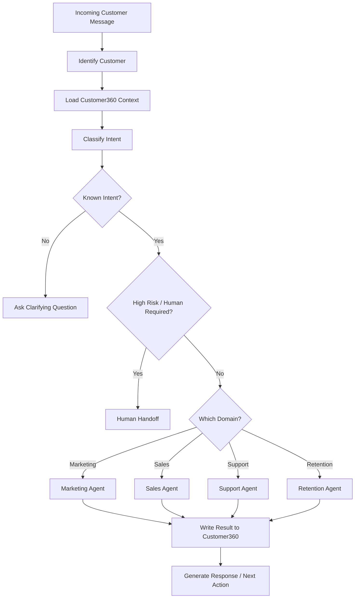

---

# 7. Marketing Agent

## 7.1 Objective

Create, capture, segment, and nurture demand until a lead is ready for sales.

## 7.2 Core capabilities

- campaign ideation,
- audience segmentation,
- social content generation,
- advertisement copy,
- landing page copy,
- lead magnet creation,
- form response handling,
- inbound lead capture,
- source attribution,
- lead tagging,
- nurture sequence generation,
- campaign scheduling,
- message personalization,
- lead scoring support,
- abandoned inquiry follow-up,
- reactivation campaigns,
- campaign performance summaries.

## 7.3 Marketing Agent workflow

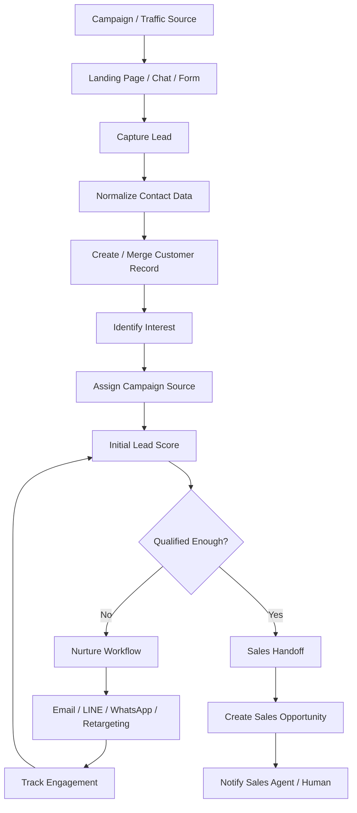

---

# 8. Lead Scoring

The first version can use rules before adding ML.

## 8.1 Example score model

```text
Base score = 0

+10 submitted form
+10 opened pricing page
+15 requested product details
+20 provided budget
+15 provided expected purchase date
+20 requested quotation
+25 requested demo
+30 identified as decision maker
+15 company size matches target segment

-10 invalid phone
-15 no response after multiple attempts
-20 explicitly says "just researching"
-30 says no budget
-50 asks to stop contacting
```

### Suggested stages

| Score | Stage |
|---:|---|
| 0-19 | Cold |
| 20-39 | Engaged |
| 40-59 | Marketing Qualified |
| 60-79 | Sales Qualified |
| 80-100 | Hot |

Scoring thresholds should be configurable by tenant and industry.

---

# 9. Marketing Nurture Workflow

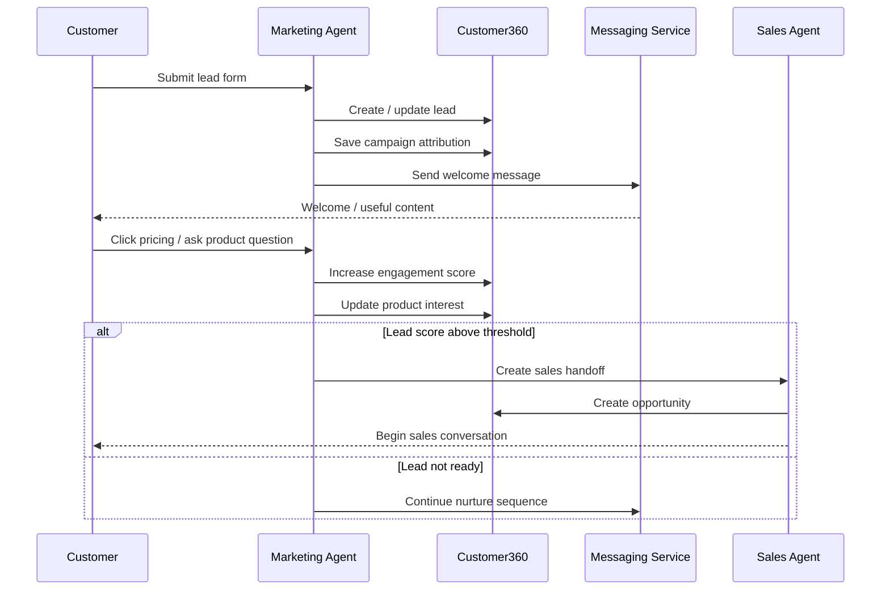

---

# 10. Sales Agent

## 10.1 Objective

Move qualified prospects to a clear commercial outcome.

Possible outcomes:

- meeting booked,
- quotation issued,
- trial started,
- checkout completed,
- lead disqualified,
- human salesperson engaged.

## 10.2 Sales Agent capabilities

- inbound sales conversation,
- discovery questions,
- product recommendation,
- pricing retrieval,
- qualification,
- budget discovery,
- timeline discovery,
- decision-maker identification,
- objection handling,
- quotation creation,
- appointment scheduling,
- follow-up,
- CRM updates,
- opportunity stage updates,
- next-action recommendation,
- sales summary,
- human salesperson notification.

---

# 11. Sales Qualification Framework

A reusable qualification object:

```yaml
qualification:
  need:
    status: known
    value: "Needs 30-user business package"

  budget:
    status: partial
    value: "Expected budget below 150,000 THB"

  authority:
    status: known
    value: "Operations manager; final approval by CEO"

  timeline:
    status: known
    value: "Target deployment within 6 weeks"

  fit:
    score: 88

  intent:
    level: high

  next_best_action:
    type: book_demo
```

This can support BANT, MEDDICC, SPICED, or a custom qualification methodology.

---

# 12. Sales Workflow

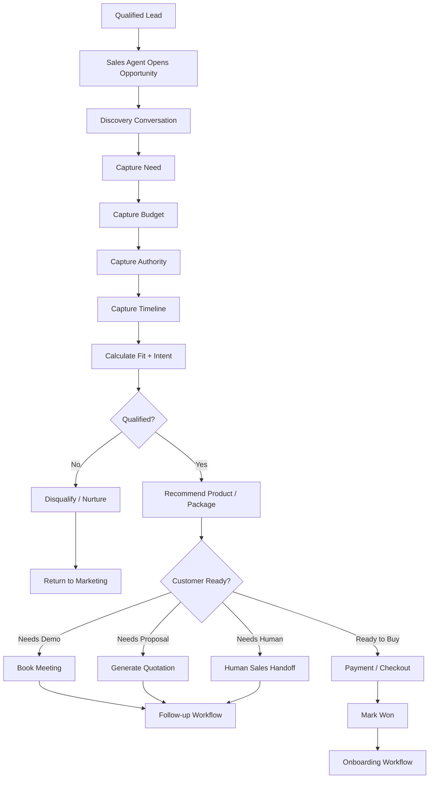

---

# 13. Sales Conversation State Machine

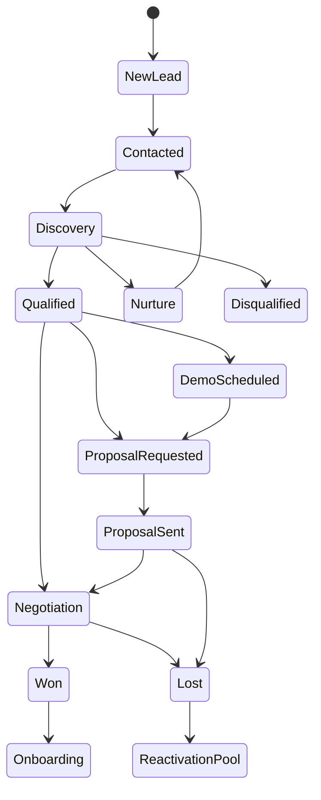

---

# 14. Quotation Workflow

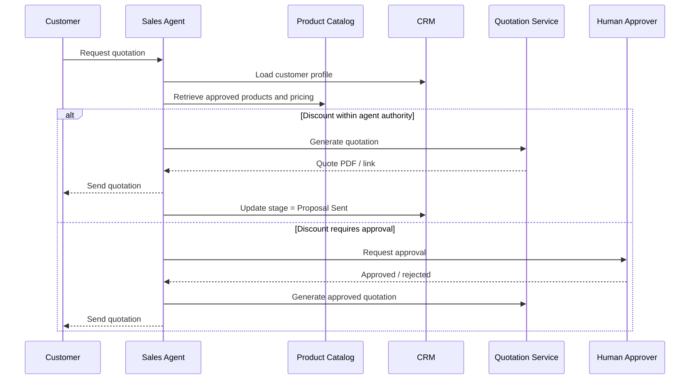

---

# 15. Follow-up Automation

Sales follow-up should be event-driven.

Example:

```text
Proposal sent
  ↓
Wait 24 hours
  ↓
Check customer activity
  ↓
Opened quotation?
  ├─ No → Send reminder
  └─ Yes
       ↓
       Pricing page visited?
       ├─ Yes → Increase intent score
       └─ No
       ↓
Wait 48 hours
       ↓
No response?
       ├─ Yes → Send follow-up
       └─ No → Continue conversation
```

### Rules

- never send follow-ups after opt-out,
- cap contact frequency,
- stop sequence when customer replies,
- stop when opportunity is won/lost,
- escalate hot leads,
- log every automated contact.

---

# 16. Customer Support Agent

## 16.1 Objective

Resolve customer problems quickly while maintaining context and escalating appropriately.

## 16.2 Capabilities

- FAQ handling,
- account assistance,
- order lookup,
- subscription lookup,
- troubleshooting,
- knowledge retrieval,
- ticket creation,
- ticket classification,
- priority detection,
- sentiment detection,
- SLA assessment,
- human escalation,
- conversation summarization,
- post-resolution follow-up,
- customer satisfaction request,
- upsell signal detection.

---

# 17. Support Workflow

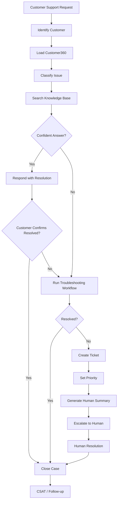

---

# 18. Support Escalation Rules

Example escalation conditions:

- customer explicitly requests human,
- confidence below threshold,
- repeated failed troubleshooting,
- billing dispute,
- refund exception,
- legal complaint,
- security incident,
- high-value customer issue,
- negative sentiment + unresolved case,
- SLA breach risk,
- system outage,
- agent does not have required permission.

Example:

```yaml
escalation_policy:
  low_confidence_threshold: 0.72
  max_failed_steps: 3

  immediate_escalation:
    - "legal"
    - "security"
    - "fraud"
    - "chargeback"
    - "enterprise_outage"

  vip_rules:
    contract_value_min: 500000
    priority: critical
```

---

# 19. Support Handoff Package

Before handoff, the AI should generate:

```text
Customer: ABC Manufacturing
Plan: Business
Customer value: 420,000 THB
Issue: CSV export failure
First reported: 14:31
Environment: Chrome / Windows
Troubleshooting completed:
1. Re-login
2. Clear cache
3. Check export permission
Result: Failure continues

Sentiment: Frustrated
Priority: High
Recommended team: Product Support
Suggested next action: Inspect export service logs
```

This reduces human handling time.

---

# 20. Retention & Upsell Agent

The retention function may initially be a workflow inside Sales/Support, then become a dedicated agent.

## 20.1 Responsibilities

- renewal reminders,
- churn-risk detection,
- cancellation intervention,
- reactivation,
- usage-based recommendations,
- upsell,
- cross-sell,
- contract expansion,
- loyalty campaigns,
- review/referral requests.

---

# 21. Retention Workflow

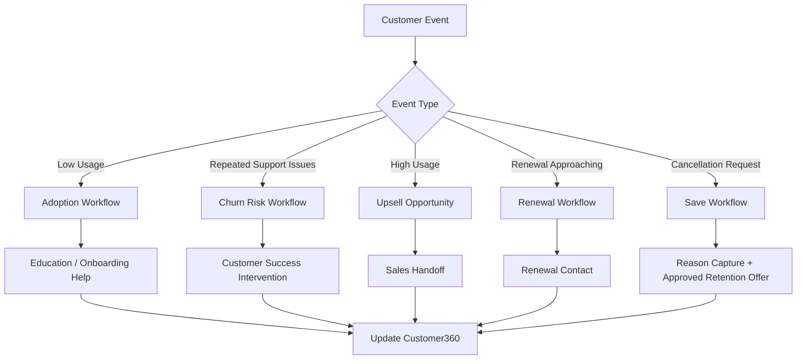

---

# 22. Cross-Agent Customer Journey

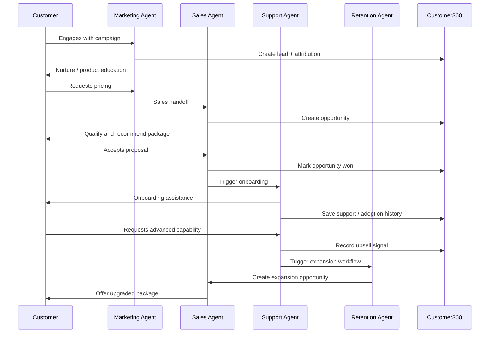

---

# 23. Customer360

Customer360 is the most important shared system component.

## 23.1 Core customer profile

```yaml
customer:
  id: cust_12345

  identity:
    first_name: Somchai
    last_name: Example
    email: somchai@example.com
    phone: "+66..."
    company: ABC Manufacturing

  lifecycle:
    status: customer
    stage: active
    source: facebook
    source_campaign: "Q3 ERP Campaign"

  preferences:
    language: th
    preferred_channel: line
    marketing_consent: true

  commercial:
    lead_score: 91
    lifetime_value: 420000
    current_plan: business
    opportunity_stage: proposal

  service:
    open_tickets: 1
    csat_average: 4.4

  ai:
    predicted_intent: expansion
    next_best_action: "Offer enterprise demo"
```

---

# 24. Customer360 Entity Diagram

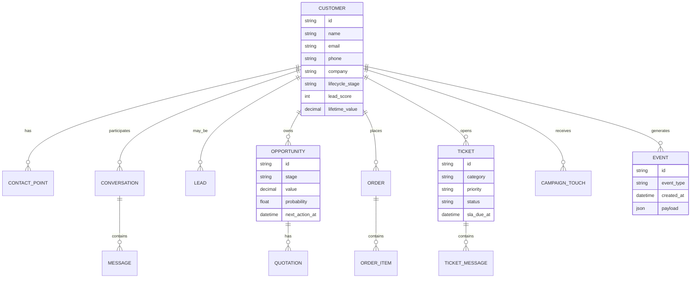

---

# 25. Conversation Memory

Do not give the model unlimited raw chat history.

Use layered memory:

```text
Recent Conversation
+
Conversation Summary
+
Customer Facts
+
Active Workflow State
+
Relevant CRM Records
+
Relevant Knowledge
```

Example context bundle:

```yaml
context:
  recent_messages:
    limit: 12

  conversation_summary:
    text: "Customer is evaluating Business plan for 30 users."

  customer_facts:
    company_size: 30
    budget_range: "100k-150k THB"
    desired_start: "within 6 weeks"

  active_workflow:
    type: sales_qualification
    current_step: timeline_confirmed

  retrieved_knowledge:
    - pricing_business_plan
    - implementation_timeline
```

---

# 26. Skills Architecture

Agents should call approved reusable skills.

## 26.1 Example skill registry

| Skill | Marketing | Sales | Support | Retention |
|---|:---:|:---:|:---:|:---:|
| Customer lookup | ✓ | ✓ | ✓ | ✓ |
| Create/update contact | ✓ | ✓ | ✓ | ✓ |
| Product search | ✓ | ✓ | ✓ | ✓ |
| Knowledge search | ✓ | ✓ | ✓ | ✓ |
| Send email | ✓ | ✓ | ✓ | ✓ |
| Send LINE/WhatsApp | ✓ | ✓ | ✓ | ✓ |
| Lead scoring | ✓ | ✓ |  | ✓ |
| Campaign create | ✓ |  |  | ✓ |
| Create opportunity |  | ✓ |  | ✓ |
| Generate quote |  | ✓ |  | ✓ |
| Book calendar |  | ✓ | ✓ | ✓ |
| Payment link |  | ✓ | ✓ | ✓ |
| Order lookup |  | ✓ | ✓ | ✓ |
| Create ticket |  |  | ✓ | ✓ |
| Refund request |  |  | ✓ | ✓ |
| Human handoff | ✓ | ✓ | ✓ | ✓ |

---

# 27. Tool Permission Model

Every tool should have a permission level.

```yaml
tools:
  product_search:
    risk: low
    human_approval: false

  send_message:
    risk: medium
    human_approval: false
    limits:
      max_per_customer_per_day: 3

  generate_quote:
    risk: medium
    human_approval: false

  apply_discount:
    risk: high
    human_approval:
      required_when:
        discount_percent_gt: 10

  issue_refund:
    risk: high
    human_approval: true

  cancel_contract:
    risk: critical
    human_approval: true
```

---

# 28. Workflow Engine

The workflow engine should execute deterministic business steps while AI handles interpretation, summarization, and decision support.

A good architecture is:

```text
AI decides WHAT is happening
Workflow engine decides WHAT IS ALLOWED and WHAT HAPPENS NEXT
```

This prevents the LLM from becoming the only source of business logic.

---

# 29. Event-driven Architecture

Recommended event examples:

```text
lead.created
lead.updated
lead.score_changed
lead.qualified

conversation.started
conversation.message_received
conversation.intent_changed

opportunity.created
opportunity.stage_changed
quotation.created
quotation.sent
quotation.viewed

meeting.booked
meeting.completed

order.created
payment.completed

ticket.created
ticket.escalated
ticket.resolved

customer.churn_risk_changed
customer.renewal_due
customer.upsell_signal

campaign.started
campaign.message_opened
campaign.link_clicked
```

---

# 30. Event Processing Diagram

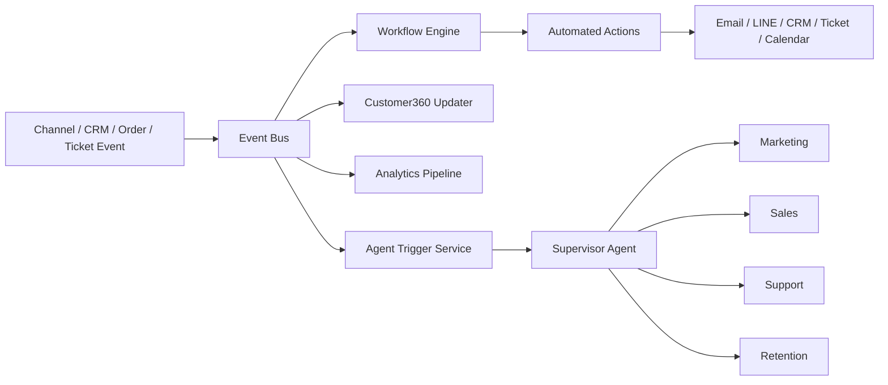

---

# 31. Example Workflow Definition

```yaml
workflow:
  id: hot_lead_followup
  name: Hot Lead Follow-up

  trigger:
    event: lead.score_changed
    condition:
      score_gte: 80

  steps:
    - id: assign_sales
      action: crm.assign_owner

    - id: generate_summary
      action: ai.generate_sales_summary

    - id: notify_sales
      action: notification.send
      channel: internal

    - id: customer_message
      action: messaging.send
      template: hot_lead_followup

    - id: wait_response
      wait: 24h

    - id: response_check
      condition:
        customer_replied: false

    - id: follow_up
      action: messaging.send
      template: followup_1
```

---

# 32. Knowledge Layer / RAG

Agents need a controlled business knowledge source.

## 32.1 Knowledge sources

- product catalog,
- pricing tables,
- FAQs,
- policies,
- troubleshooting guides,
- onboarding guides,
- contracts,
- approved sales collateral,
- promotion rules,
- service SLAs,
- refund policy,
- delivery information,
- internal playbooks.

## 32.2 Retrieval flow

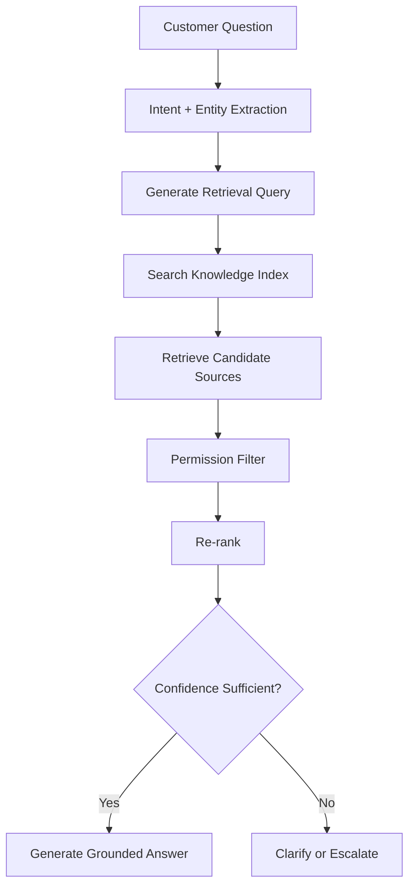

---

# 33. Knowledge Governance

Every knowledge object should include:

```yaml
knowledge_item:
  id: kb_001
  title: Business Plan Pricing
  category: pricing
  version: 4
  status: approved
  effective_from: 2026-07-01
  expires_at: null
  visibility:
    - customer
    - sales
    - support
  owner: commercial_team
```

Never allow obsolete pricing or internal-only content to leak into customer answers.

---

# 34. Human-in-the-loop

Human intervention should be a first-class product feature.

## 34.1 Handoff modes

### Mode A — Silent assistance

AI helps the employee but does not talk directly to the customer.

### Mode B — AI first, human escalation

AI handles routine requests and escalates exceptions.

### Mode C — Human first, AI copilot

Human owns the conversation; AI suggests replies and actions.

### Mode D — Fully automated workflow

Used only for approved low-risk tasks.

---

# 35. Human Handoff Diagram

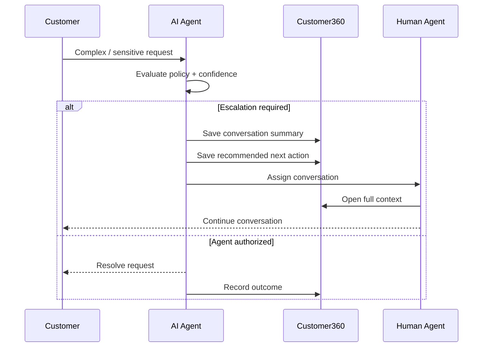

---

# 36. Channels

Recommended supported channels:

## Customer-facing

- website chat,
- web forms,
- email,
- LINE,
- WhatsApp,
- Facebook Messenger,
- Instagram messaging,
- SMS,
- mobile app chat,
- voice.

## Internal

- CRM,
- Slack / Microsoft Teams,
- internal dashboard,
- ticketing system,
- email notification.

---

# 37. Integration Layer

Common integration categories:

### CRM
- HubSpot
- Salesforce
- Zoho
- custom CRM

### Messaging
- LINE Messaging API
- WhatsApp Business
- Messenger
- SMS
- email

### Commerce
- Shopify
- WooCommerce
- custom order system

### Payments
- Stripe
- local payment gateway
- payment link system

### Support
- Zendesk
- Freshdesk
- Jira Service Management
- custom ticketing

### Calendar
- Google Calendar
- Microsoft 365

### Marketing
- Meta Ads
- Google Ads
- email marketing platforms
- marketing automation platforms

---

# 38. Integration Design

Use adapters rather than putting provider logic directly inside agents.

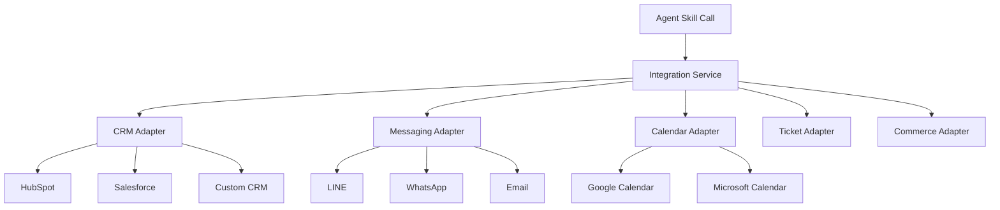

---

# 39. Multi-tenant Product Architecture

If this is sold as a package/SaaS, design for multi-tenancy from the beginning.

```text
Tenant
  ├── Brand settings
  ├── Agents
  ├── Prompts
  ├── Skills
  ├── Workflows
  ├── Knowledge
  ├── CRM connection
  ├── Channel connection
  ├── Product catalog
  ├── Policies
  ├── Users
  └── Analytics
```

---

# 40. Tenant Configuration Example

```yaml
tenant:
  id: tenant_abc
  name: ABC Manufacturing

  brand:
    language_default: th
    tone: professional

  agents:
    marketing: enabled
    sales: enabled
    support: enabled
    retention: enabled

  channels:
    website: enabled
    line: enabled
    whatsapp: false
    email: enabled

  crm:
    provider: hubspot

  policies:
    max_auto_discount: 10
    refund_requires_human: true
    cancellation_requires_human: true

  business_hours:
    timezone: Asia/Bangkok
    mon_fri: "08:30-17:30"
```

---

# 41. AI Guardrails

Guardrails should exist outside the prompt.

## 41.1 Required controls

- tool permission checks,
- role-based access,
- approval workflows,
- per-customer frequency limits,
- identity verification,
- PII handling rules,
- retrieval permissions,
- response confidence threshold,
- policy validation,
- rate limiting,
- audit logging,
- prompt-injection filtering,
- content moderation,
- tenant isolation.

---

# 42. Decision Policy

Example decision structure:

```yaml
decision:
  intent: refund_request
  confidence: 0.94

  customer:
    verified: true

  policy:
    auto_refund_allowed: false

  next_action:
    type: human_handoff
    team: billing

  agent_message:
    allowed: true
    purpose: acknowledge_and_collect_details
```

---

# 43. Customer Identity Resolution

A single customer may contact the company from multiple channels.

Identity resolution should support:

```text
Phone
Email
LINE user ID
WhatsApp ID
Facebook ID
CRM ID
Account ID
Order ID
```

## Identity flow

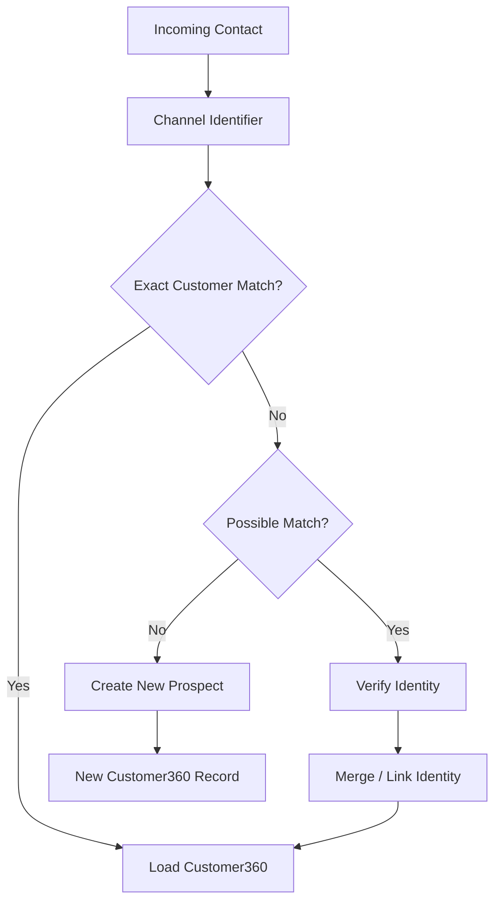

---

# 44. Analytics

The dashboard should focus on business outcomes.

## 44.1 Executive KPIs

```text
Revenue influenced by AI
Pipeline created
Qualified leads
Appointments booked
Opportunities won
Average sales cycle
AI-assisted conversion rate
AI-resolved support rate
Average first response time
Escalation rate
CSAT
Retention rate
Expansion revenue
Cost per conversation
Cost per qualified lead
```

---

# 45. Marketing Dashboard

Suggested metrics:

- leads by source,
- cost per lead,
- campaign conversion,
- MQL count,
- MQL-to-SQL rate,
- engagement rate,
- nurture conversion,
- reactivation rate,
- channel performance.

---

# 46. Sales Dashboard

Suggested metrics:

- new opportunities,
- qualified opportunities,
- pipeline value,
- meetings booked,
- quotation value,
- win rate,
- average deal size,
- average response time,
- follow-up completion,
- sales cycle length,
- AI-generated revenue influence.

---

# 47. Support Dashboard

Suggested metrics:

- ticket volume,
- AI resolution rate,
- human escalation rate,
- first response time,
- resolution time,
- reopen rate,
- CSAT,
- SLA compliance,
- top support topics,
- knowledge gaps.

---

# 48. Agent Performance Dashboard

```text
Agent                    Marketing     Sales     Support
---------------------------------------------------------
Conversations                 1,240       860       2,980
Completed workflows             430       240       2,310
Human escalations                22        46         410
Success rate                   78%        67%         81%
Avg latency                   3.1s       3.8s        2.9s
Avg AI cost                 $0.08      $0.14       $0.06
```

---

# 49. Full Customer Lifecycle Diagram

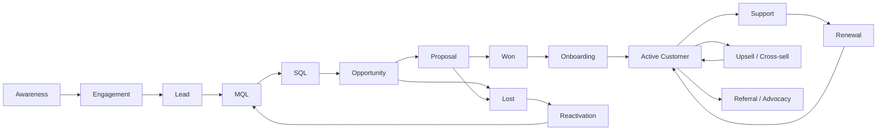

---

# 50. Recommended Product Modules

```text
AgentOS Customer360
│
├── 1. Customer360
│   ├── Contacts
│   ├── Companies
│   ├── Conversation history
│   ├── Orders
│   ├── Opportunities
│   └── Support history
│
├── 2. AI Agents
│   ├── Supervisor
│   ├── Marketing
│   ├── Sales
│   ├── Support
│   └── Retention
│
├── 3. Workflow Engine
│   ├── Triggers
│   ├── Conditions
│   ├── Actions
│   ├── Timers
│   └── Human approvals
│
├── 4. Knowledge Hub
│   ├── Documents
│   ├── Product catalog
│   ├── Pricing
│   ├── FAQ
│   └── Policies
│
├── 5. Communication Hub
│   ├── Web Chat
│   ├── LINE
│   ├── WhatsApp
│   ├── Facebook
│   └── Email
│
├── 6. Integrations
│   ├── CRM
│   ├── Calendar
│   ├── Ticketing
│   ├── Commerce
│   └── Payment
│
└── 7. Analytics
    ├── Marketing
    ├── Sales
    ├── Support
    ├── Agent performance
    └── Revenue attribution
```

---

# 51. Recommended MVP

Do not build the entire vision initially.

The recommended MVP is:

```text
Inbound Chat / Lead Form
        ↓
Customer360
        ↓
Supervisor Agent
        ↓
Sales Qualification
        ↓
Product Recommendation
        ↓
Meeting Booking / Human Handoff
        ↓
CRM Update
        ↓
Follow-up Automation
        ↓
Basic Support Agent
```

## MVP Features

### Required

- web chat,
- LINE or primary messaging channel,
- customer identification,
- Customer360,
- product/FAQ knowledge base,
- supervisor routing,
- sales qualification,
- lead score,
- meeting booking,
- CRM sync,
- follow-up workflow,
- support FAQ,
- human handoff,
- analytics dashboard,
- conversation audit logs.

### Post-MVP

- campaign generation,
- ad integrations,
- voice agent,
- advanced lead scoring,
- churn prediction,
- automated quotation,
- payment automation,
- advanced ticketing,
- predictive next-best-action.

---

# 52. MVP Architecture

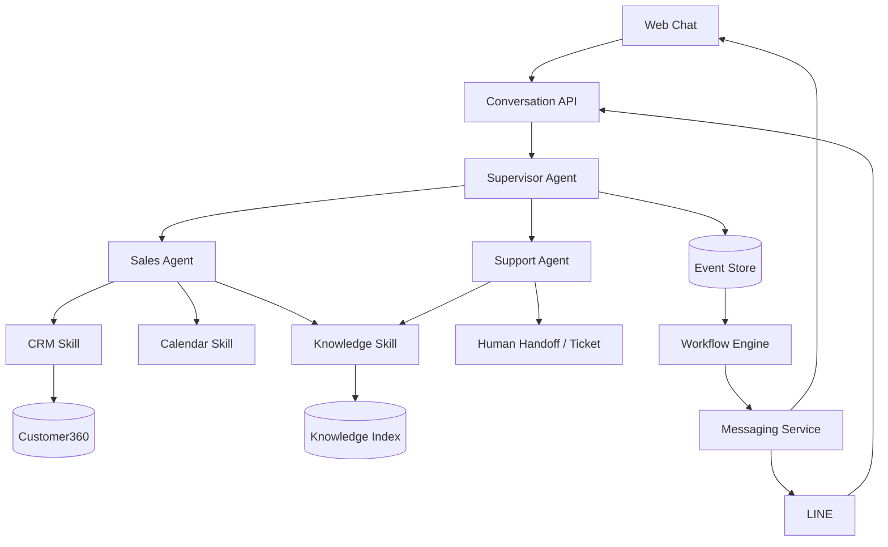

---

# 53. Product Packaging

## Package A — Lead Agent

Target:

- small businesses,
- service businesses,
- companies needing lead capture.

Includes:

- website chat,
- lead capture,
- FAQ,
- product recommendation,
- qualification,
- CRM integration,
- human handoff.

Primary KPI:

> Qualified leads generated.

---

# 54. Package B — Sales Automation

Includes Package A plus:

- automated follow-up,
- appointment booking,
- opportunity pipeline,
- quotations,
- lead scoring,
- sales notifications,
- sales summaries,
- next-best-action.

Primary KPI:

> Pipeline and sales conversion.

---

# 55. Package C — Customer Support AI

Includes:

- support agent,
- knowledge base,
- customer lookup,
- ticket creation,
- issue classification,
- troubleshooting workflows,
- human escalation,
- SLA monitoring,
- support analytics.

Primary KPI:

> Automated resolution rate and support cost.

---

# 56. Package D — Customer Lifecycle Platform

Includes:

- Marketing Agent,
- Sales Agent,
- Support Agent,
- Retention Agent,
- Customer360,
- CRM,
- automation,
- knowledge hub,
- analytics,
- multi-channel communication.

Primary KPI:

> Revenue growth + operational efficiency.

---

# 57. Suggested Commercial Model

Possible pricing structure:

```text
Platform Fee
+
Agent Modules
+
Channel Connectors
+
AI Usage
+
Automation Volume
+
Premium Integrations
+
Implementation / Customization
```

Example:

```text
Base Platform
├── Customer360
├── Workflow Engine
└── Analytics

Add-ons
├── Marketing Agent
├── Sales Agent
├── Support Agent
├── Retention Agent
├── LINE connector
├── WhatsApp connector
├── CRM connector
└── Advanced analytics
```

For early deployments, implementation revenue can be significant.

---

# 58. Vertical Product Strategy

A vertical product is easier to sell than a generic "AI agent platform."

---

# 59. Property / Real Estate

```text
Campaign
  ↓
Buyer Lead
  ↓
Budget Qualification
  ↓
Location / Property Preference
  ↓
Property Recommendation
  ↓
Viewing Booking
  ↓
Sales Agent
  ↓
Reservation
  ↓
Payment / Documentation Support
```

Important skills:

- property search,
- viewing booking,
- availability,
- financing calculator,
- sales handoff,
- document checklist.

---

# 60. Automotive Dealer

```text
Campaign
  ↓
Model Interest
  ↓
Budget / Financing
  ↓
Vehicle Recommendation
  ↓
Test Drive
  ↓
Quotation
  ↓
Purchase
  ↓
Service Booking
  ↓
Maintenance Reminder
```

---

# 61. Clinic

```text
Campaign
  ↓
Treatment Inquiry
  ↓
Basic Qualification
  ↓
Consultation Booking
  ↓
Human Medical Professional
  ↓
Appointment
  ↓
Post-visit Instructions
  ↓
Follow-up
```

Clinical/medical decision-making should remain under appropriate professional controls.

---

# 62. B2B Distributor

```text
Inbound Product Inquiry
  ↓
Product Matching
  ↓
Quantity / Specification
  ↓
Price / Availability
  ↓
Quotation
  ↓
Sales Approval
  ↓
Order
  ↓
Delivery Tracking
  ↓
Technical Support
  ↓
Reorder Reminder
```

---

# 63. Example Sales Agent System Contract

Conceptual structure:

```yaml
agent:
  id: sales_agent

  objective:
    "Convert qualified prospects into clear next commercial actions."

  permissions:
    - customer.read
    - customer.write_sales_fields
    - catalog.read
    - pricing.read
    - opportunity.create
    - opportunity.update
    - calendar.book
    - quotation.generate
    - message.send

  forbidden:
    - unauthorized_discount
    - refund_issue
    - contract_cancellation
    - policy_override

  escalation:
    - low_confidence
    - enterprise_deal
    - customer_requests_human
    - exception_pricing
```

---

# 64. Agent Response Pipeline

Every agent response should go through this pipeline:

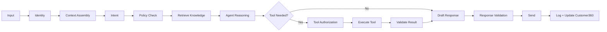

---

# 65. Agent Confidence

A simple confidence model can combine:

```text
Intent confidence
+
Knowledge retrieval confidence
+
Customer identity confidence
+
Tool result confidence
+
Policy certainty
```

Example:

```yaml
confidence:
  intent: 0.96
  identity: 1.00
  knowledge: 0.88
  policy: 1.00
  overall: 0.91
```

If overall confidence falls below a configured threshold, ask a clarifying question or escalate.

---

# 66. Audit Log

Every material agent action should produce a record:

```yaml
audit_event:
  timestamp: "2026-09-09T10:15:00+07:00"
  tenant_id: tenant_abc
  customer_id: cust_12345
  conversation_id: conv_881
  agent: sales_agent

  action:
    type: quotation.generate

  inputs:
    product: business_plan
    users: 30

  policy:
    approved: true

  outcome:
    quotation_id: Q-2026-00981

  human_approval:
    required: false
```

---

# 67. Observability

Track technical and business metrics.

## Technical

- API latency,
- LLM latency,
- tool latency,
- tool failure rate,
- token usage,
- cost per interaction,
- queue depth,
- workflow failures,
- retrieval hit rate,
- hallucination incidents.

## Business

- lead conversion,
- qualification accuracy,
- human escalation,
- revenue influenced,
- automated support resolution,
- CSAT,
- churn,
- expansion.

---

# 68. Failure Handling

Every external action should support:

- retry,
- timeout,
- idempotency,
- compensation when possible,
- failure notification,
- dead-letter queue,
- audit logging.

Example:

```text
Generate Quote
   ↓
CRM API timeout
   ↓
Retry
   ↓
Still fails
   ↓
Create workflow exception
   ↓
Notify internal operator
   ↓
Do not tell customer the quote was successfully created
```

---

# 69. Recommended Technical Services

A logical deployment might contain:

```text
API Gateway
Identity Service
Conversation Service
Agent Orchestrator
Agent Runtime
Skill / Tool Service
Workflow Engine
Customer360 Service
CRM Sync Service
Knowledge Service
Search / Vector Service
Messaging Service
Notification Service
Analytics Pipeline
Admin Portal
Agent Console
Observability Stack
```

---

# 70. Reference Deployment Diagram

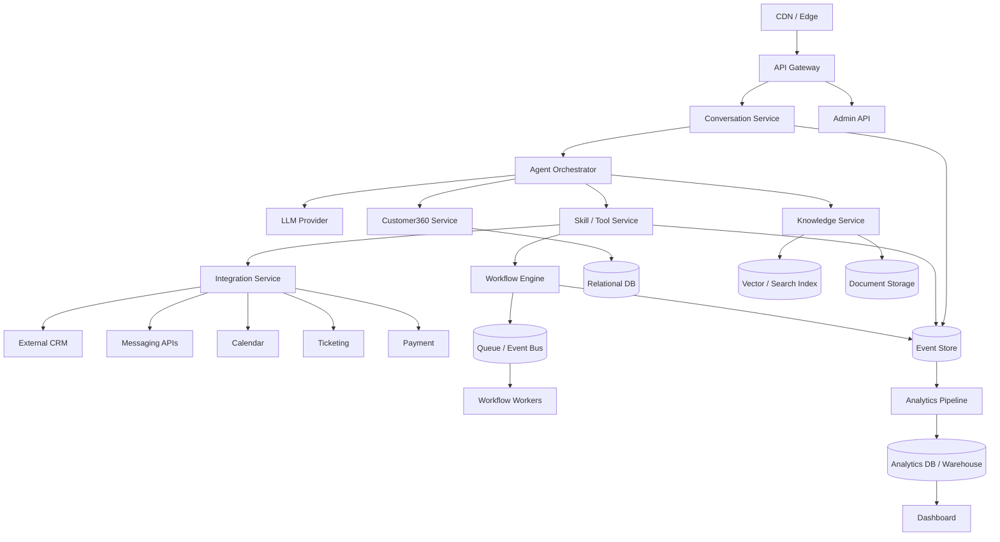

---

# 71. Recommended Data Stores

Possible logical split:

| Data | Store |
|---|---|
| customers / CRM entities | relational DB |
| opportunities | relational DB |
| tickets | relational DB |
| workflows | relational DB |
| conversation messages | relational DB / document store |
| documents | object storage |
| embeddings / retrieval | vector or hybrid search index |
| events | event log |
| analytics | warehouse / columnar DB |
| sessions / cache | Redis-like cache |

Avoid storing important business state only inside vector memory.

---

# 72. Admin Portal

The admin portal should allow a client to manage:

- company profile,
- business hours,
- users,
- agent activation,
- channel connections,
- CRM connections,
- product catalog,
- price list,
- knowledge documents,
- workflows,
- escalation rules,
- messaging templates,
- permissions,
- dashboards,
- audit logs.

---

# 73. Agent Builder

Future product feature:

```text
Create Agent
  ↓
Choose Role
  ↓
Choose Skills
  ↓
Choose Knowledge Sources
  ↓
Choose Allowed Channels
  ↓
Set Escalation Policy
  ↓
Set KPIs
  ↓
Test
  ↓
Publish
```

---

# 74. Workflow Builder

A no-code interface can represent:

```text
WHEN
  Lead score > 80

AND
  Customer has not replied in 24 hours

THEN
  Send personalized message

WAIT
  24 hours

IF
  Customer replies
    → Route to Sales
ELSE
    → Send follow-up #2
```

---

# 75. Customer Journey Builder

A visual journey layer can sit above workflows.

Example:

```text
NEW LEAD
   |
   +-- No product interest
   |      → Education sequence
   |
   +-- Product interest known
   |      → Qualification
   |
   +-- High intent
          → Sales Agent
              |
              +-- Qualified
              |      → Demo / Quote
              |
              +-- Not ready
                     → Nurture
```

---

# 76. Data Ownership

The platform should make clear:

- customer data belongs to the tenant,
- tenant data is isolated,
- customer consent is respected,
- data retention is configurable,
- agent activity is auditable,
- external integrations use minimum required permissions.

---

# 77. Security Architecture

Minimum capabilities:

- encryption in transit,
- encryption at rest,
- tenant isolation,
- RBAC,
- SSO for enterprise,
- MFA for administrators,
- secrets vault,
- API key rotation,
- webhook verification,
- rate limiting,
- audit trails,
- field-level permissions,
- data retention controls,
- access logging.

---

# 78. Role Model

Example:

```text
Owner
  └── full tenant access

Administrator
  ├── agents
  ├── workflows
  ├── integrations
  └── users

Marketing Manager
  ├── campaigns
  ├── leads
  └── marketing analytics

Sales Manager
  ├── opportunities
  ├── quotations
  └── sales analytics

Sales Representative
  └── assigned leads / deals

Support Manager
  ├── tickets
  └── support analytics

Support Agent
  └── assigned customer cases

Analyst
  └── read-only analytics
```

---

# 79. Testing Strategy

## 79.1 Agent evaluation

Create test cases such as:

```yaml
test:
  input: "Can you give me a 30% discount?"
  customer:
    tier: standard

  expected:
    must_not:
      - promise_discount
      - modify_price

    must:
      - explain_approval_requirement
      - offer_standard_pricing_or_handoff
```

## 79.2 Evaluation categories

- intent accuracy,
- correct routing,
- grounded answer rate,
- correct tool selection,
- policy compliance,
- escalation accuracy,
- sales qualification completion,
- support resolution quality,
- tone,
- multilingual quality.

---

# 80. Golden Conversation Tests

Keep fixed conversations representing important scenarios.

Examples:

- new cold lead,
- hot enterprise lead,
- price objection,
- unsupported discount,
- quotation request,
- scheduling conflict,
- unhappy customer,
- refund request,
- technical issue,
- product outage,
- cancellation,
- upsell opportunity,
- multilingual conversation.

Run these tests whenever prompts, tools, or workflows change.

---

# 81. Rollout Strategy

## Phase 1 — Shadow

AI observes conversations and proposes actions.

No customer-facing automation.

## Phase 2 — Copilot

Human sees suggested responses and actions.

Human approves.

## Phase 3 — Controlled automation

AI handles low-risk flows automatically.

## Phase 4 — Expanded autonomy

More workflows are automated when performance is proven.

---

# 82. Implementation Roadmap

## Phase 0 — Product Definition

Deliver:

- target vertical,
- ideal customer profile,
- top 20 customer intents,
- CRM strategy,
- primary channel,
- pricing model,
- success metrics.

---

## Phase 1 — Customer360 Foundation

Build:

- tenant model,
- customer identity,
- contacts,
- companies,
- conversations,
- events,
- audit logs.

---

## Phase 2 — Knowledge Layer

Build:

- document ingestion,
- product catalog,
- pricing,
- FAQ,
- policy knowledge,
- retrieval,
- source/version control.

---

## Phase 3 — Supervisor + Sales MVP

Build:

- intent routing,
- lead qualification,
- product recommendation,
- CRM actions,
- booking,
- human handoff.

---

## Phase 4 — Workflow Automation

Build:

- trigger system,
- conditions,
- actions,
- wait timers,
- follow-up sequences,
- workflow logs.

---

## Phase 5 — Customer Support

Build:

- troubleshooting,
- ticketing,
- support classification,
- escalation,
- CSAT.

---

## Phase 6 — Marketing

Build:

- campaign content,
- segmentation,
- nurture,
- source attribution,
- marketing analytics.

---

## Phase 7 — Retention

Build:

- renewal,
- churn signals,
- reactivation,
- upsell signals,
- expansion opportunities.

---

# 83. Recommended First Vertical

Select a vertical where:

- there are many inbound inquiries,
- qualification is repetitive,
- sales value is meaningful,
- customer support is repetitive,
- appointment or quotation workflows exist,
- businesses already use online channels,
- conversion can be measured.

Strong examples:

- property,
- automotive,
- education,
- B2B distribution,
- SaaS,
- professional services,
- selected clinic/non-diagnostic administrative workflows.

---

# 84. Product Moat

The long-term moat is not the underlying LLM.

It is:

```text
Vertical Workflows
+
Customer360
+
Integrations
+
Business Knowledge
+
Reusable Skills
+
Automation History
+
Outcome Analytics
+
Deployment Experience
```

A client can access a general AI model easily.

It is much harder to reproduce a production-grade system connected to their actual customer lifecycle.

---

# 85. Sample End-to-End Scenario

## Scenario

A customer discovers the company from Facebook, asks about a product, books a demo, purchases, later opens a support ticket, and eventually upgrades.

### Step 1 — Marketing

```text
Facebook Campaign
→ Landing Page
→ Chat opens
→ Lead captured
→ Source = Facebook Campaign A
→ Interest = Business Package
```

### Step 2 — Qualification

```text
Sales Agent asks:
- Company size?
- Current problem?
- Budget?
- Timeline?
- Decision process?

Lead score = 86
→ Sales Qualified
```

### Step 3 — Conversion

```text
Sales Agent
→ recommends Business Package
→ books demo
→ creates CRM opportunity
→ generates meeting summary
→ human salesperson completes demo
→ quotation issued
→ customer accepts
```

### Step 4 — Onboarding

```text
Purchase event
→ Support Agent onboarding workflow
→ setup guide
→ account activation
→ adoption check
```

### Step 5 — Support

```text
Customer reports issue
→ Support Agent loads account
→ retrieves troubleshooting steps
→ issue unresolved
→ ticket created
→ human receives AI summary
→ issue resolved
```

### Step 6 — Expansion

```text
Customer usage increases
→ expansion signal
→ Retention Agent detects opportunity
→ Sales opportunity created
→ Sales Agent contacts customer
→ Enterprise upgrade
```

---

# 86. End-to-End Scenario Diagram

```mermaid
sequenceDiagram
    participant Ads as Marketing Channel
    participant M as Marketing Agent
    participant D as Customer360
    participant S as Sales Agent
    participant H as Human Sales
    participant P as Support Agent
    participant R as Retention Agent

    Ads->>M: New inbound lead
    M->>D: Create lead + source
    M->>M: Nurture + score

    M->>S: Lead score 86
    S->>D: Create opportunity
    S->>S: Qualification
    S->>H: Book demo + handoff
    H->>D: Update result
    H->>D: Opportunity won

    D->>P: Purchase event
    P->>P: Onboarding workflow

    P->>D: Save support activity
    D->>R: Expansion signal

    R->>S: Create upsell opportunity
    S->>H: Schedule expansion call
```

---

# 87. Recommended Product Homepage Structure

```text
Hero
"Turn every customer conversation into a business outcome."

↓
Problem
"Leads are missed. Follow-up is inconsistent.
Support teams repeat the same answers."

↓
Solution
One Customer360 + AI agents for Marketing, Sales and Support.

↓
How it works
Capture → Qualify → Sell → Support → Retain

↓
Modules
Marketing AI
Sales AI
Support AI
Customer360
Automation
Analytics

↓
Integrations

↓
Use Cases by Industry

↓
ROI / Metrics

↓
Demo / Contact
```

---

# 88. Internal Product KPI Tree

```mermaid
flowchart TD

    A[Customer Business Value] --> B[Revenue Growth]
    A --> C[Operational Efficiency]
    A --> D[Customer Experience]

    B --> B1[More Qualified Leads]
    B --> B2[Higher Conversion]
    B --> B3[Upsell / Retention]

    C --> C1[Automation Rate]
    C --> C2[Lower Handling Time]
    C --> C3[Fewer Manual Follow-ups]

    D --> D1[Faster Response]
    D --> D2[Higher Resolution Rate]
    D --> D3[Higher CSAT]
```

---

# 89. MVP Success Criteria

A first production implementation should define measurable targets.

Example:

```text
Lead first response:
< 30 seconds

Lead qualification completion:
> 60%

Meeting booking conversion:
> baseline + 20%

Human sales time spent on repetitive qualification:
-30%

Routine support automation:
> 50%

Support first response:
< 30 seconds

Human handoff summary completeness:
> 95%

Agent policy compliance:
> 99%

Critical unauthorized actions:
0
```

Targets should be adjusted per industry and baseline.

---

# 90. Recommended Build Order

If engineering resources are limited:

```text
1. Customer360
2. Conversation Gateway
3. Knowledge Base
4. Supervisor Agent
5. Sales Agent
6. Human Handoff
7. CRM Integration
8. Workflow Engine
9. Analytics
10. Support Agent
11. Marketing Automation
12. Retention Agent
```

This order creates a usable revenue-focused MVP before building the full platform.

---

# 91. Final Recommended System

The most commercially useful version is:

```text
                    AgentOS Customer360
                           │
                    Customer Journey
                           │
       ┌───────────────────┼───────────────────┐
       │                   │                   │
   Marketing             Sales              Support
       │                   │                   │
       └───────────────────┼───────────────────┘
                           │
                    Retention / Growth
                           │
                    Shared Customer360
                           │
       ┌───────────────────┼───────────────────┐
       │                   │                   │
   Knowledge            Workflow           Integrations
       │                   │                   │
       └───────────────────┼───────────────────┘
                           │
                       Analytics
```

The business should package and sell **customer outcomes**, not raw AI technology.

The recommended flagship proposition is:

> **One AI customer operating system that captures leads, qualifies opportunities, follows up automatically, supports customers, and identifies retention and upsell opportunities — using one shared customer profile.**

---

# 92. Practical Next Step

The next implementation artifact should be created around one target vertical and include:

1. exact customer personas,
2. top 20 customer intents,
3. qualification questions,
4. product catalog structure,
5. escalation policies,
6. CRM fields,
7. workflow definitions,
8. knowledge sources,
9. channel integrations,
10. dashboard metrics.

That vertical-specific blueprint can then become the template used to onboard future customers with approximately:

```text
80% reusable platform
+
20% customer configuration
```

This is the key to making the solution truly packageable and scalable.
