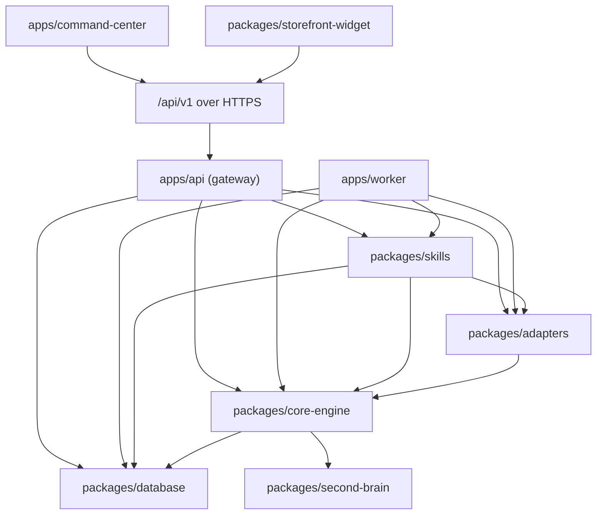

# Project Structure & Monorepo Architecture

> **BLUEPRINT STATUS — Gate P0 target design, not an inventory of existing files.**
> This document specifies the **target monorepo layout** for the Gate P0 (Foundation) deliverable in SRS
> AI-REV-SRS-001 §24. No directory, package, manifest (`package.json`, `pnpm-workspace.yaml`, `turbo.json`),
> TypeScript config, seed script, or knowledge file listed below currently exists in this documentation-only
> repository. Every tree entry and configuration snippet is a **blueprint to be created later**, and no
> package manager, bundler, or build pipeline is installed or runnable here. Numeric latency, throughput,
> bundle-size, and retention figures are **provisional design targets pending ASM-002 (KPI baseline) and the
> NFR-009 benchmark**, not committed values.

## 1. Monorepo Directory Layout (pnpm Workspaces + Turborepo) — target blueprint

The target architecture is an enterprise monorepo managed with **pnpm workspaces** and **Turborepo** (the
platform "applies" the structure described below). The design enforces strict separation of concerns across
target runnable applications (`apps/`) and reusable, shared internal libraries (`packages/`).

```text
agent-solution/
├── .github/
│   └── workflows/
│       └── production-pipeline.yml   # Target CI pipeline (09 §4): static analysis, contract/
│                                     # migration/RLS rehearsal, adversarial, pilots, then build
│                                     # + scan the three named images (local load only — never publish)
├── apps/
│   ├── api/                          # High-throughput Core API Gateway (Node.js/Fastify)
│   │   ├── src/
│   │   │   ├── middleware/           # Tenant context injection, HMAC, auth, rate limiting
│   │   │   ├── routes/               # REST, SSE streaming, and webhook endpoints
│   │   │   │   ├── v1/
│   │   │   │   │   ├── chat.ts       # Real-time customer chat SSE stream
│   │   │   │   │   ├── events.ts     # Customer event ingestion (API-002)
│   │   │   │   │   ├── campaigns.ts  # Marketing campaign management
│   │   │   │   │   └── webhooks.ts   # API-003 webhook ingestion (Facebook, TikTok, Zalo, Email, SMS, Web/App Chat; LINE/WhatsApp as extensions)
│   │   │   │   └── index.ts
│   │   │   ├── server.ts             # Fastify server initialization & graceful shutdown
│   │   │   └── index.ts
│   │   ├── package.json
│   │   └── tsconfig.json
│   ├── worker/                       # Temporal / BullMQ Durable Workflow Worker
│   │   ├── src/
│   │   │   ├── workflows/            # Multi-step stateful workflows (Cart recovery, Escalations)
│   │   │   ├── activities/           # Concrete asynchronous skill executions
│   │   │   ├── queues/               # BullMQ queue processors and retry monitors
│   │   │   └── worker.ts             # Worker process runner
│   │   ├── package.json
│   │   └── tsconfig.json
│   └── command-center/               # Administrative Dashboard (Next.js 14 App Router)
│       ├── src/
│       │   ├── app/                  # App Router screens (SCR-001 through SCR-005)
│       │   │   ├── (auth)/           # Authentication & tenant login
│       │   │   ├── (dashboard)/
│       │   │   │   ├── analytics/    # SCR-001 Executive & SCR-002 Operational dashboards
│       │   │   │   ├── approvals/    # SCR-003 Human-in-the-loop Approval Queue (AUTH-4)
│       │   │   │   ├── takeover/     # SCR-005 Real-time Operator Chat Takeover
│       │   │   │   └── settings/     # Second Brain knowledge & tenant configuration
│       │   │   ├── layout.tsx
│       │   │   └── page.tsx
│       │   ├── components/           # shadcn/ui and custom high-density UI primitives
│       │   └── lib/                  # SWR/React Query hooks and WebSocket clients
│       ├── package.json
│       ├── tailwind.config.ts
│       └── tsconfig.json
├── packages/
│   ├── core-engine/                  # Central Orchestrator, Supervisor & State Machine
│   │   ├── src/
│   │   │   ├── orchestrator/         # 11-stage lifecycle coordinator
│   │   │   ├── supervisor/           # Multi-agent intent classification & routing (FR-ORC-001)
│   │   │   ├── policy/               # Policy Engine (BR-001..010) & authority verdicts (AUTH-0..3 grants; AUTH-4/AUTH-5 verdicts)
│   │   │   ├── memory/               # 5-Tier Memory Hierarchy manager
│   │   │   ├── agents/               # 13 Specialized Agent definitions (Marketing, Sales, Care)
│   │   │   └── contracts/            # Canonical domain types and interfaces
│   │   ├── package.json
│   │   └── tsconfig.json
│   ├── skills/                       # Executable atomic capabilities (eleven SRS-minimum contract fields)
│   │   ├── src/
│   │   │   ├── customer/             # retrieve-customer, verify-identity, update-consent
│   │   │   ├── commerce/             # check-inventory, validate-owner-approved-floor, create-draft-order
│   │   │   ├── knowledge/            # search-second-brain, retrieve-evidence-card
│   │   │   ├── communication/        # send-omnichannel-message, schedule-callback
│   │   │   └── registry.ts           # Dynamic skill registry and JSON Schema validator
│   │   ├── package.json
│   │   └── tsconfig.json
│   ├── database/                     # Raw SQL migrations, repositories, RLS policies
│   │   ├── src/
│   │   │   ├── client.ts             # Connection pool with tenant RLS session hooks
│   │   │   ├── contracts/            # TypeScript projections of canonical database contracts
│   │   │   ├── repositories/         # Type-safe methods with mandatory tenant_id
│   │   │   └── rls.ts                # RLS context binder: set_config('app.current_tenant_id', ...)
│   │   ├── migrations/               # Authoritative raw SQL migration files
│   │   ├── seeds/                    # Registry seeds; policy placeholders fail closed
│   │   │   ├── 01_agents.seed.ts     # 13 specialized agents
│   │   │   ├── 02_skills.seed.ts     # 23 canonical skills with the 11 SRS minima
│   │   │   └── 03_tenants.seed.ts    # Tenant shell only; no approved policy defaults
│   │   ├── package.json
│   │   └── tsconfig.json
│   ├── second-brain/                 # Ground-truth knowledge base: 8 folders / 21 canonical Markdown files (exact SRS §10 set)
│   │   ├── company/
│   │   │   ├── company.md            # Enterprise overview, vision, operating model
│   │   │   └── positioning.md        # Brand positioning & target market segments
│   │   ├── customer/
│   │   │   ├── customer.md           # ICP, personas, customer lifecycle stages
│   │   │   └── segmentation.md       # Cohort rules & RFM qualification criteria
│   │   ├── product/
│   │   │   ├── products.md           # Master product catalog, technical specs, boundaries
│   │   │   ├── pricing.md            # Official price lists, cost structures, P_floor rules
│   │   │   └── promotion-policy.md   # Promotion rules, voucher terms & caps
│   │   ├── brand/
│   │   │   ├── voice.md              # Tone of voice across channels (LINE/WhatsApp/Web)
│   │   │   ├── terminology.md        # Canonical terminology & glossary
│   │   │   └── prohibited-claims.md  # Disallowed statements & unauthorized promises
│   │   ├── marketing/
│   │   │   ├── playbook.md           # Omnichannel marketing playbooks & journeys
│   │   │   ├── content-guidelines.md # Message standards & compliance guidelines
│   │   │   └── campaign-rules.md     # Frequency capping & budget constraints
│   │   ├── sales/
│   │   │   ├── sales-playbook.md     # Sales methodology, closing tactics & objections
│   │   │   ├── qualification.md      # BANT criteria & lead triage questions
│   │   │   └── objection-handling.md # Price and competitor objection scripts
│   │   ├── customer-care/
│   │   │   ├── faq.md                # Verified customer Q&A knowledge base
│   │   │   ├── support-policy.md     # Return, warranty & refund policies
│   │   │   └── escalation.md         # 7-state escalation & human transfer matrix
│   │   └── policy/
│   │       ├── authority.md          # Authority model: AUTH-0..3 grants, AUTH-4 routing, AUTH-5 terminal deny
│   │       └── approval.md           # High-risk human approval triggers (SCR-003)
│   ├── adapters/                     # External channel & enterprise connectors
│   │   ├── src/
│   │   │   ├── base/                 # BaseAdapter interface with mTLS, HMAC, circuit breaker
│   │   │   ├── taiwan/               # ADPT-TW-001: LINE OA, ECPay, CVS COD (7-11 / FamilyMart)
│   │   │   ├── global-messaging/     # ADPT-GL-001: WhatsApp Business Cloud API, Webhooks
│   │   │   ├── global-payment/       # ADPT-GL-002: Stripe, PayPal, Klarna
│   │   │   ├── compliance/           # ADPT-GL-003: GDPR/CCPA Consent & Data Subject Rights
│   │   │   └── erp/                  # API-001 ERP Connector & API-002 Event Ingestor
│   │   ├── package.json
│   │   └── tsconfig.json
│   ├── storefront-widget/            # Embeddable <agent-storefront-widget> Web Component (bundle budget [PROVISIONAL][ASM-002])
│   │   ├── src/
│   │   │   ├── component.ts          # CustomElement extending HTMLElement with Shadow DOM
│   │   │   ├── stream.ts             # SSE streaming parser for live chat
│   │   │   └── styles.css            # Scoped styles (Zero CSS leakage into host page)
│   │   ├── vite.config.ts            # Micro-bundle compilation (IIFE target)
│   │   ├── package.json
│   │   └── tsconfig.json
│   ├── typescript-config/            # Shared tsconfig definitions (base, react, node)
│   │   ├── base.json
│   │   ├── react.json
│   │   └── package.json
│   └── eslint-config/                # Shared ESLint + Prettier rules
│       ├── index.js
│       └── package.json
├── docker/                           # Container deployment manifests
│   ├── Dockerfile.api
│   ├── Dockerfile.worker
│   └── Dockerfile.command-center
├── services/                         # LOCAL/CI-ONLY simulators — never deployed anywhere shared
│   └── mock-erp/                     # API-001/API-002 SoR simulator (01 §2 compose service "mock-erp")
│       ├── src/                      # Simulated ERP/OMS reads and event ingestion
│       └── Dockerfile                # Built only by local/CI Compose; no staging/production image
├── docker-compose.yml                # Local Compose topology (local only): backing services plus
│                                     # api/worker/command-center built from the named Dockerfiles (01 §2)
├── package.json                      # Monorepo root configuration
├── pnpm-workspace.yaml               # Workspace definitions
├── turbo.json                        # Turborepo pipeline cache configuration
└── tsconfig.json                     # Root TypeScript configuration
```

Two path rules follow from this tree and are relied on by §2, §5, and §6:

- **Canonical shared-contract locations.** `packages/core-engine/src/contracts/` is the only place orchestration/domain contracts are declared, and `packages/database/src/contracts/` is the only place persistence projections are declared. There is **no** `packages/contracts` package in this target layout and none may be introduced; a new shared type belongs to whichever owner document defines its contract (`03`, `04`, `05`, `06`, `08`), at one of those two paths.
- **Simulator boundary.** `services/mock-erp/` exists only so local and CI runs can exercise the API-001/API-002 boundary. It is not a workspace package, is imported by no `apps/*` code, is used only when `MOCK_ERP_ENABLED=true`, and MUST NOT appear in the staging, pilot-sandbox, or production topology (`01` §6, `09` §8).

---

## 2. Package Boundaries & Dependency Graph

Dependencies may only flow inward from applications toward core domain libraries. The graph below is the **single allowed dependency DAG** for the target workspace; the earlier draft graph (which let `apps/command-center` reach `packages/core-engine` and `packages/database` directly) is withdrawn, because a browser-rendered application must never hold a database driver or orchestrator implementation (`01` §9 edge 13).



**Implementation import edges (the only allowed `import` relationships):**

| From | May import (implementation) | May import (types only) | MUST NOT import |
|---|---|---|---|
| `apps/api` | `core-engine`, `skills`, `adapters`, `database` | any owner contract | browser code, UI packages |
| `apps/worker` | `core-engine`, `skills`, `adapters`, `database` | any owner contract | browser code, UI packages |
| `apps/command-center` | nothing from `packages/*` except dev config | nothing (it consumes wire DTOs generated from `06`) | `database` driver, `core-engine`, `adapters`, any provider SDK or secret |
| `packages/core-engine` | `second-brain` loader utilities | `database` contracts | `apps/*`, UI, adapter implementation details |
| `packages/skills` | `adapters` ports, `database` contracts | `core-engine` contracts | `apps/*`, browser APIs, another agent's private module |
| `packages/adapters` | nothing from other workspace packages | `core-engine` contracts | `core-engine` implementation, `skills`, `apps/*`, provider SDK leakage upward |
| `packages/database` | nothing (leaf) | `core-engine` contracts are **not** imported here | `apps/*`, `skills`, UI, adapter SDKs |
| `packages/second-brain` | nothing (leaf) | — | `apps/*`, adapters, `database` driver |
| `packages/storefront-widget` | nothing (zero runtime dependencies) | — | any `@agentos/*` runtime package; any secret; any policy or price logic |
| `packages/typescript-config`, `packages/eslint-config` | dev-only | — | runtime code |

**Process and network edges (not imports):**

| Edge | Transport | Contract owner |
|---|---|---|
| Operator browser and storefront widget → `apps/api` `/api/v1` | HTTPS, SSE, WebSocket | `06` §1.1, `07` |
| `apps/api` → `apps/worker` | Durable queue/workflow handoff (Redis + Temporal), never a direct call into worker code | `04` §4 |
| `apps/api` / `apps/worker` → PostgreSQL, Redis, Qdrant, SoR, providers | Outbound authenticated connections per `01` §9 | `01` §9, `03`, `06` |
| `apps/command-center` → `apps/api` | HTTPS only (`NEXT_PUBLIC_API_URL`) | `07`, `06` |

Cycle rule: the import DAG above is acyclic and MUST stay acyclic; any edge that would close a cycle is a build failure, not a judgment call. **Agents never call one another directly** — every cross-domain handoff runs through the orchestrator (`04` §1) so authority, consent, and evidence checks cannot be bypassed by a peer call.

### Module Responsibilities

1. **`@agentos/core-engine`**:
   - Holds zero knowledge of specific HTTP frameworks (Fastify, Express) or UI libraries.
   - Owns the canonical orchestration contracts under `src/contracts/` (`SignalEnvelope`, `HydratedContext`, `RoutingDecision`, `ExecutionPlan`, `ActionDraft`, `ApprovalGateResult`, `ExecutionReceipt`, `ImmutableEvidenceRecord`, `BusinessOutcome` — see §6 for the owner/alias map).
   - Contains pure business logic: intent parsing, state-machine transitions, authority evaluation (assignable grants `AUTH-0`..`AUTH-3`; `AUTH-4` approval routing and `AUTH-5` terminal hard deny are **verdicts, never grants** — `08` §7.2), and the price-floor decision boundary. The floor arithmetic shown in §4.1 is a competing candidate, not the platform rule.
   - Consumes `@agentos/database` contracts and `@agentos/second-brain` loader utilities only; it owns neither DDL (`03`) nor knowledge content (`03` §4, §7).

2. **`@agentos/skills`**:
   - Targets atomic units of work adhering to the 11-field Skill System Contract owned by `05`; the canonical interface is `ISkillContract` (`05` §2) and every skill row is defined there.
   - Reusable across synchronous API flows (`apps/api`) and asynchronous durable workers (`apps/worker`).

3. **`@agentos/second-brain`**:
   - Stores the authoritative **21 canonical Markdown files across 8 enterprise folders**, exactly the set enumerated in SRS AI-REV-SRS-001 §10: `/company` 2, `/customer` 2, `/product` 3, `/brand` 3, `/marketing` 3, `/sales` 3, `/customer-care` 3, `/policy` 2. This is the single canonical count; earlier drafts of this document quoted a lower figure and are superseded.
   - Any customer-specific or Taiwan/vertical addendum document is kept as a **separate, clearly labelled extension** and is never counted in the canonical 21.
   - Provides document loader utilities, metadata frontmatter parsers, and verification schemas ensuring only `status: approved` documents are ingested into Qdrant.

4. **`@agentos/adapters`**:
   - Encapsulates network communication with third-party vendors (LINE, WhatsApp, ECPay, Stripe, ERP) behind ports defined against `core-engine` contracts; adapters are bound at the gateway/worker boundary, not inside the orchestrator.
   - Target behavior: HMAC/signature verification on incoming webhooks and mTLS plus bounded exponential retry on outgoing dispatches (`06` §9). A dispatched mutation with no acknowledgement reconciles by `effect_key`; it is never blind-retried.

5. **`@agentos/database`**:
   - Target single source of truth for PostgreSQL schema, raw SQL migrations, connection pools, RLS policies, and TypeScript projections under `src/contracts/` (`03`).
   - Owns the target `seeds/` scripts that initialize the 13 canonical agents and 23 platform skills. Tenant policy values, including ASM-003/ASM-004 inputs, remain unset and MUST fail closed; a seed never becomes an approved business policy by accident (§7).

6. **`@agentos/storefront-widget`**:
   - Zero runtime dependencies (`dependencies: {}`) is a target constraint, not a measured fact.
   - Self-contained IIFE bundle registered as a standard Custom Element (`<agent-storefront-widget>` — canonical element name per `07` §7.2) with Shadow DOM isolation. The bundle-size figure is `[PROVISIONAL][ASM-002]` — the earlier "< 20 KB / < 18 KB gzip" numbers are design targets to be locked by the NFR-009 benchmark (`01` §10; `09` §6.3).
   - The widget holds a browser-safe session token only: no enterprise secret, no policy verdict, and no price computation (`07` widget boundary; `01` §9 edge 1).

7. **Runtime scope (Node core vs. optional Python service)**:
   - Every application and package in this layout is a **Node.js (TypeScript 5.x)** artifact. There is no Python
     service in the target structure.
   - If a Python (FastAPI) auxiliary worker is ever approved for Python-only ML/NLP libraries (see
     `01-tech-stack-and-environment.md` §5, gated by ASM-001), it is added as an **optional extra `apps/api-py`
     entry** and does not become a second core runtime. Until that approval exists, this layout is authoritative
     and the Python snippets in the other specifications remain illustrative.
   - Neither the Node layout nor any Python alternative is implemented in this repository today.

---

## 2.1. Queue Architecture Separation: BullMQ vs. Temporal.io

The target architecture separates low-latency operational task execution from durable business orchestration into two queues with different failure semantics. Nothing below is implemented: the diagram is a design sketch and every timing figure is provisional.

```text
+-----------------------------------------------------------------------------------------+
|                                 DUAL-QUEUE ARCHITECTURE                                 |
+-----------------------------------------------------------------------------------------+
|                                                                                         |
|  [ INCOMING TRAFFIC ] ──────► [ BullMQ (Redis-Backed) ]                                 |
|                                ├── Sub-10ms latency execution                           |
|                                ├── Ephemeral operational tasks                          |
|                                ├── Webhook HMAC validation & deduplication             |
|                                ├── Real-time chat message outbound dispatch             |
|                                └── Second Brain Qdrant indexing jobs                    |
|                                                                                         |
|  [ BUSINESS WORKFLOWS ] ────► [ Temporal.io (PostgreSQL Engine) ]                       |
|                                ├── Long-running stateful workflows (hours/days)         |
|                                ├── Deterministic checkpointing & execution history      |
|                                ├── Abandoned cart multi-stage recovery (15m, 2h, 24h)   |
|                                ├── Campaign batch dispatch (> 5,000 users with rate cap)|
|                                └── Human-in-the-Loop approvals (SCR-003, 72h pause gate)|
+-----------------------------------------------------------------------------------------+
```

| Dimension | BullMQ (Operational Task Queue) | Temporal.io (Durable Workflow Engine) |
|---|---|---|
| **Underlying Engine** | Redis 7.2 In-Memory Cluster | PostgreSQL 16 Stateful Event Store |
| **Execution Latency** | Sub-10 milliseconds | 50ms – 150ms per step transition |
| **Process Lifespan** | Ephemeral: 100ms – 5 seconds | Long-running: Minutes, hours, or days |
| **State Persistence** | In-memory with Redis AOF persistence | Permanent write-ahead event history |
| **Primary Use Cases** | 1. Webhook processing & rate limiting<br>2. Real-time outbound messaging<br>3. Async Customer Event Ingestion (API-002)<br>4. Qdrant vector chunk upserts | 1. Omnichannel abandoned cart recovery (15m, 2h, 24h delays)<br>2. Marketing campaign batch dispatch (AUTH-4)<br>3. Human approval pauses at SCR-003 (no automatic expiry until the owner-approved TTL contract exists, `04` §4.2)<br>4. Complex multi-agent order fulfillment sagas |
| **Failure Handling** | Redis retry with exponential backoff; dead-letter queue (DLQ) | Deterministic event replay from the exact last verified step; zero lost state |

> **Provisional figures.** Latency, throughput, and timing values in this table and diagram (e.g.
> "Sub-10 milliseconds", "50ms – 150ms per step", the 15m/2h/24h cart-recovery delays, and "> 5,000 users")
> are provisional design targets to be re-baselined against NFR-009 and ASM-002, not measured SLAs.
> They do not define an approval lifetime; the effect-cache window cannot be reused as an approval TTL.

---

## 3. Package Configurations (target blueprint — not present files)

### Root `package.json`

```json
{
  "name": "agent-solution-monorepo",
  "version": "1.0.0",
  "private": true,
  "engines": {
    "node": ">=20.10.0",
    "pnpm": ">=9.0.0"
  },
  "packageManager": "pnpm@9.1.0",
  "scripts": {
    "build": "turbo run build",
    "dev": "turbo run dev --parallel",
    "lint": "turbo run lint",
    "typecheck": "turbo run typecheck",
    "test:unit": "turbo run test:unit",
    "test:contracts": "turbo run test:contracts",
    "test:adversarial": "turbo run test:adversarial",
    "test:security": "turbo run test:security",
    "test:pilots": "turbo run test:pilots",
    "test:e2e": "turbo run test:e2e",
    "db:migrate:rehearse": "turbo run db:migrate:rehearse",
    "test:rls-policies": "vitest run --config packages/database/vitest.rls.config.ts",
    "clean": "turbo run clean && rm -rf node_modules"
  },
  "devDependencies": {
    "@agentos/eslint-config": "workspace:*",
    "@agentos/typescript-config": "workspace:*",
    "prettier": "^3.2.5",
    "turbo": "^1.13.3",
    "typescript": "^5.4.5"
  }
}
```

Task-name contract: these script names are the ones the `09` §10 pipeline invokes (`pnpm install --frozen-lockfile`, `pnpm turbo run lint typecheck`, `pnpm turbo run test:unit test:contracts`, `pnpm turbo run db:migrate:rehearse`, `pnpm test:rls-policies`, `pnpm turbo run test:adversarial test:security`, `pnpm turbo run test:pilots test:e2e`) and MUST NOT be duplicated under npm-style names. `test:rls-policies` is deliberately a **root** script rather than a Turborepo task because it drives a real PostgreSQL instance for RLS verification; `db:migrate:rehearse` is a Turborepo task owned by `packages/database`. The referenced config/test paths are target paths, not existing files.

### `pnpm-workspace.yaml`

```yaml
packages:
  - "apps/*"
  - "packages/*"
```

> `services/mock-erp` is intentionally **outside** the workspace: it is a local/CI simulator container, not a workspace package (§1).

### `turbo.json`

```json
{
  "$schema": "https://turbo.build/schema.json",
  "pipeline": {
    "build": {
      "dependsOn": ["^build"],
      "outputs": [".next/**", "!.next/cache/**", "dist/**"]
    },
    "typecheck": {
      "dependsOn": ["^build"],
      "outputs": []
    },
    "lint": {
      "outputs": []
    },
    "test:unit": {
      "dependsOn": ["^build"],
      "outputs": ["coverage/**"]
    },
    "test:contracts": {
      "dependsOn": ["^build"],
      "outputs": ["coverage/**"]
    },
    "test:adversarial": {
      "dependsOn": ["^build"],
      "outputs": ["coverage/**"]
    },
    "test:security": {
      "dependsOn": ["^build"],
      "outputs": []
    },
    "test:pilots": {
      "dependsOn": ["^build"],
      "outputs": []
    },
    "test:e2e": {
      "dependsOn": ["^build"],
      "outputs": []
    },
    "db:migrate:rehearse": {
      "dependsOn": ["^build"],
      "cache": false,
      "outputs": []
    },
    "dev": {
      "cache": false,
      "persistent": true
    },
    "clean": {
      "cache": false
    }
  }
}
```

`pipeline` is the Turborepo 1.x key used by the pinned `turbo ^1.13.3`; upgrading to Turborepo 2.x renames it to `tasks` and is a separate architecture decision, not an implicit follow-up. Raw SQL migration execution stays in `packages/database` (`03` §9); no Prisma/Drizzle/Flyway task may be added as a parallel path.

### Core Engine `packages/core-engine/package.json`

```json
{
  "name": "@agentos/core-engine",
  "version": "1.0.0",
  "private": true,
  "main": "./dist/index.js",
  "types": "./dist/index.d.ts",
  "exports": {
    ".": {
      "types": "./dist/index.d.ts",
      "default": "./dist/index.js"
    },
    "./contracts": {
      "types": "./dist/contracts/index.d.ts",
      "default": "./dist/contracts/index.js"
    }
  },
  "scripts": {
    "build": "tsc --project tsconfig.build.json",
    "dev": "tsc --project tsconfig.build.json --watch",
    "typecheck": "tsc --noEmit",
    "test:unit": "vitest run"
  },
  "dependencies": {
    "@agentos/database": "workspace:*",
    "@agentos/second-brain": "workspace:*",
    "ioredis": "^5.4.1",
    "zod": "^3.23.8",
    "@opentelemetry/api": "^1.8.0"
  },
  "devDependencies": {
    "@agentos/typescript-config": "workspace:*",
    "typescript": "^5.4.5",
    "vitest": "^1.6.0"
  }
}
```

The `./contracts` subpath is the enforcement mechanism for the §2 DAG: `packages/adapters` (and any other package granted a type-only edge) imports `@agentos/core-engine/contracts`, never the package root, so it cannot reach orchestrator runtime code. `packages/database` must publish the equivalent `./contracts` subpath for its projections. Package-level scripts reuse the root task names (`test:unit`, `typecheck`, `lint`, `build`) so Turborepo runs one vocabulary; a package MUST NOT invent a divergent test script name.

---

## 4. Coding Conventions & Architectural Standards

### 1. Functional Programming & Immutability First
- **No Class God-Objects**: Core logic (routing, policy checking, price floor verification) must be implemented as pure, deterministic functions without internal mutable state.
- **Data In, Data Out**: Orchestration state is represented as immutable data structures. Functions accept state and return an updated state or a validated decision object.

#### 1.1 Price-floor helper — competing candidate, not the platform rule `[OWNER-DECISION-REQUIRED]`

The snippet below is a **target-snippet illustration of one competing candidate model**. It is `[NOT-RUNTIME-EVIDENCE]`, it exists in no repository file, and it is not the platform rule. Until the Solution Architect and Business/Finance record a decision on ownership, formula/mode, rounding, currency, staleness, and provenance (`README.md` §8.1), the following are the binding rules for any implementation:

1. Two models stay visible: (a) the authoritative source supplies `floor_price` with provenance and the platform only validates/refuses; (b) the platform derives the floor from owner-approved policy inputs with a documented formula. Neither is selected here.
2. **No price-bearing action may dispatch without an owner-approved, provenance-bearing floor decision.** A missing or unapproved floor decision refuses the dispatch with `P_FLOOR_UNAVAILABLE` (`08` §7.3) — it is not queued for approval and it is never replaced by a locally computed number.
3. The data needed by candidate (b) — unit cost, logistics cost, subsidy cap, commission/margin mode — arrives only from an owner-approved source; if any input is absent or unapproved, the function returns "cannot evaluate", not an optimistic floor.
4. "The tenant may disable the discount/subsidy capability" describes an unused optional capability. It is **not** a licence to skip the floor decision when the capability is used. The phrase "P_floor if enabled" MUST NOT appear in any implementation document or code comment.

```typescript
/**
 * Evaluates whether an automated discount violates the mathematical price floor.
 * Pure function: No side effects, no database calls, no mutable arguments.
 *
 * @param basePrice - Officially listed catalog price from API-001 (SoR)
 * @param costOfGoods - Unit landed inventory cost (C)
 * @param platformCommissionRate - Platform commission or target margin percentage (r)
 * @param proposedDiscount - Requested discount amount
 * @param logisticsCost - Fulfilment / delivery cost (L), supplied by the owner-approved policy source
 * @param basketCapPoints - Point reward / subsidy cap (D_cap), supplied by the owner-approved policy source
 * @returns Object indicating validity, allowed floor price, and computed discount
 */
export function evaluatePriceFloorConstraint(
  basePrice: number,
  costOfGoods: number,
  platformCommissionRate: number,
  proposedDiscount: number,
  logisticsCost: number,
  basketCapPoints: number
): { isValid: boolean; allowedPrice?: number; appliedDiscount?: number; violationReason?: string } {
  if (![basePrice, costOfGoods, platformCommissionRate, proposedDiscount, logisticsCost, basketCapPoints].every(Number.isFinite)
    || basePrice <= 0 || costOfGoods < 0 || proposedDiscount < 0 || logisticsCost < 0 || basketCapPoints < 0
    || platformCommissionRate < 0 || platformCommissionRate >= 1) {
    return { isValid: false, violationReason: 'P_FLOOR_UNAVAILABLE' };
  }
  // ==========================================================================
  // COMPETING CANDIDATE ONLY. This arithmetic is ONE proposal for the
  // platform-derived floor model. Ownership, formula/mode, rounding, currency,
  // staleness, and provenance remain [OWNER-DECISION-REQUIRED] until the
  // Solution Architect and Business/Finance record the decision
  // (./README.md §8.1; 08 §7.3). A real implementation MUST refuse dispatch
  // with P_FLOOR_UNAVAILABLE when no owner-approved, provenance-bearing floor
  // decision exists, and MUST NOT substitute this computation.
  // ==========================================================================
  const priceFloor = Math.ceil((costOfGoods + logisticsCost + basketCapPoints) / (1 - platformCommissionRate));

  const proposedFinalPrice = basePrice - proposedDiscount;
  if (proposedFinalPrice < priceFloor) {
    const maximumAllowedDiscount = Math.max(0, basePrice - priceFloor);
    return {
      isValid: false,
      allowedPrice: priceFloor,
      appliedDiscount: maximumAllowedDiscount,
      violationReason: `Proposed price ${proposedFinalPrice} is below strict economic floor ${priceFloor}`,
    };
  }

  return {
    isValid: true,
    allowedPrice: proposedFinalPrice,
    appliedDiscount: proposedDiscount,
  };
}
```

### 2. Anti-God-Files Policy (< 300 Lines of Code)
- A single source code file must not exceed 300 lines of code.
- If a file approaches 250 lines, it must be proactively refactored by extracting cohesive helpers, separate schema definitions, or domain sub-handlers into modular sibling files.
- Each file must adhere strictly to the Single Responsibility Principle (SRP).

### 3. Descriptive Naming & Mandatory JSDoc
- Naming must explicitly reflect business domain intent rather than generic technical actions. Avoid names like `handleData()`, `doProcess()`, or `tempHelper()`.
- Use domain-precise names: `verifyCustomerConsentStatus()`, `dispatchTaiwanCvsShippingOrder()`, `evaluateAuthorityThreshold()`.
- All exported interfaces, functions, and types must include complete JSDoc annotations describing parameters, return values, exceptions, and associated SRS requirements.

### 4. Strict TypeScript Settings (`packages/typescript-config/base.json`)

```json
{
  "$schema": "https://json.schemastore.org/tsconfig",
  "compilerOptions": {
    "target": "ES2022",
    "module": "NodeNext",
    "moduleResolution": "NodeNext",
    "lib": ["ES2022"],
    "strict": true,
    "noImplicitAny": true,
    "strictNullChecks": true,
    "strictFunctionTypes": true,
    "strictBindCallApply": true,
    "strictPropertyInitialization": true,
    "noImplicitThis": true,
    "alwaysStrict": true,
    "noUnusedLocals": true,
    "noUnusedParameters": true,
    "exactOptionalPropertyTypes": true,
    "noImplicitReturns": true,
    "noFallthroughCasesInSwitch": true,
    "noUncheckedIndexedAccess": true,
    "noImplicitOverride": true,
    "declaration": true,
    "declarationMap": true,
    "sourceMap": true,
    "forceConsistentCasingInFileNames": true,
    "skipLibCheck": true
  }
}
```

## 5. Package Ownership and Dependency Contract `[BLUEPRINT][SRS §24 / FR-ORC-001, NFR-006]`

The tree in §1 is a target layout. Ownership is singular: one artifact owns each responsibility, an application may consume a published contract subpath, and no artifact may reach through another's private modules. The rows below cover **every** `apps/*`, `packages/*`, `services/*`, named Dockerfile, and workspace-root artifact in that tree — there is no unowned directory.

| Target artifact | Responsibility | May import publicly (implementation) | MUST NOT import | Runtime process / owning doc |
|---|---|---|---|---|
| `apps/api` | `/api/v1` gateway: auth, tenant binding, route registry, webhooks, SSE/WS, rate limiting | `core-engine`, `skills`, `adapters`, `database` | any UI package, any provider SDK bypassing `adapters`, direct SQL strings outside `database` repositories | Node gateway process / `06` |
| `apps/worker` | Durable workflow activities, queue processors, leases, retry/reconciliation | `core-engine`, `skills`, `adapters`, `database` | browser APIs, UI packages, direct peer-agent calls | Node worker process / `04` |
| `apps/command-center` | SCR-001..005 operator UI, widget host integration, realtime client | generated API client + wire DTOs from `06` (generated into `src/lib/api-client`, not a workspace package) | `database` driver, `core-engine`, `adapters`, `skills`, any provider secret, any policy/price computation | Next.js 14 server + browser / `07` |
| `packages/core-engine` | 11-stage orchestration, supervisor routing, policy/authority verdicts, memory manager, agent definitions, **canonical orchestration contracts in `src/contracts/`** | `database/contracts`, `second-brain` loader utilities | `apps/*`, UI, `adapters` implementation, DDL ownership | library (gateway + worker) / `04` |
| `packages/skills` | 23-skill registry, deterministic validation, per-skill contract rows | `core-engine/contracts`, `adapters` ports, `database/contracts` | `apps/*`, browser APIs, another agent's private module, direct agent-to-agent calls | library (gateway + worker) / `05` |
| `packages/database` | Raw SQL migrations, RLS context binder, repositories, connection pool, **canonical persistence projections in `src/contracts/`** | nothing (leaf) | `apps/*`, `skills`, `adapters` SDKs, any ORM migration generator (Prisma/Drizzle/Flyway) | library + migration runner / `03` |
| `packages/second-brain` | 21 canonical knowledge documents, frontmatter/verification schemas, Qdrant ingestion helpers | nothing (leaf) | `apps/*`, `adapters`, database driver | library / `03` §4, §7 |
| `packages/adapters` | API-001/002/003 ports and provider connectors; HMAC/mTLS/signature verification; bounded retry | `core-engine/contracts` (type-only) | `core-engine` implementation, `skills`, `apps/*`, upward SDK leakage | library (gateway + worker) / `06` |
| `packages/storefront-widget` | Embeddable `<agent-storefront-widget>` web component, SSE stream parser, scoped styles | nothing (zero runtime dependencies) | any `@agentos/*` runtime package, any secret, any policy/price logic | browser IIFE bundle / `07` |
| `packages/typescript-config` | Shared `base.json` / `react.json` TypeScript presets | dev-only | runtime code | build tooling / `02` |
| `packages/eslint-config` | Shared ESLint + Prettier rules, including the import-direction rule that enforces §2 | dev-only | runtime code | build tooling / `02` |
| `services/mock-erp` | Local/CI simulator of API-001/API-002 | none — outside the workspace, not importable | anything: it is never imported or deployed (`01` §6) | local/CI container only / `01`, `06` |
| `docker/Dockerfile.api` | Target image for `apps/api`; build context = repository root | package build outputs | an alternate root `Dockerfile` name | CI image build (`09` §10) / `01` |
| `docker/Dockerfile.worker` | Target image for `apps/worker` | package build outputs | npm/Prisma alternative build paths | CI image build (`09` §10) / `01` |
| `docker/Dockerfile.command-center` | Target image for `apps/command-center` | package build outputs | embedding server secrets into the client bundle | CI image build (`09` §10) / `01` |
| `docker-compose.yml` (root) | Local Compose topology only: backing services (PostgreSQL, Redis, Qdrant, mock ERP, Temporal) **and** the local `api`/`worker`/`command-center` containers built from the named Dockerfiles (`01` §2) | — | staging/pilot/production deployment; contains no real credential | developer workstation / `01` §2 |
| `package.json` (root) | Workspace scripts and dev dependencies (§3) | — | per-app task names that diverge from §3 | CI entry point / `02`, `09` §10 |
| `pnpm-workspace.yaml` | Workspace globs `apps/*`, `packages/*` | — | adding `services/*` to the workspace | pnpm bootstrap / `02` |
| `turbo.json` | Task graph and cache configuration (§3) | — | task names not used by `09` §10 | Turborepo / `02`, `09` §10 |
| `tsconfig.json` (root) | Path aliases and project references only | — | per-package compiler options that contradict `packages/typescript-config` | build tooling / `02` |

**Dependency decision (final for this blueprint).** The allowed edges are exactly those in §2. `apps/command-center` consumes only `/api/v1` and generated wire types — the earlier claim that it may import `packages/core-engine` or `packages/database` is withdrawn, because that edge would have given a browser-rendered application a database driver and a second, unaudited path to tenant data (`01` §9 edge 13). `packages/contracts` does **not** exist and MUST NOT be introduced: shared types live at `packages/core-engine/src/contracts/` (orchestration/domain) and `packages/database/src/contracts/` (persistence projections), each owned by the document that defines its contract.

### 5.1 Rollout prerequisites for the workspace `[BLUEPRINT][SRS §24]`

| Step | Deliverable | Prerequisite | Gate alignment (`09` §7) |
|---|---|---|---|
| 1 | Root workspace bootstrap: `package.json`, `pnpm-workspace.yaml`, `turbo.json`, `packages/typescript-config`, `packages/eslint-config` | Environment owner named (`01` §5.1); pnpm 9 + Node 20 available | P0 entry |
| 2 | Contract modules first: `packages/core-engine/src/contracts/`, `packages/database/src/contracts/` with the §6 interface set | Step 1; owner documents `03`/`04`/`05`/`06`/`08` frozen for the interfaces being declared | P0 entry |
| 3 | Lint rule that fails a forbidden import edge (§2) before any app code lands | Step 2 | P0 exit evidence |
| 4 | `packages/database` migrations + RLS rehearsal and `packages/database` seeds | Step 2; `01` §7 readiness order | P0 exit evidence |
| 5 | `apps/api` gateway skeleton with config validation | Step 3; `01` §8 catalog variables injected | P0 exit evidence |
| 6 | `apps/worker` durable skeleton with lease/checkpoint probes | Step 4 | P0 exit evidence |
| 7 | `packages/skills` registry with 23 rows and authority serialization | Step 2; `05` registry invariants | P0 exit evidence |
| 8 | `apps/command-center` reads only `/api/v1` (no database driver present in its dependency tree) | Step 5; `07` screen contracts | P0 exit evidence |
| 9 | `packages/storefront-widget` bundle built with zero runtime dependencies | Step 5 | P1 evidence (first real conversation) |

A step MAY be reordered only when its prerequisite set is already satisfied; a missing prerequisite blocks the step rather than being worked around with a mock that later becomes load-bearing (`09` §8 harness boundary).

## 6. Canonical Public Module Boundaries `[BLUEPRINT][SRS §11, §12, §14, §17]`

The interfaces below cross package boundaries. Each has exactly one declaring document; every other document links to it and MUST NOT re-declare it. Where the label used in `README.md`/plan material differs from the symbol an owner actually exports, the owner's exported symbol is canonical and the label is an alias — not a second type.

| Label used across documents | Canonical owner (declaring document) | Symbol exported by the owner | Import path | Consumers | Notes |
|---|---|---|---|---|---|
| `SignalEnvelope` | [./04-core-engine-and-orchestrator.md](./04-core-engine-and-orchestrator.md) §3.1 | `SignalEnvelope` | `@agentos/core-engine/contracts` | gateway ingest, orchestrator, skills input | Stage 1 (`SIGNAL`) output; carries `correlation_id` |
| `HydratedContext` | [./04-core-engine-and-orchestrator.md](./04-core-engine-and-orchestrator.md) §3.1 | `HydratedContext` | `@agentos/core-engine/contracts` | orchestrator, skills, SCR-005 read model | Stage 2 (`CONTEXT`) output; anonymous sessions stay `session_id`-scoped |
| `RoutingDecision` | [./04-core-engine-and-orchestrator.md](./04-core-engine-and-orchestrator.md) §3.1 | `RoutingDecision` | `@agentos/core-engine/contracts` | orchestrator, PEP | Stage 4 (`DECISION`) output; produced only by the supervisor, never by an agent peer call |
| `ExecutionPlan` | [./04-core-engine-and-orchestrator.md](./04-core-engine-and-orchestrator.md) §3.1 | `ExecutionPlan` | `@agentos/core-engine/contracts` | orchestrator, worker | Stage 5 (`PLAN`) output |
| `ActionDraft` | [./04-core-engine-and-orchestrator.md](./04-core-engine-and-orchestrator.md) §3.1 | `ActionDraft` | `@agentos/core-engine/contracts` | orchestrator, PEP, adapters | Stage 6 (`ACTION`) output; a price-bearing draft requires an owner-approved floor decision (`README.md` §8.1) |
| `ApprovalGateResult` | [./04-core-engine-and-orchestrator.md](./04-core-engine-and-orchestrator.md) §3.1 | `ApprovalGateResult` | `@agentos/core-engine/contracts` | orchestrator, SCR-003, audit | Stage 7 (`APPROVAL`) output; `AUTH-4` routes to the queue, `AUTH-5` denies and is never queued |
| `ExecutionReceipt` | [./04-core-engine-and-orchestrator.md](./04-core-engine-and-orchestrator.md) §3.1 | `ExecutionReceipt` | `@agentos/core-engine/contracts` | orchestrator, adapters, evidence logger | Stage 8 (`EXECUTION`) output; provider acknowledgement or an `UNKNOWN` reconciliation path |
| `EvidenceRecord` | [./04-core-engine-and-orchestrator.md](./04-core-engine-and-orchestrator.md) §3.1 | `ImmutableEvidenceRecord` | `@agentos/core-engine/contracts` | evidence logger, audit (`08` §4), SCR-004 | Alias note: `EvidenceRecord` in `README.md`/plan text = `ImmutableEvidenceRecord` |
| `OutcomeAttribution` | [./04-core-engine-and-orchestrator.md](./04-core-engine-and-orchestrator.md) §3.1 | `BusinessOutcome` (stage 10 output) | `@agentos/core-engine/contracts` | outcome watcher, learning memory | Alias note: `OutcomeAttribution` = the stage 10 attribution record; the owner's exported name wins |
| `SkillContract` | [./05-skill-system-specifications.md](./05-skill-system-specifications.md) §2 | `ISkillContract<TInput, TOutput>` | `@agentos/skills` (registry module) | registry, gateway, worker | Alias note: `SkillContract` = `ISkillContract`; field mapping and registry invariants are owned by `05` §6.1 |
| `TenantContext` | [./03-database-and-memory-schema.md](./03-database-and-memory-schema.md) §2 (binder) and §6 (isolation matrix) | `withTenantContext<T>(tenantId, callback)` plus the tenant/subject binding contract | `@agentos/database` | every data-touching module | Wire binding (`X-Tenant-ID` header + token claims) is owned by `06` §1; the operator UI projection is `07`; `04`'s `ResolvedSubject` is the orchestration projection — none of these is a competing definition |

Related type ownership that does not cross a package boundary but is commonly mis-referenced:

- **Authority types.** `AuthorityLevel`, `AssignableAuthority`, and `AuthorityVerdict` are declared in `04` §3.1; the semantics that make `AUTH-4` routing and `AUTH-5` terminal deny (and that agents carry only `AUTH-0..AUTH-3` grants) are owned by [./08-security-governance-nfr.md](./08-security-governance-nfr.md) §1 and §7.2. A type declaration is not a policy statement: change the policy wording only in `08`.
- **Persistence projections.** Tables, columns, and their TypeScript projections are owned by [./03-database-and-memory-schema.md](./03-database-and-memory-schema.md); the projections ship from `packages/database/src/contracts/`.
- **Wire DTOs.** Request/response bodies and event envelopes are owned by [./06-api-and-connectors-spec.md](./06-api-and-connectors-spec.md); UI and worker code must not invent parallel shapes.
- **Policy verdicts.** Business-rule outcomes (`BR-001..BR-010`, including `P_FLOOR_UNAVAILABLE`) are owned by `08` §2 and §7.3.

Rule: a package that needs one of these types imports the owning package's published subpath; if a needed type does not exist yet, it is added in the owner document first and then imported — never copy-declared locally "for now".

## 7. Toolchain, Generation, Seed, and Test Boundaries `[BLUEPRINT][SRS §24, §26]`

- pnpm and Turborepo are the target toolchain. `pnpm-lock.yaml` and task names are authoritative; npm commands are not parallel alternatives.
- Raw SQL files under the target database package are the migration source of truth. Prisma/Drizzle/Flyway migration generation is not part of this contract unless a later architecture decision replaces the entire migration ownership model.
- Canonical registry seeds load the 13 agents and 23 skills. Synthetic fixtures are test-only. Tenant policy placeholders, including ASM-003/004 values, remain unset/unapproved and MUST fail closed; no seed becomes approved business policy by accident.
- Runtime migrations and backfills are separate from seeds. Append-only audit/evidence data is not rolled back destructively.
- Unit tests may mock pure ports. Contract tests use real schemas. Integration tests use real PostgreSQL/RLS and durable state. Adversarial tests use untrusted input. Pilot/system gates require the real boundary specified by `09`; a mock-only result is `[NOT-RUNTIME-EVIDENCE]`. In particular, a mocked Redis or a stubbed SoR proves component logic only: it can never evidence durable idempotency, lease/mutex durability, or a provider/SoR receipt, so any gate whose invariant depends on durability MUST run against the real Redis/PostgreSQL store (`09` §2, §8).

## 8. Verification Scenarios `[BLUEPRINT][SRS §24 / NFR-001, NFR-006]`

Future checks MUST reject a forbidden dependency cycle, an undeclared package import, a generated contract incompatible with its owner, an out-of-order raw SQL migration, and a tenant seed containing unapproved policy defaults. The checks verify target structure only until the repository contains runtime artifacts.
