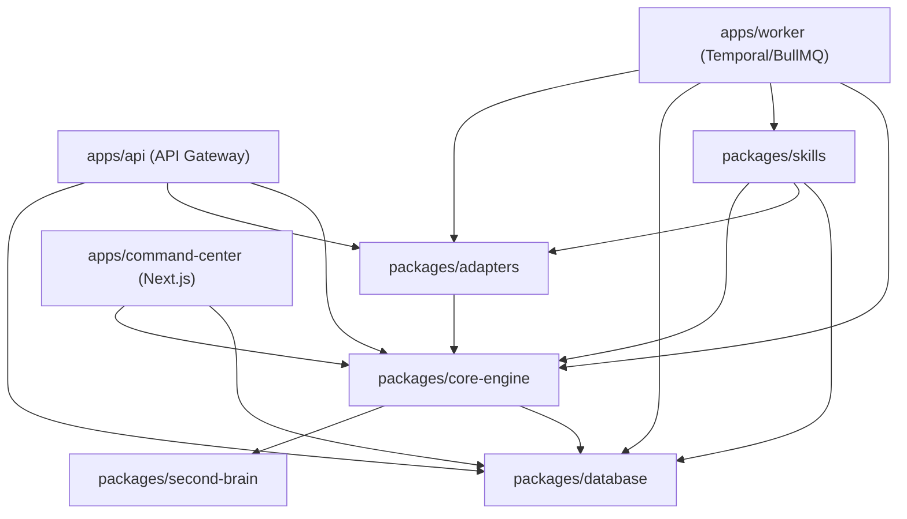

# Project Structure & Monorepo Architecture

## 1. Monorepo Directory Layout (pnpm Workspaces + Turborepo)

The platform is architected as an enterprise monorepo managed with **pnpm workspaces** and **Turborepo**. The codebase enforces strict separation of concerns across runnable applications (`apps/`) and reusable, shared internal libraries (`packages/`).

```text
agent-solution/
├── .github/
│   └── workflows/
│       ├── ci.yml                    # Automated lint, typecheck, unit & integration tests
│       └── release.yml               # Semantic versioning and Docker image builds
├── apps/
│   ├── api/                          # High-throughput Core API Gateway (Node.js/Fastify)
│   │   ├── src/
│   │   │   ├── middleware/           # Tenant context injection, HMAC, auth, rate limiting
│   │   │   ├── routes/               # REST, SSE streaming, and webhook endpoints
│   │   │   │   ├── v1/
│   │   │   │   │   ├── chat.ts       # Real-time customer chat SSE stream
│   │   │   │   │   ├── events.ts     # Customer event ingestion (API-002)
│   │   │   │   │   ├── campaigns.ts  # Marketing campaign management
│   │   │   │   │   └── webhooks.ts   # LINE, WhatsApp, Stripe webhook ingestion
│   │   │   │   └── index.ts
│   │   │   ├── server.ts             # Fastify server initialization & graceful shutdown
│   │   │   └── index.ts
│   │   ├── package.json
│   │   └── tsconfig.json
│   ├── worker/                       # Temporal / BullMQ Durable Workflow Worker
│   │   ├── src/
│   │   │   ├── workflows/            # Multi-step stateful workflows (Cart recovery, Escalations)
│   │   │   ├── activities/           # Concrete asynchronous skill executions
│   │   │   ├── queues/               # BullMQ queue processors and retry monitors
│   │   │   └── worker.ts             # Worker process runner
│   │   ├── package.json
│   │   └── tsconfig.json
│   └── command-center/               # Administrative Dashboard (Next.js 14 App Router)
│       ├── src/
│       │   ├── app/                  # App Router screens (SCR-001 through SCR-005)
│       │   │   ├── (auth)/           # Authentication & tenant login
│       │   │   ├── (dashboard)/
│       │   │   │   ├── analytics/    # SCR-001 Executive & SCR-002 Operational dashboards
│       │   │   │   ├── approvals/    # SCR-003 Human-in-the-loop Approval Queue (AUTH-4)
│       │   │   │   ├── takeover/     # SCR-005 Real-time Operator Chat Takeover
│       │   │   │   └── settings/     # Second Brain knowledge & tenant configuration
│       │   │   ├── layout.tsx
│       │   │   └── page.tsx
│       │   ├── components/           # shadcn/ui and custom high-density UI primitives
│       │   └── lib/                  # SWR/React Query hooks and WebSocket clients
│       ├── package.json
│       ├── tailwind.config.ts
│       └── tsconfig.json
├── packages/
│   ├── core-engine/                  # Central Orchestrator, Supervisor & State Machine
│   │   ├── src/
│   │   │   ├── orchestrator/         # 11-step E2E Lifecycle coordinator
│   │   │   ├── supervisor/           # Multi-agent intent classification & routing (FR-ORC-001)
│   │   │   ├── policy/               # Authority Model (AUTH-0..5) & Policy Engine (BR-001..010)
│   │   │   ├── memory/               # 5-Tier Memory Hierarchy manager
│   │   │   ├── agents/               # 13 Specialized Agent definitions (Marketing, Sales, Care)
│   │   │   └── contracts/            # Canonical domain types and interfaces
│   │   ├── package.json
│   │   └── tsconfig.json
│   ├── skills/                       # Executable atomic capabilities (11-field contract)
│   │   ├── src/
│   │   │   ├── customer/             # retrieve-customer, verify-identity, update-consent
│   │   │   ├── commerce/             # check-inventory, calculate-floor-price, create-draft-order
│   │   │   ├── knowledge/            # search-second-brain, retrieve-evidence-card
│   │   │   ├── communication/        # send-omnichannel-message, schedule-callback
│   │   │   └── registry.ts           # Dynamic skill registry and JSON Schema validator
│   │   ├── package.json
│   │   └── tsconfig.json
│   ├── database/                     # Relational ORM schema, RLS policies, migrations
│   │   ├── src/
│   │   │   ├── client.ts             # Connection pool with automatic tenant RLS session hooks
│   │   │   ├── schema/               # Drizzle/Prisma schema for 28 canonical entities
│   │   │   ├── repositories/         # Type-safe repository methods with mandatory tenant_id
│   │   │   └── rls.ts                # RLS context binder: SET LOCAL app.current_tenant_id
│   │   ├── migrations/               # Raw SQL migration files
│   │   ├── seeds/                    # Seed scripts for base system registries
│   │   │   ├── 01_agents.seed.ts     # Preloads 13 canonical agents (MKT-01..05, SAL-01..05, CS-01..02, SUPERVISOR)
│   │   │   ├── 02_skills.seed.ts     # Preloads 20 canonical skills with 11-field contracts
│   │   │   └── 03_tenants.seed.ts    # Default tenant policies, margin floors, and approval thresholds
│   │   ├── package.json
│   │   └── tsconfig.json
│   ├── second-brain/                 # Ground-truth organizational knowledge base (8 folders, 20 markdown files)
│   │   ├── company/
│   │   │   ├── company.md            # Enterprise overview, vision, operating model
│   │   │   └── positioning.md        # Brand positioning & target market segments
│   │   ├── customer/
│   │   │   ├── customer.md           # ICP, personas, customer lifecycle stages
│   │   │   └── segmentation.md       # Cohort rules & RFM qualification criteria
│   │   ├── product/
│   │   │   ├── products.md           # Master product catalog, technical specs, boundaries
│   │   │   ├── pricing.md            # Official price lists, cost structures, P_floor rules
│   │   │   └── promotion-policy.md   # Promotion rules, voucher terms & caps
│   │   ├── brand/
│   │   │   ├── voice.md              # Tone of voice across channels (LINE/WhatsApp/Web)
│   │   │   ├── terminology.md        # Canonical terminology & glossary
│   │   │   └── prohibited-claims.md  # Disallowed statements & unauthorized promises
│   │   ├── marketing/
│   │   │   ├── playbook.md           # Omnichannel marketing playbooks & journeys
│   │   │   ├── content-guidelines.md # Message standards & compliance guidelines
│   │   │   └── campaign-rules.md     # Frequency capping & budget constraints
│   │   ├── sales/
│   │   │   ├── sales-playbook.md     # Sales methodology, closing tactics & objections
│   │   │   ├── qualification.md      # BANT criteria & lead triage questions
│   │   │   └── objection-handling.md # Price and competitor objection scripts
│   │   ├── customer-care/
│   │   │   ├── faq.md                # Verified customer Q&A knowledge base
│   │   │   ├── support-policy.md     # Return, warranty & refund policies
│   │   │   └── escalation.md         # 7-state escalation & human transfer matrix
│   │   └── policy/
│   │       ├── authority.md          # Agent Authority Model (AUTH-0..5) rules
│   │       └── approval.md           # High-risk human approval triggers (SCR-003)
│   ├── adapters/                     # External channel & enterprise connectors
│   │   ├── src/
│   │   │   ├── base/                 # BaseAdapter interface with mTLS, HMAC, circuit breaker
│   │   │   ├── taiwan/               # ADPT-TW-001: LINE OA, ECPay, CVS COD (7-11 / FamilyMart)
│   │   │   ├── global-messaging/     # ADPT-GL-001: WhatsApp Business Cloud API, Webhooks
│   │   │   ├── global-payment/       # ADPT-GL-002: Stripe, PayPal, Klarna
│   │   │   ├── compliance/           # ADPT-GL-003: GDPR/CCPA Consent & Data Subject Rights
│   │   │   └── erp/                  # API-001 ERP Connector & API-002 Event Ingestor
│   │   ├── package.json
│   │   └── tsconfig.json
│   ├── storefront-widget/            # Embeddable Web Component (< 20 KB bundle)
│   │   ├── src/
│   │   │   ├── component.ts          # CustomElement extending HTMLElement with Shadow DOM
│   │   │   ├── stream.ts             # SSE streaming parser for live chat
│   │   │   └── styles.css            # Scoped styles (Zero CSS leakage into host page)
│   │   ├── vite.config.ts            # Micro-bundle compilation (IIFE target)
│   │   ├── package.json
│   │   └── tsconfig.json
│   ├── typescript-config/            # Shared tsconfig definitions (base, react, node)
│   │   ├── base.json
│   │   ├── react.json
│   │   └── package.json
│   └── eslint-config/                # Shared ESLint + Prettier rules
│       ├── index.js
│       └── package.json
├── docker/                           # Container deployment manifests
│   ├── Dockerfile.api
│   ├── Dockerfile.worker
│   └── Dockerfile.command-center
├── docker-compose.yml                # Local backing services
├── package.json                      # Monorepo root configuration
├── pnpm-workspace.yaml               # Workspace definitions
├── turbo.json                        # Turborepo pipeline cache configuration
└── tsconfig.json                     # Root TypeScript configuration
```

---

## 2. Package Boundaries & Dependency Graph

To prevent circular dependencies and enforce strict architectural layering, dependencies may only flow inward from outer applications to core domain libraries.



### Module Responsibilities

1. **`@agentos/core-engine`**:
   - Holds zero knowledge of specific HTTP frameworks (Fastify, Express) or UI libraries.
   - Contains pure business logic: Intent parsing, State Machine transitions, Authority checks (AUTH-0..5), and Mathematical Price Floor ($P_{floor}$) verification.
   - Dependent only on `@agentos/database` and `@agentos/second-brain` contracts.

2. **`@agentos/skills`**:
   - Implements atomic units of work adhering to the 11-field Skill System Contract.
   - Reusable across both synchronous API flows (`apps/api`) and asynchronous durable workers (`apps/worker`).

3. **`@agentos/second-brain`**:
   - Stores the authoritative 20 Markdown documents across 8 enterprise folders.
   - Provides document loader utilities, metadata frontmatter parsers, and verification schemas ensuring only `status: approved` documents are ingested into Qdrant.

4. **`@agentos/adapters`**:
   - Encapsulates network communication with third-party vendors (LINE, WhatsApp, ECPay, Stripe, ERP).
   - Enforces HMAC validation on incoming webhooks and mTLS / exponential retry on outgoing dispatches.

5. **`@agentos/database`**:
   - The single source of truth for PostgreSQL schema, migrations, connection pools, and Row-Level Security (RLS) policies.
   - Houses `seeds/` scripts initializing the 13 canonical agents, 20 skills, and tenant policies.

6. **`@agentos/storefront-widget`**:
   - Zero runtime dependencies (`dependencies: {}`).
   - Self-contained IIFE build outputting a single script (< 20 KB) registered as a standard Custom Element (`<agentos-chat-widget>`).

---

## 2.1. Queue Architecture Separation: BullMQ vs. Temporal.io

The platform implements a dual-queue architecture, cleanly dividing responsibilities between low-latency operational queues and durable business orchestrations:

```text
+-----------------------------------------------------------------------------------------+
|                                 DUAL-QUEUE ARCHITECTURE                                 |
+-----------------------------------------------------------------------------------------+
|                                                                                         |
|  [ INCOMING TRAFFIC ] ──────► [ BullMQ (Redis-Backed) ]                                 |
|                                ├── Sub-10ms latency execution                           |
|                                ├── Ephemeral operational tasks                          |
|                                ├── Webhook HMAC validation & deduplication             |
|                                ├── Real-time chat message outbound dispatch             |
|                                └── Second Brain Qdrant indexing jobs                    |
|                                                                                         |
|  [ BUSINESS WORKFLOWS ] ────► [ Temporal.io (PostgreSQL Engine) ]                       |
|                                ├── Long-running stateful workflows (hours/days)         |
|                                ├── Deterministic checkpointing & execution history      |
|                                ├── Abandoned cart multi-stage recovery (15m, 2h, 24h)   |
|                                ├── Campaign batch dispatch (> 5,000 users with rate cap)|
|                                └── Human-in-the-Loop approvals (SCR-003, 72h pause gate)|
+-----------------------------------------------------------------------------------------+
```

| Dimension | BullMQ (Operational Task Queue) | Temporal.io (Durable Workflow Engine) |
|---|---|---|
| **Underlying Engine** | Redis 7.2 In-Memory Cluster | PostgreSQL 16 Stateful Event Store |
| **Execution Latency** | Sub-10 milliseconds | 50ms – 150ms per step transition |
| **Process Lifespan** | Ephemeral: 100ms – 5 seconds | Long-running: Minutes, hours, or days |
| **State Persistence** | In-memory with Redis AOF persistence | Permanent write-ahead event history |
| **Primary Use Cases** | 1. Webhook processing & rate limiting<br>2. Real-time outbound messaging<br>3. Async Customer Event Ingestion (API-002)<br>4. Qdrant vector chunk upserts | 1. Omnichannel abandoned cart recovery (15m, 2h, 24h delays)<br>2. Marketing campaign batch dispatch (AUTH-4)<br>3. Human approval pauses at SCR-003 (up to 72h)<br>4. Complex multi-agent order fulfillment sagas |
| **Failure Handling** | Redis retry with exponential backoff; dead-letter queue (DLQ) | Deterministic event replay from the exact last verified step; zero lost state |

---

## 3. Package Configurations

### Root `package.json`

```json
{
  "name": "agent-solution-monorepo",
  "version": "1.0.0",
  "private": true,
  "engines": {
    "node": ">=20.10.0",
    "pnpm": ">=9.0.0"
  },
  "packageManager": "pnpm@9.1.0",
  "scripts": {
    "build": "turbo run build",
    "dev": "turbo run dev --parallel",
    "lint": "turbo run lint",
    "typecheck": "turbo run typecheck",
    "test": "turbo run test",
    "clean": "turbo run clean && rm -rf node_modules"
  },
  "devDependencies": {
    "@agentos/eslint-config": "workspace:*",
    "@agentos/typescript-config": "workspace:*",
    "prettier": "^3.2.5",
    "turbo": "^1.13.3",
    "typescript": "^5.4.5"
  }
}
```

### `pnpm-workspace.yaml`

```yaml
packages:
  - "apps/*"
  - "packages/*"
```

### `turbo.json`

```json
{
  "$schema": "https://turbo.build/schema.json",
  "pipeline": {
    "build": {
      "dependsOn": ["^build"],
      "outputs": [".next/**", "!.next/cache/**", "dist/**"]
    },
    "typecheck": {
      "dependsOn": ["^build"],
      "outputs": []
    },
    "lint": {
      "outputs": []
    },
    "test": {
      "dependsOn": ["^build"],
      "outputs": ["coverage/**"]
    },
    "dev": {
      "cache": false,
      "persistent": true
    },
    "clean": {
      "cache": false
    }
  }
}
```

### Core Engine `packages/core-engine/package.json`

```json
{
  "name": "@agentos/core-engine",
  "version": "1.0.0",
  "private": true,
  "main": "./dist/index.js",
  "types": "./dist/index.d.ts",
  "scripts": {
    "build": "tsc --project tsconfig.build.json",
    "dev": "tsc --project tsconfig.build.json --watch",
    "typecheck": "tsc --noEmit",
    "test": "vitest run"
  },
  "dependencies": {
    "@agentos/database": "workspace:*",
    "ioredis": "^5.4.1",
    "zod": "^3.23.8",
    "openai": "^4.47.1",
    "@opentelemetry/api": "^1.8.0"
  },
  "devDependencies": {
    "@agentos/typescript-config": "workspace:*",
    "typescript": "^5.4.5",
    "vitest": "^1.6.0"
  }
}
```

---

## 4. Coding Conventions & Architectural Standards

### 1. Functional Programming & Immutability First
- **No Class God-Objects**: Core logic (routing, policy checking, price floor verification) must be implemented as pure, deterministic functions without internal mutable state.
- **Data In, Data Out**: Orchestration state is represented as immutable data structures. Functions accept state and return an updated state or a validated decision object.

```typescript
/**
 * Evaluates whether an automated discount violates the mathematical price floor.
 * Pure function: No side effects, no database calls, no mutable arguments.
 *
 * @param basePrice - Officially listed catalog price from API-001 (SoR)
 * @param costOfGoods - Unit landed inventory cost
 * @param minimumMarginRate - Mandatory profit margin percentage (e.g. 0.15 = 15%)
 * @param proposedDiscount - Requested discount amount
 * @returns Object indicating validity, allowed floor price, and computed discount
 */
export function evaluatePriceFloorConstraint(
  basePrice: number,
  costOfGoods: number,
  minimumMarginRate: number,
  proposedDiscount: number
): { isValid: boolean; allowedPrice: number; appliedDiscount: number; violationReason?: string } {
  // P_floor = Cost / (1 - minimum_margin_rate)
  const priceFloor = Math.ceil(costOfGoods / (1 - minimumMarginRate));
  const proposedFinalPrice = basePrice - proposedDiscount;

  if (proposedFinalPrice < priceFloor) {
    const maximumAllowedDiscount = Math.max(0, basePrice - priceFloor);
    return {
      isValid: false,
      allowedPrice: priceFloor,
      appliedDiscount: maximumAllowedDiscount,
      violationReason: `Proposed price ${proposedFinalPrice} is below strict economic floor ${priceFloor}`,
    };
  }

  return {
    isValid: true,
    allowedPrice: proposedFinalPrice,
    appliedDiscount: proposedDiscount,
  };
}
```

### 2. Anti-God-Files Policy (< 300 Lines of Code)
- A single source code file must not exceed 300 lines of code.
- If a file approaches 250 lines, it must be proactively refactored by extracting cohesive helpers, separate schema definitions, or domain sub-handlers into modular sibling files.
- Each file must adhere strictly to the Single Responsibility Principle (SRP).

### 3. Descriptive Naming & Mandatory JSDoc
- Naming must explicitly reflect business domain intent rather than generic technical actions. Avoid names like `handleData()`, `doProcess()`, or `tempHelper()`.
- Use domain-precise names: `verifyCustomerConsentStatus()`, `dispatchTaiwanCvsShippingOrder()`, `evaluateAuthorityThreshold()`.
- All exported interfaces, functions, and types must include complete JSDoc annotations describing parameters, return values, exceptions, and associated SRS requirements.

### 4. Strict TypeScript Settings (`packages/typescript-config/base.json`)

```json
{
  "$schema": "https://json.schemastore.org/tsconfig",
  "compilerOptions": {
    "target": "ES2022",
    "module": "NodeNext",
    "moduleResolution": "NodeNext",
    "lib": ["ES2022"],
    "strict": true,
    "noImplicitAny": true,
    "strictNullChecks": true,
    "strictFunctionTypes": true,
    "strictBindCallApply": true,
    "strictPropertyInitialization": true,
    "noImplicitThis": true,
    "alwaysStrict": true,
    "noUnusedLocals": true,
    "noUnusedParameters": true,
    "exactOptionalPropertyTypes": true,
    "noImplicitReturns": true,
    "noFallthroughCasesInSwitch": true,
    "noUncheckedIndexedAccess": true,
    "noImplicitOverride": true,
    "declaration": true,
    "declarationMap": true,
    "sourceMap": true,
    "forceConsistentCasingInFileNames": true,
    "skipLibCheck": true
  }
}
```
