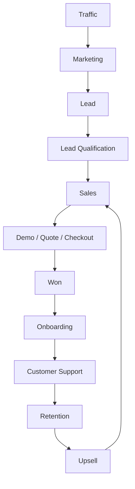
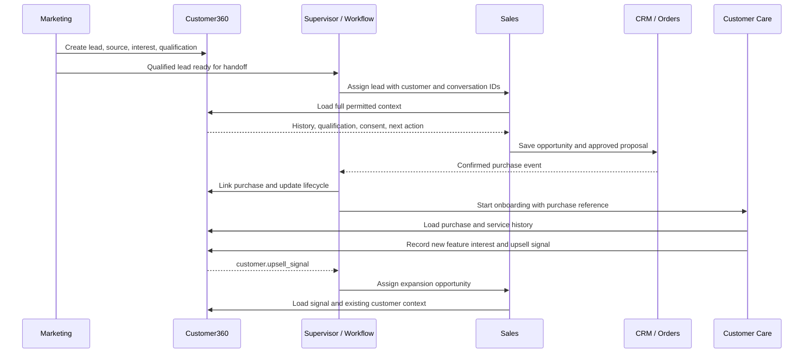

# Customer Lifecycle and Business Cases

[Plan index](README.md) · [Vietnamese easy-read flow](plan-easy-read-flow.md)

Status: proposed design, not implemented functionality. Examples and targets are illustrative until agreed with a pilot customer.

## Full Customer Lifecycle

This is the central business flow when all three modules are enabled. A company can also call Sales or Support directly from its existing application; support, renewal, and expansion can start from relevant customer events.

| Stage | Owner | Input | Action | Output |
|---|---|---|---|---|
| Traffic | Marketing team / Agent | Audience and campaign plan | Attract visitors through approved campaigns | Attributed visit |
| Marketing | Marketing Agent | Visit or inquiry | Explain the offer and invite engagement | Interested visitor |
| Lead | Marketing Agent | Contact details and interest | Capture contact, source, and consent | Lead in Customer360 |
| Lead Qualification | Marketing / Sales | Lead and engagement | Check required fields, fit, and intent | Sales-qualified lead (SQL) |
| Sales | Sales Agent | SQL and full context | Discover needs and open a deal | Opportunity with next action |
| Demo / Quote / Checkout | Sales / Human | Opportunity and approved product | Book, propose, or provide checkout | Meeting, quote, or purchase request |
| Won | Sales + confirmed system event | Verified commercial outcome | Record the sale and purchase reference | Customer and won opportunity |
| Onboarding | Support + Workflow | Confirmed purchase | Send setup guidance and check activation | Onboarded customer |
| Customer Support | Support Agent | Question and customer history | Answer, troubleshoot, or escalate | Resolved case or human-owned ticket |
| Retention | Support / Sales + Workflow | Usage, renewal, or risk signal | Support adoption and coordinate renewal | Retained customer or recovery action |
| Upsell | Sales Agent | Valid expansion signal | Qualify additional needs | Expansion opportunity |

Not ready → nurture. Poor fit → disqualify with a reason. Lost → record the reason; reactivate only when appropriate and permitted. A customer's statement alone must not mark a purchase as confirmed.

Retention starts as Sales/Support workflows. A dedicated Retention Agent is a later internal option, not a fourth product module or an MVP dependency; advocacy and referral requests can follow successful customer outcomes.

## Key Business Cases

These scenarios describe the full product. [MVP](delivery/mvp-and-roadmap.md#section-21) defines which steps are automated in the MVP.

| Case | Short flow | Success record |
|---|---|---|
| 1 — New Lead → Sale | Facebook → Marketing → Lead → Qualification → Sales → Quote → Confirmed purchase → Won | Attribution, opportunity, quote, purchase |
| 2 — Lead not ready | Lead → Nurture → Engagement → Score increases → Qualification check → Sales handoff | Updated score, readiness, next action |
| 3 — Support issue | Customer → Support → Identity check → Knowledge search → Troubleshoot → Customer confirms solved → Close | Resolution and CSAT request |
| 4 — Support escalation | Customer → Support → Troubleshooting fails → Ticket → Context summary → Human assignment → Human resolution | Ticket owner and outcome |
| 5 — Upsell | Existing customer → Feature interest → Upsell signal → Sales → Expansion qualification → Approved offer → Upgrade | Expansion opportunity and revenue |
| 6 — High-value lead | Enterprise request → Sales qualification → Supervisor policy check → Context package → Human Sales → Approved proposal | Assigned owner and approval history |

## Cross-Agent Handoff

**The customer should not re-enter known information when changing agents.**
Security re-verification and confirmation of outdated details may still be necessary.

Every handoff carries customer/conversation IDs, current owner and stage, a short summary, relevant business-record links, unresolved items, and the next action.

Business-system arrows above represent approved connector/API calls and verified events, not unrestricted Agent access to company databases.

The receiving owner must accept the handoff. Keep one active responder per conversation; pause automated replies while a human owns it. Failed assignment remains visible in a queue and must not be reported as completed.

## Entry points in an existing company application

The lifecycle is not a mandatory sequence of screens. The same person can enter at the stage relevant to the current request.

| Entry | Work starts when | Initial owner |
|---|---|---|
| Paid acquisition | The company runs an ad; a customer clicks and submits a form or starts a conversation | Marketing, if enabled; otherwise the company's configured Sales/staff intake |
| Direct purchase inquiry | An existing website/app sends a buying question | Sales or Supervisor routing |
| Existing support request | A signed-in account or verified channel raises an issue | Support |
| Recorded lead | Company CRM/form system sends an authorized lead event | Enabled module/workflow selected by policy |
| Confirmed purchase | The configured source system records a verified commercial outcome | Onboarding workflow, Support, or company staff |
| Renewal/feature interest | A supported source provides an eligible customer signal | Sales/Support workflow; later automation per roadmap |

The company and ad platforms own campaign spend and delivery. Marketing may help draft content; a page view alone does not establish identity, consent, readiness, or a purchase.

## Case-specific decisions and evidence

The earlier case table owns the short paths. This table adds branch decisions and the MVP boundary without redefining those paths.

| Case | Required context | Decision or failure branch | Evidence of the outcome | MVP boundary |
|---|---|---|---|---|
| New lead to sale | Source, permitted contact, interest, qualification, product terms | Missing qualification prompts a question; unsupported pricing goes to staff | CRM opportunity and provider-confirmed purchase reference, not only a chat statement | Sales qualification/booking; humans handle quotes and purchase confirmation |
| Lead not ready | Permission to contact, missing readiness fields, engagement history | Opt-out, reply, closed opportunity or human takeover stops outreach | Recorded eligibility decision, next action and eventual accepted handoff | One follow-up sequence; full Marketing nurture later |
| Support resolved | Verified identity where private facts are used, current approved guide | If evidence is weak or customer still reports failure, do not close | Customer-confirmed resolution; reopen linked if the issue returns | Basic FAQ and bounded guidance |
| Support escalated | Issue, attempted steps, results, impact, active owner | No assigned staff member means visible pending ownership | Accepted human assignment and subsequent resolution | Human-owned case/queue; advanced ticketing later |
| Upsell | Existing customer reference, observed need, source of signal | No Sales Module means company Sales/staff handoff; a signal is not an approved offer | Expansion owner, qualification and confirmed upgrade outcome | Record interest and hand off; automated expansion later |
| High-value lead | Need, budget, authority, timeline, configured threshold | Await named human decision; silence cannot authorize pricing | Owner acceptance, approval reference, verified proposal terms | Qualification and human handoff |

## Cross-module consistency checks

1. The company/customer reference and conversation remain linked through each handoff.
2. All receiving modules see only permitted, relevant history; stale details can be reconfirmed.
3. Returning to Sales for expansion preserves the original purchase reference and creates a distinct commercial opportunity.
4. A rejected/failed handoff leaves a visible current owner or accountable queue, not an abandoned conversation.
5. A customer can request a person at any stage; do not force completion of the AI's questions first.

Detailed ownership and workflow states are defined in [Workflows and handoffs](platform/workflows-and-handoffs.md). Module-specific decisions are in [Marketing](modules/marketing.md), [Sales](modules/sales.md), and [Support](modules/customer-support.md).
