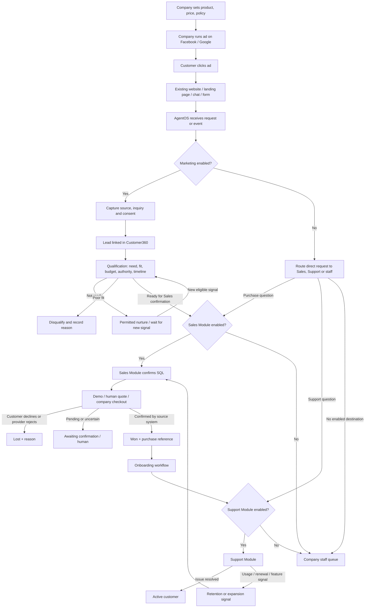
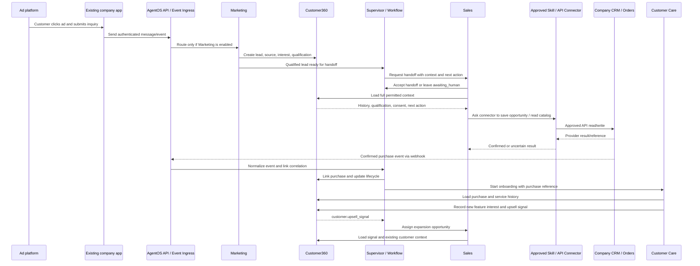

# Customer Lifecycle and Business Cases

[Plan index](README.md) · [Vietnamese easy-read flow](plan-easy-read-flow.md) · [Glossary](glossary.md)

Status: proposed design, not implemented functionality. Examples and targets are illustrative until agreed with a pilot customer.

<a id=section-3></a>

## Full Customer Lifecycle

This is the central business flow when all three modules are enabled. A company can also call Sales or Support directly from its existing application; support, renewal, and expansion can start from relevant customer events.



The main path is **ad click → company entry point → enabled module → verified result**. “Won” is not a word the customer can trigger; it requires a confirmation from the agreed CRM/order/payment source. Retention and expansion are signal-driven branches, not steps that happen after every support conversation.

Terms in this flow: a **lead** is a person/company showing interest; **qualification** checks whether Sales should spend time on it; **nurture** means permitted follow-up while the person is not ready; an **opportunity** is a tracked possible sale; a **source system** is the company application accepted as the official record.

| Stage | Owner | Input | Action | Output |
|---|---|---|---|---|
| Traffic | Company marketing team / Facebook or Google | Audience and campaign plan | Run the campaign and send people to the company entry point | Click/visit |
| Marketing | Marketing Agent | Authenticated inquiry/event after a click or visit | Explain the offer and invite engagement | Interested visitor |
| Lead | Marketing Agent | Contact details and interest | Capture contact, source, and consent | Lead in Customer360 |
| Lead Qualification | Marketing evidence + Sales confirmation | Lead, engagement and answers | Marketing prepares evidence; Sales confirms required fields, fit, and intent | Sales-qualified lead (SQL) |
| Sales | Sales Agent | SQL and full context | Discover needs and open a deal | Opportunity with next action |
| Demo / Quote / Checkout | Sales / Human | Opportunity and approved product | Book, prepare a human quote, or use the company's checkout | Meeting, quote, or purchase request |
| Won | Sales + confirmed system event | Verified commercial outcome | Record the sale and purchase reference | Customer and won opportunity |
| Onboarding | Support + Workflow | Confirmed purchase | Send setup guidance and check activation | Onboarded customer |
| Customer Support | Support Agent | Question and customer history | Answer, troubleshoot, or escalate | Resolved case or human-owned case |
| Retention | Support / Sales + Workflow | Usage, renewal, or risk signal | Support adoption and coordinate renewal | Retained customer or recovery action |
| Upsell | Sales Agent | Valid expansion signal | Qualify additional needs | Expansion opportunity |

Not ready → nurture. Poor fit → disqualify with a reason. Lost → record the reason; reactivate only when appropriate and permitted. A customer's statement alone must not mark a purchase as confirmed.

Retention starts as Sales/Support workflows. A dedicated Retention Agent is a later internal option, not a fourth product module or an MVP dependency; advocacy and referral requests can follow successful customer outcomes.

<a id=section-4></a>

## Key Business Cases

These scenarios describe the full product. [MVP](delivery/mvp-and-roadmap.md#section-21) defines which steps are automated in the MVP. **SQL** means a lead that Sales has confirmed is ready for sales work; a score or Marketing handoff request alone does not create an SQL or opportunity.

| Case | Short flow | Success record |
|---|---|---|
| 1 — New Lead → Sale | Company ad → customer click → company entry point → Marketing → Lead → Sales qualification → quote process → confirmed purchase → Won | Attribution, opportunity, quote, purchase |
| 2 — Lead not ready | Lead → Nurture → Engagement → Score increases → Qualification check → Sales handoff | Updated score, readiness, next action |
| 3 — Support issue | Customer → Support → Identity check → Knowledge search → Troubleshoot → Customer confirms solved → Close → optional CSAT | Resolution and optional CSAT request |
| 4 — Support escalation | Customer → Support → Troubleshooting fails → Ticket if connector enabled, otherwise human queue → Context summary → Human assignment → Human resolution | Case owner and outcome |
| 5 — Upsell | Existing customer → Feature interest → Upsell signal → Sales → Expansion qualification → Approved offer → Upgrade | Expansion opportunity and revenue |
| 6 — High-value lead | Enterprise request → Sales qualification → Supervisor policy check → Context package → Human Sales → Approved proposal | Assigned owner and approval history |

## Business cases, step by step

The cases below show who acts, what data moves, and where the flow stops. The **company source** is the connected application accepted as the official record for that fact. A **handoff** is a recorded transfer of responsibility; it is not just a notification.

### Case 1 — New lead to sale

```text
1. Company runs a Facebook/Google ad.
2. Customer clicks the ad and opens the company landing page, website, chat, or form.
3. Company backend sends the inquiry and campaign details to AgentOS.
4. Marketing Module records the contact, product interest, source and consent when available.
5. The system asks the configured qualification questions: need, budget, authority and timeline.
6. When the criteria are met, Marketing hands the lead and evidence to Sales; Sales accepts ownership.
7. Sales reads the current product data, recommends an eligible option, and offers a demo or the company's quote process.
8. The company CRM/calendar records the confirmed next action. Only the company's confirmed purchase event can mark Won.
```

**If something fails:** missing fields cause another question; stale price causes a human review; missing Sales causes a staff queue; a provider timeout is reconciled before retry.

### Case 2 — Lead is not ready

```text
1. Marketing receives a valid inquiry but the person is not ready to buy.
2. The system stores what is known and marks missing answers as unknown.
3. It checks consent and channel rules before any outbound message.
4. If contact is allowed, Workflow sends one permitted follow-up and waits for a new signal.
5. A reply, opt-out, human takeover, closed opportunity, or policy block stops the sequence.
6. New eligible engagement can update the score and reopen a qualification check.
7. When the required criteria are met, Sales receives a new handoff with the previous history.
```

**If something fails:** no consent means no outbound message; duplicate events reuse the same lead/run; no new signal leaves the lead waiting without inventing readiness.

### Case 3 — Support issue is resolved

```text
1. A customer sends a question from the existing company app or channel.
2. Support verifies the customer before showing private account details.
3. Support searches the approved knowledge base and current permitted context.
4. It gives an answer or runs only the configured troubleshooting steps.
5. The customer confirms the issue is solved.
6. Support records the source used, resolution confirmation and next step, then closes the case.
7. The company may request a CSAT rating after closure.
```

**If something fails:** no reliable source or an unsafe step goes to human support; an answer alone does not close the case; an unverified customer receives only public guidance.

### Case 4 — Support escalation

```text
1. Support receives a problem it cannot answer or fix within the allowed steps.
2. It records the issue, desired outcome, customer context, steps tried and results.
3. If a ticket connector is enabled, it creates or updates the company ticket and verifies the returned ticket ID.
4. If the connector is unavailable, it creates an AgentOS human queue item instead.
5. A named human owner accepts the handoff; Support pauses its automated replies.
6. The human resolves the case or records the next owner and status.
7. Support/analytics links the final result to the original conversation.
```

**If something fails:** a timeout triggers reconciliation before retry; no ticket ID means the system reports pending or failed, never “ticket created”; no available person remains visible as `awaiting_human`.

### Case 5 — Existing customer upsell

```text
1. Support or an existing company system records feature interest, usage growth or a renewal signal.
2. AgentOS links the signal to the verified customer and the original order/subscription reference.
3. Workflow checks that the signal is eligible and has not already created the same expansion opportunity.
4. Sales receives a handoff with the signal source and existing customer context.
5. Sales confirms the new need, quantity, budget and approval path.
6. Sales prepares the company's approved offer; a signal alone is not a sale.
7. The company source confirms the upgrade, or Sales records Lost/Not now with a reason.
```

**If something fails:** no Sales module means staff handoff; missing product/price data means no offer; duplicate signals reuse the same expansion opportunity.

### Case 6 — High-value lead

```text
1. An enterprise inquiry enters through the company's app, form or CRM.
2. Sales collects need, budget, authority and timeline.
3. Supervisor checks the configured high-value threshold and policy.
4. AgentOS prepares a context package with the customer, conversation, evidence and proposed next action.
5. A named Human Sales owner accepts the handoff.
6. The human decides on custom terms or an approved proposal.
7. AgentOS records the decision and keeps AI paused while the human owns the conversation.
```

**If something fails:** no owner means `awaiting_human`; no approver response is not approval; the AI cannot send custom pricing or mark the deal Won.

For the common definitions used here, see [Glossary](glossary.md). For durable timers and retry behavior, see [Workflows and handoffs](platform/workflows-and-handoffs.md).

<a id=section-9></a>

## Cross-Agent Handoff

**The customer should not re-enter known information when changing agents.**
Security re-verification and confirmation of outdated details may still be necessary.



Every handoff carries customer/conversation IDs, current owner and stage, a short summary, relevant business-record links, unresolved items, and the next action. A handoff remains pending until the receiving Agent or person accepts it; creating a request or notification is not a completed handoff.

Business-system arrows above represent approved connector/API calls and verified events, not unrestricted Agent access to company databases.

The receiving owner must accept the handoff. Keep one active responder per conversation; pause automated replies while a human owns it. Failed assignment remains visible in a queue and must not be reported as completed.

In this sequence, **accept handoff** means the receiving Agent or person has acknowledged responsibility. `awaiting_human` means the work is waiting for a named person; it is not success. The connector is the controlled API bridge, so an Agent never writes directly to the company's database.

## Entry points in an existing company application

The lifecycle is not a mandatory sequence of screens. The same person can enter at the stage relevant to the current request.

| Entry | Work starts when | Initial owner |
|---|---|---|
| Paid acquisition | The company runs an ad; a customer clicks and submits a form or starts a conversation | Marketing, if enabled; otherwise the company's configured Sales/staff intake |
| Direct purchase inquiry | An existing website/app sends a buying question | Sales or Supervisor routing |
| Existing support request | A signed-in account or verified channel raises an issue | Support |
| Recorded lead | Company CRM/form system sends an authorized lead event | Enabled module/workflow selected by policy |
| Confirmed purchase | The configured source system records a verified commercial outcome | Onboarding workflow, Support, or company staff |
| Renewal/feature interest | A supported source provides an eligible customer signal | Sales/Support workflow; later automation per roadmap |

The company and ad platforms own campaign spend and delivery. Marketing may help draft content; a page view alone does not establish identity, consent, readiness, or a purchase. A preliminary score is evidence for routing; Sales confirms qualification before an SQL or opportunity is created.

## Case-specific decisions and evidence

The earlier case table owns the short paths. This table adds branch decisions and the MVP boundary without redefining those paths.

| Case | Required context | Decision or failure branch | Evidence of the outcome | MVP boundary |
|---|---|---|---|---|
| New lead to sale | Source, permitted contact, interest, qualification, product terms | Missing qualification prompts a question; unsupported pricing goes to staff | CRM opportunity and provider-confirmed purchase reference, not only a chat statement | Sales qualification/booking; humans handle quotes and purchase confirmation |
| Lead not ready | Permission to contact, missing readiness fields, engagement history | Opt-out, reply, closed opportunity or human takeover stops outreach | Recorded eligibility decision, next action and eventual accepted handoff | One follow-up sequence; full Marketing nurture later |
| Support resolved | Verified identity where private facts are used, current approved guide | If evidence is weak or customer still reports failure, do not close | Customer-confirmed resolution; reopen linked if the issue returns | Basic FAQ and bounded guidance |
| Support escalated | Issue, attempted steps, results, impact, active owner | No assigned staff member means visible pending ownership | Accepted human assignment and subsequent resolution | Human-owned case/queue; advanced ticketing later |
| Upsell | Existing customer reference, observed need, source of signal | No Sales Module means company Sales/staff handoff; a signal is not an approved offer | Expansion owner, qualification and confirmed upgrade outcome | Record interest and hand off; automated expansion later |
| High-value lead | Need, budget, authority, timeline, configured threshold | Await named human decision; silence cannot authorize pricing | Owner acceptance, approval reference, verified proposal terms | Qualification and human handoff |

## Cross-module consistency checks

1. The company/customer reference and conversation remain linked through each handoff.
2. All receiving modules see only permitted, relevant history; stale details can be reconfirmed.
3. Returning to Sales for expansion preserves the original purchase reference and creates a distinct commercial opportunity.
4. A rejected/failed handoff leaves a visible current owner or accountable queue, not an abandoned conversation.
5. A customer can request a person at any stage; do not force completion of the AI's questions first.

Detailed ownership and workflow states are defined in [Workflows and handoffs](platform/workflows-and-handoffs.md). Module-specific decisions are in [Marketing](modules/marketing.md), [Sales](modules/sales.md), and [Support](modules/customer-support.md).
