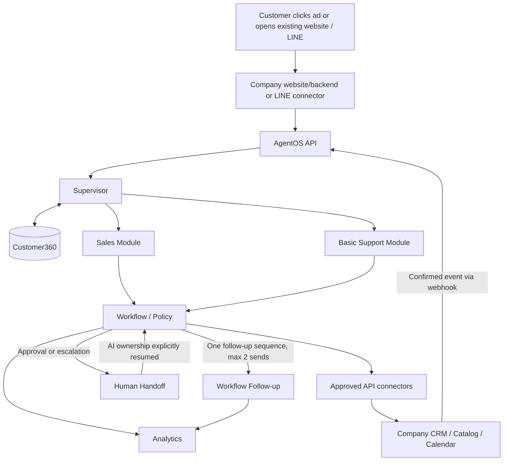
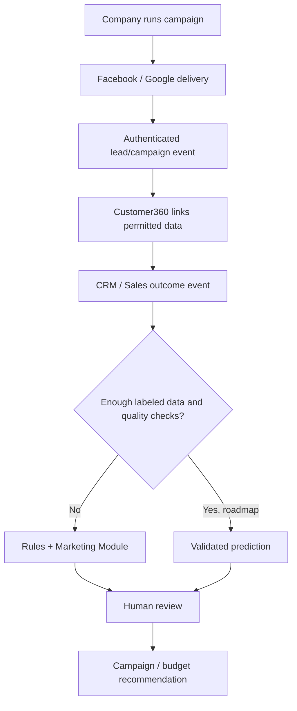

# MVP, Validation, and Roadmap

[Plan index](../README.md) · [Vietnamese easy-read flow](../plan-easy-read-flow.md) · [Glossary](../glossary.md)

Status: proposed design, not implemented functionality. Examples and targets are illustrative until agreed with a pilot customer.

## MVP

Objective: prove the Sales Module works inside one company's existing application through the AgentOS API, with basic Support enabled for this pilot and accountable human handoff. Preserve the current Sales-first scope; full Marketing remains a later phase.

The diagram shows MVP scope. Handoff is conditional, and analytics consumes events from every stage, not only follow-up. The existing website displays returned answers; connected channels can deliver replies directly. “One follow-up sequence, max 2 sends” means one initial message and at most one later reminder, subject to the stop rules; it does not mean unlimited automation.

| Priority | Deliverable | Minimum usable behavior |
|---:|---|---|
| 1 | Customer360 | Tenant-scoped identity, contact, conversation, consent, lead and opportunity references |
| 2 | Module API + Web/LINE connection | Existing backend can create conversations, submit messages/events, and read task results; supported channels normalize messaging and deduplicate delivery |
| 3 | Knowledge | Connect/import approved company catalog/FAQ data; retrieval and source/version controls |
| 4 | Supervisor | Sales/Support routing, context loading, safe clarification |
| 5 | Sales qualification | Required questions, persisted fields, rules-based score |
| 6 | Product recommendation | Catalog-backed choices with verified prices and eligibility |
| 7 | Company API connectors | One CRM and one approved catalog source; permitted reads/writes and contact/opportunity sync with known field ownership |
| 8 | Booking | One calendar provider, verified availability and booking result |
| 9 | Follow-up | One durable sequence with timers, consent checks, and stop rules |
| 10 | Basic Support | Approved FAQ answers, bounded guidance, unresolved-case capture; optional order/ticket connectors are not required |
| 11 | Human handoff | Queue, assigned owner, complete summary, AI pause/resume; approved operator event for accept/takeover/approve/reject |
| 12 | Dashboard | Conversations, qualification, bookings, handoffs, basic support outcomes, cost |

Permissions, tenant isolation, audit, and failure handling are acceptance requirements across all twelve items, not optional add-ons.

Not in MVP: custom ML; automated ad management; full campaign/nurture automation; a dedicated Retention Agent (retention is a cross-module workflow, not a fourth product module); advanced ticketing/SLA; automated quote generation, payment/refund/cancellation execution; voice; visual builders. Humans handle quotations and purchase confirmation through the chosen CRM process.

### MVP action boundary

An **allowlist** is the small set of actions the first release may perform. A **denylist** is the explicit set of actions that must remain unavailable even if a prompt asks for them.

| Area | MVP allowlist | MVP denylist |
|---|---|---|
| Customer and conversation | Read/write AgentOS conversation, permitted Customer360 links, summaries and ownership | Cross-company lookup, unverified private data, deleting source records |
| CRM | Read contact/lead/opportunity; create or update qualification, notes, owner, next action | Marking a sale without source confirmation; arbitrary CRM fields or bulk changes |
| Product data | Read approved catalog/product terms and eligibility | Editing catalog prices, promotions or eligibility |
| Calendar | Read free/busy and create one meeting request; save confirmed booking reference | Cancel/reschedule, double-booking, or claiming success before provider confirmation |
| Customer messaging | Send one initial follow-up plus at most one reminder when every live consent/stop check passes | Unlimited nurture, ad operations, messages after opt-out/reply/human takeover |
| Support | Answer approved FAQ and bounded troubleshooting; create a human queue item | Payment, refund, cancellation, account-changing action, or pretending a ticket is resolved |
| Human operations | Create/accept/approve/reject/take over/resume through the approved operator path | Silent AI takeover, approval by timeout, or sending while a human owns the conversation |

The allowlist applies per company and enabled module. A request for a denied action returns an explicit unsupported or `awaiting_human` result and leaves an audit record; it does not fall through to a more powerful connector.

### Validation and rollout

Run a fixed conversation test set after changing prompts, tools, catalog, knowledge, configuration, or workflows.

| Acceptance area | Required evidence |
|---|---|
| End-to-end journey | Lead → qualification → recommendation → booking → CRM; basic support → answer or human-owned case |
| Existing application integration | A request from the company's backend receives a task result displayed in the existing UI; approved CRM updates are confirmed in that CRM; callback delivery has polling fallback |
| Human handoff control | An authorized operator accepts, takes over, rejects, or resumes through the approved event path; the action is idempotent and the customer conversation pauses while human-owned |
| Selectable modules | Sales works with Marketing disabled; Support routes only when enabled; an unavailable module is rejected or handed off explicitly |
| Reusable deployment | The same build passes scoped tests for two isolated company configurations using test data; changing products/fields does not require Agent code edits |
| Shared context | Sales/Support handoff preserves identity, history, next action, and ownership |
| Commercial correctness | Recommendations use approved terms; a 30% discount request cannot bypass policy |
| Safety and privacy | Tenant-isolation, prompt-injection, unverified-identity, refund/cancellation, and human-request tests |
| Reliability | Repeated API request, duplicate webhook, timeout, uncertain write, unavailable calendar, callback delivery failure with polling recovery, and failed-handoff tests |
| Outreach | Opt-out, reply, closed opportunity, and human ownership prevent scheduled sends |
| Agent quality | Routing, grounded answers, qualification, escalation, and configured language/tone tests |

Proposed pilot targets, to agree against a documented baseline: first response under 30 seconds; qualification completion above 60%; booking conversion +20% relative to baseline; repetitive Sales qualification time -30%; routine Support automation above 50%; handoff-summary completeness above 95%; policy-test compliance above 99%; **zero critical unauthorized actions**.

Progress through `Shadow → Human Copilot → Controlled Low-risk Automation → Expanded Autonomy`.
Advance only after reviewing test results and pilot evidence; keep a human takeover and rollback path.

## Roadmap

MVP already includes basic FAQ support and one follow-up sequence. Later phases deepen those capabilities rather than defer them.

| Phase | Delivery focus | Exit evidence |
|---|---|---|
| 1 — Sales Module MVP | Module API, existing website/LINE connection, company API connectors, Customer360, Knowledge, Supervisor; Lead → Qualification → Booking → CRM; basic Support/handoff/follow-up/dashboard | [MVP](mvp-and-roadmap.md#section-21) acceptance checks pass; a pilot journey runs in the existing app and configuration isolation is tested |
| 2 — Support | FAQ → troubleshooting → Ticket → Human; richer ticketing, priority/SLA, CSAT | Confirmed resolutions and context-complete escalations |
| 3 — Workflow Automation | More follow-up and event workflows; approved quotation and commerce adapters as needed | Durable runs, safe retries, approvals, and verified outcomes |
| 4 — Marketing | Campaign content, lead nurture, segmentation, campaign attribution, reactivation | Source → qualified lead → Sales result is traceable |
| 5 — Retention workflows | Adoption, renewal, churn signals, upsell/cross-sell, expansion across enabled modules; not a fourth module | Renewal actions and expansion outcomes are recorded |
| 6 — Marketing Intelligence | Prediction and optimization roadmap below | Sufficient linked data, validated predictions, human-reviewed recommendations |

Before Phase 1, select the first vertical, pilot customer, existing application to integrate, available company APIs, CRM/catalog/calendar sources, business owners, and baseline metrics. This plan does not assume those choices or API access are already available.

## Marketing Intelligence / ML — Roadmap Only

Custom ML is not MVP core. Do not build an ad-bidding engine to replace Meta or Google.

| Responsibility boundary | Optimization focus |
|---|---|
| Meta / Google | Delivery, Auction, Placement |
| AgentOS | Lead Quality, Revenue, LTV, Budget Decision |

**ML** means a learned prediction model. It is not part of the MVP and it does not replace Facebook/Google's ad auction. The model may suggest a decision; a person approves any campaign or budget change.

| Intelligence phase | Capability | Dependency |
|---|---|---|
| 1 | Rules + Marketing Agent | Approved rules and campaign-to-lead tracking; no custom ML |
| 2 | Lead Quality Prediction | Consistent qualification fields and labeled Sales outcomes |
| 3 | Conversion Prediction | Reliable opportunity stages and Won/Lost history |
| 4 | LTV / Expected Revenue | Linked revenue, renewal, expansion, and customer cohorts |
| 5 | Budget Recommendation | Spend data and validated quality/revenue estimates |

The intelligence phases are a capability ladder: rules arrive with Marketing; learned models follow only when data supports them. Validate on later, held-out outcomes, check calibration and drift, and compare with the rules baseline.

Marketing proposes campaign and budget changes for human approval. Predictive scores and attributed revenue do not establish causal lift or authorize autonomous spend.

## MVP build packages and evidence

These packages are dependency gates, not a delivery schedule. Keep the same code path for both test companies; vary only tenant configuration, credentials, mappings, catalog, and test data.

| Package | Depends on | Evidence to accept |
|---|---|---|
| Tenant and deployment bundle | [Product configuration](../product-and-packaging.md#product-and-business-configuration); access model | Two isolated test-company configs pass cross-tenant read and write-denial tests |
| Existing ingress | [API contract](../platform/api-and-integrations.md#apis-and-enterprise-integrations); authenticated caller credentials | Existing web backend submits a message and reads a task; LINE delivery is deduplicated |
| Shared context and knowledge | Tenant bundle; approved catalog and FAQ sources | Identity, consent, history, source version, and tenant scope appear in a trace |
| Supervisor routing | Shared context; enabled-module configuration | Sales routes correctly; basic Support answers or creates a human-owned case |
| Qualification and recommendation | Sales fields/rules; catalog connector | Required fields persist; recommendation shows approved price and eligibility |
| CRM, catalog, and calendar adapters | Company credentials, field ownership, provider sandboxes | One CRM update, one catalog read, and one confirmed booking have provider references |
| Follow-up and human queue | Event store; consent and stop rules; staff owner | One durable follow-up stops on reply/opt-out/closure; human handoff pauses AI replies |
| Audit, analytics, and dashboard | Events from every package; metric dictionary | Correlated trace, policy result, cost, and unavailable-data state are reviewable |

### Dependency and evidence gates

- Do not enable an action until its connector has an owner, allowed fields, and an uncertain-write recovery test.
- Treat `202 Accepted` as queued work; require a provider-confirmed result before calling a booking or CRM write successful.
- Test the existing web backend and LINE API paths with duplicate requests, duplicate webhooks, timeout, callback failure, and polling recovery.
- Run the fixed conversation set after any prompt, tool, catalog, knowledge, configuration, or workflow change.
- Include tenant, conversation, correlation, event, configuration-version, actor, and policy-result identifiers in the audit trace.
- Keep an explicit negative test for an unavailable module; it must reject or hand off rather than silently activate it.
- Record human ownership, AI pause, and explicit resume before a workflow can continue after handoff.
- Require a human-readable failure reason and named recovery owner for every failed or uncertain workflow.

### Pilot prerequisites

| Input | Ready when | Accountable owner |
|---|---|---|
| Pilot vertical and business outcome | One Sales outcome and one basic Support outcome are written | Business sponsor |
| Existing application and channels | Web backend endpoint and LINE webhook/callback owner are named | Integration owner |
| CRM, catalog, calendar | One provider each has test access, mappings, and permitted operations | Company system owners |
| Products and policy | Approved prices, eligibility, discount ceiling, FAQ versions, and escalation rules exist | Sales/Support managers |
| Human operations | Queue, assigned owner, business hours, pause/resume authority, and rollback contact exist | Operations owner |
| Privacy and test data | Consent, retention, redaction, test identities, and deletion path are approved | Security/privacy owner |
| Baseline and test cases | Baseline period, acceptance set, and target denominator are signed off | Analytics owner |
| Reuse proof | Two isolated test-company configurations run on the same build; no second real customer is required | Product + engineering |

### Open decisions before controlled use

- Which vertical, pilot tenant, and existing web backend are first, and which LINE account is in scope?
- Which system owns customer, opportunity, product, price, availability, booking, and consent fields?
- What timezone, business hours, booking conflict rule, and calendar confirmation count as final?
- What message/channel, quiet hours, consent wording, and stop conditions govern the single follow-up?
- Who can accept a handoff, resume AI, approve exceptions, and trigger rollback?
- Which baseline period and cohort rules apply to conversion, support resolution, and cost metrics?
- What evidence may be retained, for how long, and who signs pilot exit or expansion?

### Pilot evidence packet

- Save representative web-backend and LINE request, response, callback, and polling traces.
- Link every external write to its provider reference and audit correlation ID.
- Include both test-company configuration IDs and a cross-tenant access-test result.
- Attach the fixed conversation-set result, policy cases, failure cases, and human-handoff cases.
- Record catalog, FAQ, workflow, policy, and configuration versions used by each run.
- Mark missing or stale source data and list the owner responsible for correction.
- Capture opt-out, reply, closed-opportunity, timeout, and rollback outcomes.
- Obtain business-owner acceptance for the agreed pilot outcome and expansion gate.

MVP scope remains Sales-first: the existing web backend and LINE API, Sales with basic Support enabled, one CRM/catalog/calendar, one follow-up sequence, and human handoff. Custom ML, full Marketing, automatic quotes, payments, refunds, and cancellations remain outside MVP.
