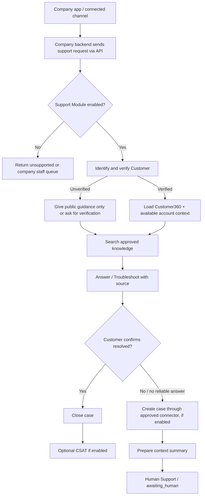
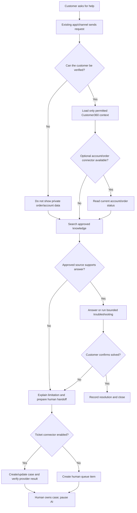

# Customer Support Module

[Plan index](../README.md) · [Vietnamese easy-read flow](../plan-easy-read-flow.md) · [Glossary](../glossary.md)

Status: proposed design, not implemented functionality. Examples and targets are illustrative until agreed with a pilot customer.

## Customer Care / Support Agent

Purpose: resolve routine problems with customer and product context, then transfer exceptions cleanly.

The **knowledge base** is the approved FAQ and guide collection. A **ticket** is a trackable support case. **CSAT** is the customer's satisfaction rating after help. Order/subscription lookup and ticket creation are optional connectors in the full product; the basic MVP can still answer approved general questions and hand off a context summary.

### Detailed Support flow

Support never treats a message sent as proof that the case is solved. The result must include the evidence used, steps attempted, current owner and next action. If a ticket API times out, reconcile it before trying again so one problem does not create two tickets.

Without a reliable answer, or when permitted troubleshooting is exhausted, take the escalation path. Do not close a case solely because the AI sent a response.

| Handoff field | What Human Support receives |
|---|---|
| Customer | Verified customer ID, contact, account, and plan |
| Issue | Customer's problem and desired outcome |
| Context | Relevant conversation, product, order, subscription, and environment |
| Troubleshooting tried | Steps attempted, results, and remaining unknowns |
| Priority | Impact, urgency, sentiment, and SLA risk |
| Recommended next action | Suggested action, destination team, and ticket/conversation links |

Support also records adoption gaps and feature interest as signals. Sales owns any resulting commercial offer.

## Support Module Operating Contract

Support is independently selectable and begins when the Supervisor or company application assigns a customer message to Support. Many independent conversations can run at once; each conversation has one active responder/owner at a time. Support does not take over a Sales-owned opportunity without an explicit transfer and recorded reason.

### Inputs and company-owned data

| Input | Required data and source of truth |
|---|---|
| Customer context | Customer360 identity, verification state, contact, plan, consent, conversation history, and owner |
| Knowledge | Approved FAQ, product guides, troubleshooting steps, source/version, effective date, and allowed claims |
| Optional product/account sources | Company API responses for product, order, subscription, entitlement, environment, and service status; order/subscription lookup is full-product optional |
| Issue details | Customer-described problem, desired outcome, reproduction steps, impact, urgency, and time zone |
| Optional ticketing source | Ticket/case ID, queue, assignee, status, SLA, and resolution event when a later connector is enabled |
| Policy and security | Verification rules, safe troubleshooting limits, incident routing, privacy rules, and escalation policy |

Company applications remain authoritative. Basic Support in the Planned MVP uses approved knowledge, verified context, and bounded guidance; order/subscription lookup and ticketing are optional full-product sources, not required new MVP connectors. Use the approved read APIs and ticket adapter in [APIs and Integrations](../platform/api-and-integrations.md); never expose data from an unverified match or rely on unrestricted database access. Knowledge and catalog ownership follow [Customer Data and Knowledge](../platform/data-and-knowledge.md).

### Actions and outputs

| Scope | Supported action | Output and boundary |
|---|---|---|
| Planned MVP | Verify the customer and load permitted context | Verification result, loaded source references, and any missing context |
| Planned MVP | Search approved knowledge and answer routine questions | Grounded answer with source/version, confidence, and next step |
| Planned MVP | Run bounded, approved troubleshooting | Steps attempted, observed results, and explicit stop condition |
| Planned MVP | Capture an unresolved case and human handoff | Complete summary, priority/SLA signal, queue, owner request, and task status |
| Full product, later (optional connector) | Create or update a ticket after provider confirmation | Case reference and confirmed status; otherwise `awaiting_human` or `failed` |
| Full product, later | Rich ticketing, SLA automation, CSAT, and proactive adoption workflows | Labeled workflow proposal or separately enabled action with human policy boundaries |
| Full product, later | Refund, cancellation, payment, or account-changing action | Human-approved, provider-confirmed adapter only; none is added to MVP |

Support never closes a case merely because it sent an answer. It asks whether the customer is resolved, and it records a resolution confirmation or transfers the case. Feature interest can be a signal for Sales, but Support cannot create or promise a commercial offer.

### Main flow, decisions, and fallbacks

1. Confirm Support is enabled, accept the active-owner transfer, and verify the customer before revealing account-specific details.
2. Load configured product/account context and service status through permitted APIs; if optional order/subscription sources are absent, continue with core context and do not claim those details.
3. Search approved knowledge. If no source supports an answer, state the limitation and escalate rather than guess.
4. Offer only configured troubleshooting steps; stop on unsafe, repeated, or ineffective steps and record results.
5. Ask whether the issue is resolved. Close only after confirmation; otherwise create a case where possible and prepare the human summary.
6. Return source references, case/task status, owner, and next action to the existing company application.

| Exception | Safe fallback |
|---|---|
| Identity cannot be verified or matches are ambiguous | Ask the approved verification question or hand off; disclose no account or order data |
| Product or ticket API is unavailable | Give only generic sourced guidance, record the outage, and queue human review |
| Knowledge is missing, stale, or conflicting | Show no unsupported claim; cite the conflict and escalate to the knowledge owner |
| Security, safety, regulated, or incident signal | Stop troubleshooting and route immediately to the configured human/incident queue |
| Ticket write times out after possible acceptance | Reconcile by idempotency key before retrying; never create a duplicate case |
| Refund, cancellation, payment, or account change requested in MVP | Capture intent and context for a human; perform no execution |
| Support disabled | Preserve the message in core, return unsupported or a human queue item, and do not fabricate a Support answer |

If Sales is enabled and the customer clearly asks for a commercial offer, the Supervisor may request an explicit transfer; otherwise Support remains owner. If Sales is disabled, keep the signal attached to the case for human follow-up. See [Workflows and Human Handoffs](../platform/workflows-and-handoffs.md) for transfer and pause rules.

### Configuration and acceptance scenarios

Configure enabled modules, identity checks, permitted fields, knowledge sources and versions, troubleshooting allowlists and limits, severity/SLA mapping, ticket fields and queues for later ticketing, human owners, language/tone, CSAT policy, retry limits, and audit/retention rules. Keep credentials in protected company-scoped connector storage; a delegated secret may be held by an AgentOS connector when required, with scope, rotation, and audit.

Acceptance scenarios:

1. A verified customer asks an FAQ question; Support answers from an approved version, the customer confirms resolution, and the case closes with an auditable result.
2. A customer reports a problem with no grounded knowledge answer; Support states the limitation, records attempted checks, and hands off a complete summary.
3. An unverified customer asks about an order; Support requests verification and reveals no order or subscription details.
4. Ticket creation times out; reconciliation returns one confirmed case or a human queue item, never duplicate tickets or a false success.
5. Support is disabled; the message is preserved and explicitly queued/rejected for a human, with no pretend Support response.
