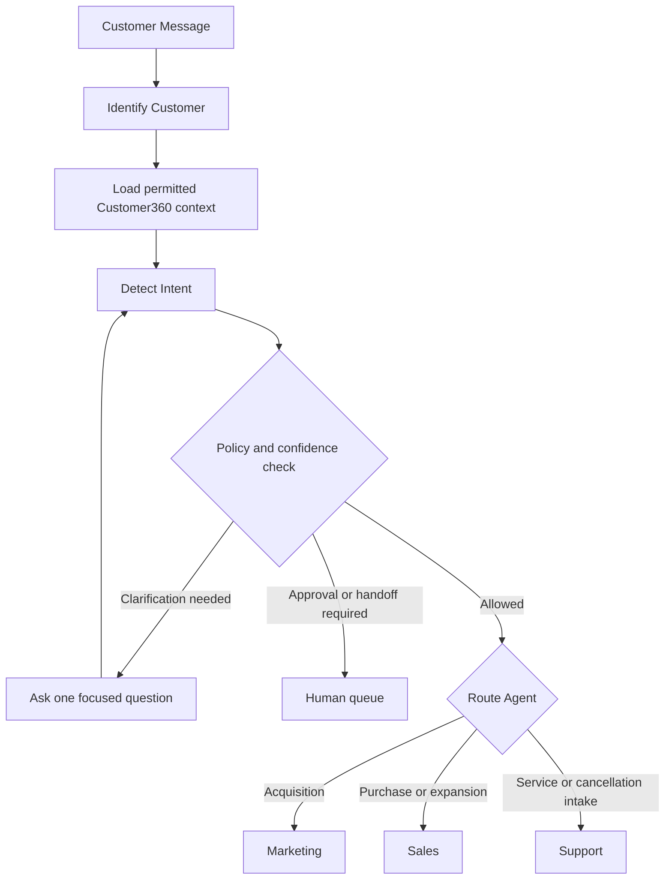
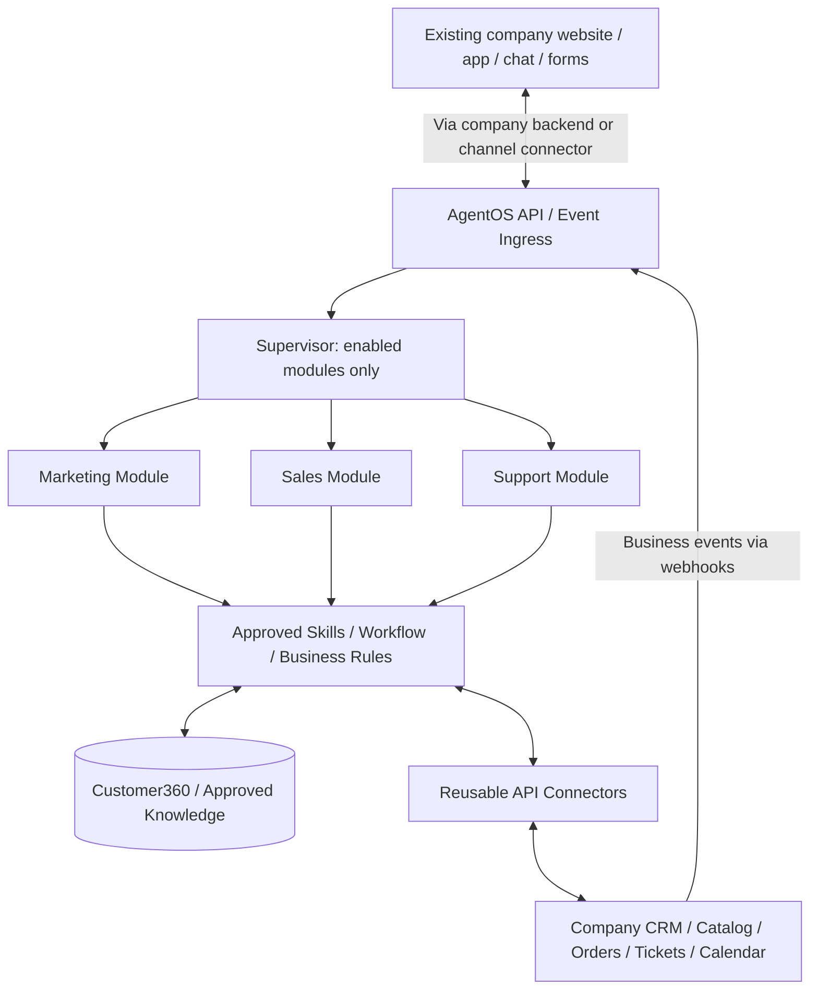

# Architecture and Orchestration

[Plan index](../README.md) · [Vietnamese easy-read flow](../plan-easy-read-flow.md)

Status: proposed design, not implemented functionality. Examples and targets are illustrative until agreed with a pilot customer.

## Supervisor Agent

The Supervisor is the AI manager and router. It assembles context, selects an owner, and coordinates next steps; the policy and tool layers enforce permissions.

An application may request a specific enabled module or let the Supervisor route the request. Both paths enforce the same permissions and business rules; an unavailable module results in an explicit unsupported response or a configured human/company-system handoff.

| Customer message | Routing |
|---|---|
| "How much does it cost?" | Sales |
| "Send me the catalog." | Marketing for general discovery; Sales for purchase intent |
| "I cannot log in." | Support |
| "I want to buy 50 more users." | Sales / upsell |
| "I want to cancel." | Support / retention intake, then Human for the cancellation decision |

If identity is unverified, load only safe public or session context. If intent remains unclear, clarify or hand off instead of repeatedly switching agents.

## High-Level Architecture

AgentOS runs as a connected AI service. The company can keep its customer interface and call AgentOS through its backend; supported channel connectors can deliver messages to the same entry point. No separate AgentOS customer-facing app is required.

This is a logical map, not a requirement to deploy each module as a separate service. Responses return through the AgentOS API or a configured callback; the company application or connected channel displays them.

| Boundary | Responsibility |
|---|---|
| Company applications and data | Own the customer interface, account authentication, existing business records, and permitted operations |
| AgentOS API and event ingress | Authenticate the calling company, check enabled modules and permissions, normalize messages/events, deduplicate delivery |
| Supervisor and runtime | Assemble context, route work, run role-specific agents, validate responses |
| Skills and workflow | Validate tool inputs, enforce policy, execute approved actions, track state and timers |
| Data and API connectors | Link customer context, retrieve permitted company data, perform approved updates, return verified results |

Execution contract: `Approved context → Agent proposal → Authorize/execute needed tools → Validate results and response → Send → Audit + Customer360 update`.

Start with one modular application, a versioned API, and a durable background worker. Module packaging does not require a microservice per Agent.

| Data | Initial storage approach |
|---|---|
| Customer links and approved snapshots; AgentOS conversations, workflow state, events, audit | Relational database with tenant-scoped access |
| Source documents | Object storage with controlled access |
| Retrieval index | Derived search/vector index; never the only copy of business state |
| Analytics | Derived views or aggregates; introduce a warehouse only when justified |

## One request through the platform

| Step | Component | Input | Required output or stop |
|---|---|---|---|
| 1. Receive | Company backend / channel connector | Customer message or permitted company event | Normalized request with source and correlation reference |
| 2. Admit | AgentOS API | Verified caller credentials and request | Company-scoped task or explicit error; never trust a body field to select the company |
| 3. Resolve | Supervisor + Customer360 | Conversation, customer references, enabled modules | Permitted identity/context; ask or limit to public information if verification is missing |
| 4. Route | Supervisor | Requested module or `auto`, intent, current owner | Allowed owner; unavailable module is rejected or handed to configured staff |
| 5. Propose | Selected module | Bounded context and business configuration | Grounded answer or a proposed action, not permission to execute |
| 6. Execute | Workflow / approved skill / connector | Validated proposal and current policy | Verified provider result, pending approval, or recoverable failure |
| 7. Respond | Runtime + API / channel | Validated answer and action outcome | Answer/result in the existing application; no invented success |
| 8. Record | Customer360, workflow and audit stores | Outcome, ownership, source references | Linked activity for the next request and permitted analytics |

`auto` is routing behavior, not a fourth business module. A named module request still passes authorization and current-owner checks.

## Shared service, selectable capabilities

| Concern | Initial implementation boundary |
|---|---|
| Module behavior | Separate role-specific logic/configuration inside one modular application |
| Long-running work | Durable worker executes queued tasks, timers, and approved retries |
| Customer interface | Company's existing UI or supported channel; optional widget only where needed |
| State separation | Company-scoped records, retrieval filters, task access and connector credentials |
| External operations | Approved skills call connectors; Agent prompts contain no provider secrets or database credentials |
| New customer | New configuration and permitted connections using the existing build |

Do not introduce a separate microservice, message broker, or per-customer fork solely to label a capability a module. Select actual hosting and infrastructure with the pilot; the logical diagram does not prescribe a vendor stack.

## Architecture acceptance checks

1. A backend request reaches only the modules enabled for its authenticated company.
2. The same conversation cannot have automated and human responders active concurrently.
3. A module may request a tool but cannot bypass workflow approval or directly write external records.
4. Task results return to the authorized caller/channel; a different company cannot read them by guessing IDs.
5. Inbound events and interactive messages produce linked workflow/audit records without duplicate external actions.

Protocol details: [APIs and integrations](api-and-integrations.md). Identity/data rules: [Data and knowledge](data-and-knowledge.md). Ownership and waits: [Workflows and handoffs](workflows-and-handoffs.md).
