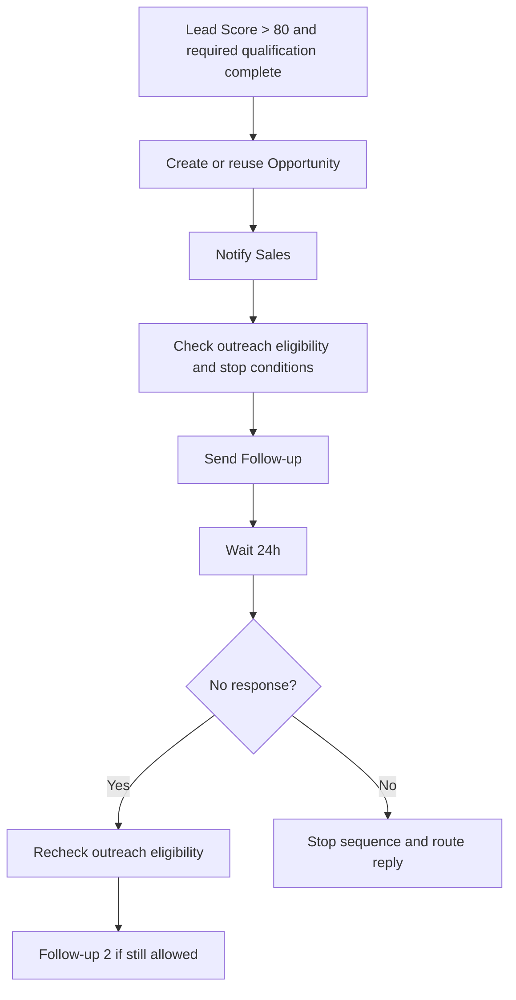

# Workflows and Human Handoffs

[Plan index](../README.md) · [Vietnamese easy-read flow](../plan-easy-read-flow.md)

Status: proposed design, not implemented functionality. Examples and targets are illustrative until agreed with a pilot customer.

## Workflow Engine

**AI understands the situation and proposes actions. The Workflow Engine controls the business process.**
Rules, permissions, transitions, timers, and stop conditions must exist outside prompts.

Example — an eligible hot lead:

A failed eligibility check ends the outbound path; it does not send a message.

| Workflow element | Contract |
|---|---|
| Trigger | A recorded event such as `lead.qualified`, `quotation.sent`, `payment.completed`, `ticket.resolved`, or `customer.upsell_signal` |
| State | Persist current step, owner, next run time, and terminal outcome |
| Conditions | Evaluate configured qualification, eligibility, policy, and current customer state |
| Actions | Call approved skills and save verified results |
| Timers and approvals | Resume durably after a wait or explicit human decision |
| Event record | Include event ID, tenant/customer IDs, timestamp, source, and correlation ID |

Stop the active sales/nurture sequence after opt-out, a customer reply, its opportunity reaching Won/Lost, or human takeover. Other lifecycle workflows need their own eligibility checks; do not implicitly restart a stopped sequence. Every send must respect purpose-specific consent, channel restrictions, business hours/timezone, frequency caps, and active human ownership; recheck immediately before sending and log the outcome.

## Human-in-the-loop

Flow: `Agent → Policy → Approval/Handoff → Human → Recorded decision`.

| Mandatory human involvement | AI may do before handoff |
|---|---|
| High-value deal | Collect qualification and prepare the commercial summary |
| Custom pricing or discount outside policy | Retrieve standard prices and submit an approval request |
| Refund or cancellation | Verify identity, collect reasons, explain the process, create the request |
| Legal or security issue | Acknowledge and route to the responsible team |
| Low confidence, repeated failure, or SLA risk | Preserve evidence and recommend a next step |
| Customer requests a human | Transfer without forcing further AI troubleshooting |

High-value thresholds, discount limits, minimum evidence/confidence thresholds, and maximum failed troubleshooting steps are tenant configuration. No response from an approver is not approval.

Supported modes: shadow/silent assistance, human-first copilot, AI-first with escalation, and approved low-risk automation. If a human is unavailable, acknowledge the pending request, retain an accountable queue/owner, and apply the configured business-hours response.

## Durable workflow contracts (full-product target)

These contracts make the example sequence executable and reviewable without putting transitions in a prompt. They describe the full product; MVP enables one bounded follow-up sequence and the owners named in [MVP](../delivery/mvp-and-roadmap.md#section-21).

### Run record and state transitions

Every run has one durable record. The record is the source of truth when a worker, callback, or timer is retried.

| Field | Contract |
|---|---|
| `run_id` | Stable instance ID associated with the tenant + source + event ID + workflow identity deduplication key |
| `trigger_event_id` | Source event ID that started the run; never silently replaced |
| Context | Tenant, customer, conversation, opportunity, and correlation IDs |
| Definition | Workflow name and structural version; configuration is an audit snapshot, not a substitute for live safety checks |
| Progress | Current state, step ID, attempt count, and next run time |
| Ownership | Accountable owner type/ID, queue, and last handoff time |
| Decision | Approval reference, decision, actor, and decision time when required |
| Outcome | Stop reason, verified result references, or stable failure code |

| State | Allowed meaning and transition |
|---|---|
| `queued` | Trigger accepted; dedupe and eligibility checks have not finished |
| `running` | One worker owns the current step lease and may execute it |
| `waiting` | Timer or external event is pending; resume from the saved step |
| `awaiting_human` | A named person or queue must decide or take over; no automatic success |
| `completed` | All required actions have verified results and the configured outcome is recorded |
| `stopped` | A configured stop condition ended outbound work; reason is recorded |
| `failed` | Overall outcome was not established; confirmed, rejected, or uncertain action results and next owner/action remain explicit |

Only one active worker may advance a run step. Pin only structural process steps for reproducibility; reload live consent, permissions, enabled modules, security policy, and customer state before every execution. A stale lease is recovered from the record, and the step's effect key is reused before another attempt. See the API task and callback rules in [APIs and Enterprise Integrations](api-and-integrations.md#section-15).

### Guarded hot-lead follow-up contract

The canonical trigger is `lead.qualified`. A lead is eligible only when its score is above the tenant threshold (the example uses `>80`), required qualification is complete, the opportunity is open, and current outreach policy allows the channel.

| Step | Required contract |
|---|---|
| Dedupe | Use tenant + source + event ID + workflow identity for one run; reuse an opportunity by tenant + customer + external business key |
| Owner | Keep the current opportunity owner; otherwise assign the configured Sales owner/queue before any send |
| Approval | Pause for a recorded approval when value, discount, message, or policy requires it |
| Notify | Give the owner the qualification evidence, proposed next action, and expiry/SLA |
| Send gate | Recheck reply, opt-out, consent, channel, hours, frequency cap, opportunity stage, and human ownership immediately before sending |
| Effect | Send with one stable `run_id:send_step` idempotency key and save the provider result/reference |
| Wait | Save the configured wait (default example: 24 hours); wake from durable state, not process memory |
| Follow-up 2 | Re-run the send gate; send only if still allowed and the sequence limit has not been reached |
| Finish | Record replied, booked, stopped, handed-off, or failed outcome and update the owning system as permitted |

If the score or qualification is below the threshold, the opportunity is closed, or no accountable owner can be assigned, the run records the reason and sends nothing. A customer reply stops the outbound path and routes the reply to the owner or configured queue.

### Ownership and approval flow

There is exactly one accountable owner at each human boundary, even when several watchers receive a notification. Ownership changes are events with actor, reason, timestamp, and the next action; an AI worker cannot silently reclaim a human-owned run.

| Situation | State and next action |
|---|---|
| Assigned sales owner | `running` or `waiting`; owner receives the next action and SLA |
| No owner or owner unavailable | `awaiting_human` on the configured queue; no outbound send |
| High-value/custom/out-of-policy action | `awaiting_human` with evidence, proposed action, approver, and expiry |
| Approval granted | Record actor and decision, recheck all gates, then resume the saved step |
| Approval denied or expired | Record the reason; stop or route to the configured alternative |
| Human takeover | Pause AI actions until a human explicitly resumes the AI-owned step |

No approver response is an unresolved pending state, not approval. Customer-facing status and the API task must say `awaiting_human`; they must not say completed, booked, or resolved. Human decisions are linked to the run and [Customer360](data-and-knowledge.md#section-11).

### Retry and recovery contract

Retry only a transient failure and only after reloading the durable run record. Use tenant-configured maximum attempts and bounded backoff; keep the same effect key for the same business action.

| Failure | Required behavior |
|---|---|
| Temporary transport, rate, or worker failure | Retry within the bound; do not advance the step until a result is known |
| Validation, policy, or eligibility failure | Do not retry; record the reason and apply the configured stop/handoff |
| Timeout after a possible write | Reconcile the source system by its reference/business key before retrying |
| Repeated failure | Mark `failed`, preserve evidence, and assign the configured human exception owner |
| Stop condition during backoff | Cancel the pending attempt and mark `stopped`; never send on wake-up |

### Configurable stops and acceptance tests

Tenant configuration defines the threshold, wait times, sequence length, business hours, frequency cap, owner fallback, approval rules, maximum attempts, and stop signals. Structural process changes apply to new runs unless active runs are explicitly migrated. Live consent, access permissions, module enablement, safety policy, and current eligibility override any saved configuration snapshot before the next action.

| Stop signal | Default effect |
|---|---|
| Customer reply | Stop outbound; route the reply and preserve ownership |
| Opt-out or consent withdrawal | Stop all matching outreach and record the channel/reason |
| Opportunity reaches Won/Lost or is deleted | Stop the sequence; keep the commercial outcome |
| Human takeover | Pause until explicit resume; do not auto-resume on timer |
| Channel blocked, outside hours, or frequency cap | Stop the current sequence; any later restart requires an explicit permitted new decision |
| Maximum attempts/sequence reached | End with `failed` or `stopped` and a clear next owner/action |

Acceptance tests must prove that:

- an eligible hot lead creates one run, one opportunity link, one owner notification, and at most the configured sends;
- a score at the boundary, missing qualification, closed opportunity, or missing owner sends nothing;
- duplicate `lead.qualified` events reuse the run; a different legitimate event reuses the opportunity business key without duplicating the opportunity;
- required approval remains `awaiting_human` until approve/reject/expire is recorded, with no silent success;
- a reply, opt-out, takeover, closed opportunity, blocked channel, outside-hours trigger, or frequency cap before the timer prevents the next send and requires an explicit permitted decision to restart;
- a provider timeout reconciles before retry, and an exhausted retry becomes an explicit human-owned failure;
- a tenant's changed wait, stop, owner, and attempt settings are observable in the run record;
- resume after approval or takeover executes the saved step once and records its verified outcome; a live consent, permission, module-enable, or policy change is enforced on the next execution even when the structural definition is pinned.
