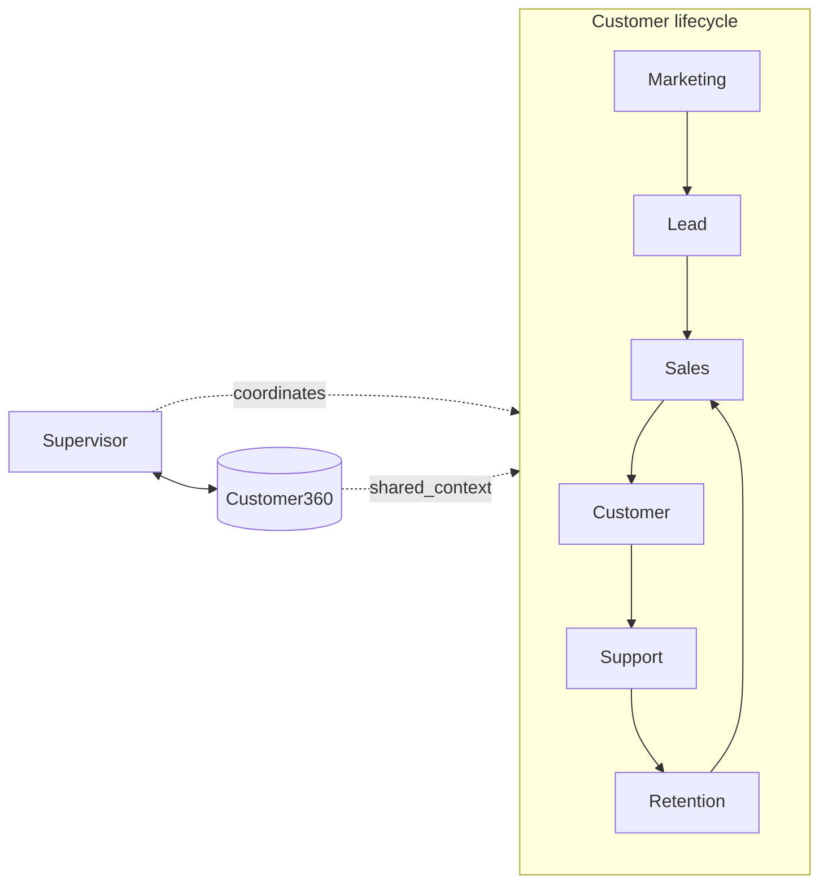
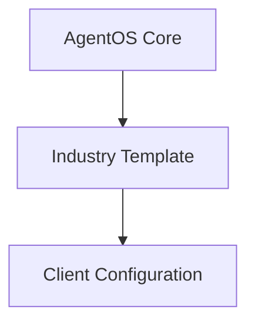

# Product, Configuration, and Packaging

[Plan index](README.md) · [Vietnamese easy-read flow](plan-easy-read-flow.md)

Status: proposed design, not implemented functionality. Examples and targets are illustrative until agreed with a pilot customer.

<a id=section-1></a>

## Executive Summary

AgentOS Customer360 is a packaged set of AI modules that connects to a company's existing applications and data, preferably through APIs.
It addresses missed leads, inconsistent follow-up, repetitive support, and fragmented customer information.
Companies can enable Marketing, Sales, Customer Support, or any combination; each module uses an AI Agent for its work.
Enabled modules share a Supervisor, Customer360, Workflow, Knowledge, and Business Rules.
The company's website, app, CRM, order system, and support tools can stay in place.
AgentOS receives messages or events, retrieves permitted data, and returns answers or performs approved updates through connected APIs.
Customer360 links customer history across modules while existing systems retain ownership of their business records.
The same modules can serve many companies through separate data access, configuration, and reusable connections.



<a id=section-2></a>

## Core Concept

```text
Shared Core + Selected AI Modules
            + Connections to Existing Applications and Data
            + Business Configuration and Approved Knowledge
            = Customer Deployment
```

**A module is a packaged business capability, not a new AI model or a replacement application.**

| Selectable module | Receives from the company's applications | Returns or updates through approved connections |
|---|---|---|
| Marketing | Ad/form leads, inquiries, campaign and engagement events | Lead details, permitted nurture actions, qualification and Sales handoff |
| Sales | New or qualified inquiries, customer context, product and price data | Recommendations, meeting bookings, CRM updates, follow-up and human requests |
| Customer Support | Customer questions, approved guides, verified order/account references | Answers, troubleshooting, case updates and human handoff |

Each module can be used without buying the other two, but all use the shared core below. If the receiving module is not enabled, hand off to the company's staff or existing application instead.

| Area | Core — code once | Configuration — change by business |
|---|---|---|
| Agent behavior | Agent Runtime, Supervisor | Sales questions, qualification fields, agent tone |
| Business process | Workflow Engine | Lead scoring, follow-up rules, sales stages, business hours |
| Business information | Customer360, Knowledge/RAG | Products, prices, promotions, support FAQ |
| Connectivity | Module API, reusable connectors, Messaging | Enabled modules, channels, company API connections, field mappings |
| Control and measurement | Permissions, Audit, Analytics | Escalation policy, role assignments, KPI targets |

Target: **80–90% reusable platform + 10–20% customer configuration**.
This is a design target, not a measured reuse rate or a guarantee.

A product or industry change should normally update configuration, catalog connections, knowledge, workflows, and business rules. Reuse a supported connector; a genuinely new company API may require a new reusable connector, not a customer-specific fork of the agents. Integration effort depends on the APIs and permissions the company can provide; this is not a promise of zero-setup compatibility.

<a id=section-17></a>

## Product and Business Configuration

Use the same Sales Agent with different data and qualification definitions.



| Industry template | Qualification fields | Typical next action |
|---|---|---|
| SaaS | Users, need, budget, authority, timeline | Demo, trial, subscription proposal |
| Automotive | Model, budget, financing, purchase timeline | Vehicle recommendation and test drive |
| Real Estate | Location, budget, property type, buying timeline | Property shortlist and viewing |
| B2B Distribution | Specification, quantity, budget, delivery timeline | Availability check and approved quote |
| Clinic administration | Service inquiry, appointment preference, contact details | Consultation booking and professional handoff |

Clinic templates cover administrative workflows; clinical decisions remain with qualified professionals.

**Do not hard-code product logic directly in agent prompts.** Prompts define the role and interaction boundaries; structured configuration defines questions, fields, process choices, and rules.

A deployment bundle contains enabled modules, the selected template, catalog/knowledge sources, workflow definitions, company API connections, allowed operations, field mappings, callback/channel settings, policies, and evaluation cases. Keep secrets in protected storage and include only secret references in the bundle. Version it, validate it, test it, obtain owner approval, and publish it with a rollback path.

<a id=section-19></a>

## Product Packaging and Deployment

Sell three independently selectable business modules on the same shared platform. A subscription enables capabilities for a company; it does not create a separate codebase. Keep company credentials, configuration, context, and permissions isolated.

| Package | Included outcome-focused scope | Primary KPI |
|---|---|---|
| Marketing Module | Lead capture, segmentation, scoring, nurture, attribution, Sales or staff handoff | Qualified leads |
| Sales Module | Qualification, recommendation, booking, follow-up, CRM updates, approved quotations | Pipeline and sales conversion |
| Customer Support Module | Knowledge, customer/order lookup, troubleshooting, ticketing, escalation | Resolution rate and handling cost |
| Full Lifecycle Bundle | All three modules plus cross-module handoffs and retention/expansion workflows | Revenue growth and operational efficiency |

The optional bundle combines the three modules; it is not a fourth module. Each package includes access to the required shared core: Customer360, Supervisor, Workflow, Knowledge, API access, permissions, audit, and basic analytics. These are target packages, not a claim that every module ships in the MVP.

Proposed commercial model: platform fee + selected modules/connectors + metered AI/automation usage + implementation. Premium integrations can be scoped separately; exact pricing requires pilot validation.

Choose one first vertical with frequent inquiries, repetitive qualification/support, measurable conversion, and a clear booking or quotation outcome. Do not launch all templates at once.

Deployment sequence:

1. Choose modules, target outcomes, and business owners; inventory existing applications, APIs, and data permissions.
2. Configure product/knowledge sources, qualification, workflow rules, and escalation.
3. Connect the company backend/channels and required systems; verify field ownership, credentials, and callbacks.
4. Test representative conversations, API contracts, handoffs, permissions, and failure paths using agreed test data.
5. Launch through the company's existing interface with controlled autonomy; review outcomes before adding modules.

Provide a basic admin/operator console for module settings, knowledge/catalog sources, connections, fallback human queues, dashboards, and audits. Customer-facing screens remain in the company's existing applications; use its staff tools for handoffs where supported. A chat widget is optional, not a deployment requirement. Visual Agent, Workflow, and Journey Builders are later usability layers.

The defensible product value is tested vertical workflows, reusable skills/adapters, deployment experience, and linked customer outcomes—not exclusive access to an LLM.

## Deployment configuration worksheet

Use one versioned bundle per company. A template provides starting values, not permission to reuse another company's data or credentials.

| Decision | Company supplies or approves | Reusable platform responsibility |
|---|---|---|
| Business outcome | Target audience, primary journey, baseline, accountable owner | Enable selected capabilities and measure the agreed journey |
| Modules | Marketing, Sales, Support selection | Enforce enablement in routing and execution |
| Customer experience | Existing app/channel, language, tone, business hours/timezone | Return responses to that interface through a supported connection |
| Business data | Product/price source, customer-system references, approved guides | Map fields and retrieve only permitted data |
| Actions | Allowed updates, approval limits, human destination | Enforce rules and record confirmed outcomes |
| Connections | API access, field ownership, callback destination | Reuse connectors; declare any unsupported capability |
| Operations | Staff queues, retention/export/deletion rules, incident contact | Isolate company state, surface errors, and support takeover |

Example configuration outline, not a final schema or executable secret file:

```yaml
deployment:
  company_ref: company_demo
  configuration_version: demo_v1
  enabled_modules: [sales, support]
  template: saas
  interface: existing_website
  sources:
    customers: approved_crm_connection
    products: approved_catalog_connection
    calendar: approved_calendar_connection
  policies: approved_sales_support_rules
  human_queue: company_service_team
```

Connection names resolve to approved settings and protected secret references. Missing required access blocks that capability; it must not fall back to another company's connection.

## Repeatable customer onboarding

| Step | Business owner | Required evidence before moving on |
|---|---|---|
| Select | Sponsor / Sales lead | Selected modules, intended users, success metric, pilot scope |
| Map | Company IT + platform engineer | Existing app/data inventory, known field ownership, read/write permission list |
| Configure | Business process owner | Product/knowledge sources, questions, handoff and approval rules approved |
| Verify | Company tester + platform engineer | Scoped test data, working requests/results, denied-access and failure tests |
| Release | Named approver | Versioned bundle, agreed operating mode, staff coverage, rollback decision |
| Review | Sponsor + operations | Measured outcomes and known gaps; approval before expanding scope |

Two deployments on the same supported connections should differ through these settings, not through copied Agent code. A new provider integration is a separately scoped reusable connector. Do not promise a fixed integration effort until the company's API capability is checked.

## Package acceptance

1. An enabled module works from the company's existing interface without requiring purchase of the other two modules.
2. A disabled module cannot be reached by changing a request parameter or by an internal handoff.
3. The same build passes with two isolated company test configurations; products, fields, and permissions remain separate.
4. Configuration rollback restores an approved version without overwriting external business records or blindly replaying past actions.

Build scope and evidence are owned by [MVP and roadmap](delivery/mvp-and-roadmap.md). API details are owned by [APIs and integrations](platform/api-and-integrations.md).
